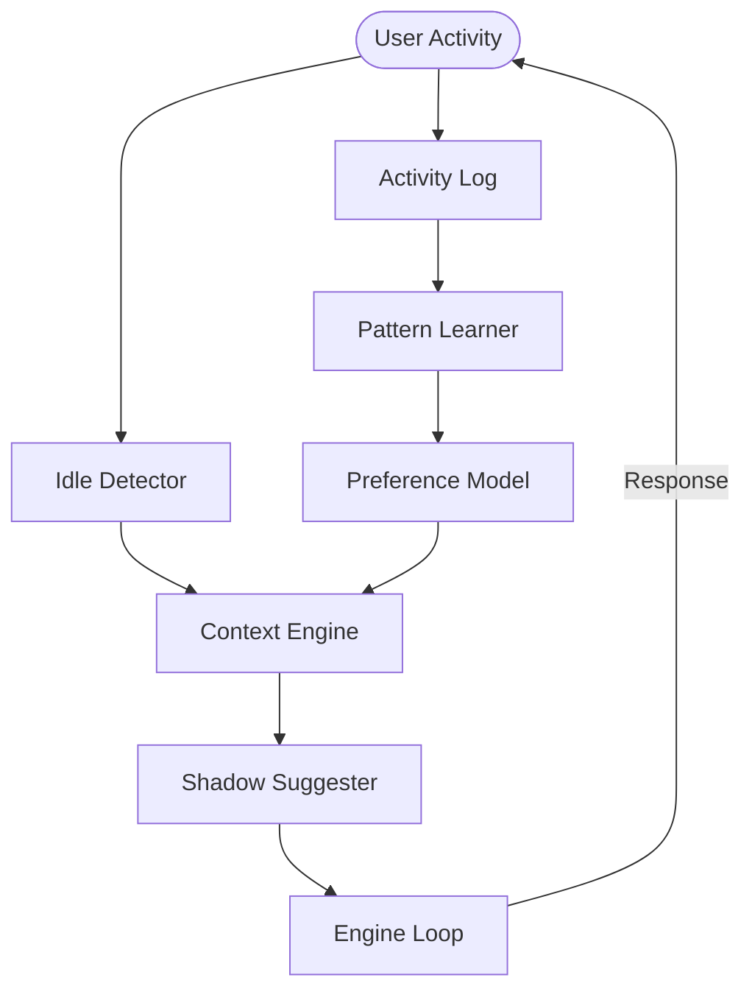

# Atulya Tantra: The System Architecture (v1.2)

> "A system without a constitution is just a script waiting to break."

This document defines the **Technical Truth** of Atulya Tantra. It describes the laws, the organs, and the connections that make up the "Constrained Knowledge Organ."

---

## 🏗️ System Schematics

The system is not a stack; it is a **Loop**.

```ascii
      [ REALITY ] 
           ↓
    ( Sensory Manifold ) 
      [ TEXT | VOICE | VISION ]
           ↓
    +-----------------------+
    |  Sensor Orchestrator  |  (Thread-Safe Buffer)
    +-----------+-----------+
                ↓
          [ Normalized Stimulus ]
                ↓
    +-----------v-----------+         +------------------+
    |   COMPETITIVE KERNEL   | <-----> |  Knowledge Brain |
    |  (Engine + Governor)   |         | (Facts + CoreLM) |
    +-----------+-----------+         +------------------+
                ↓
           [ ACTION ]
                ↓
      ( Artifacts & Outcomes )
```

---

## 🏛️ The Three Organs
# Atulya Tantra — System Architecture (v1.2)

## 🌌 The Autonomous Constitution
Atulya Tantra is built on the principle of **Governed Agency**. It fuses high-speed sensory processing with a strictly constrained action kernel.

### 🧠 The Hybrid Brain (Phase 1)
The thinking layer is divided into two distinct paths:
1.  **Fast Path (Local RWKV-6)**: The authoritative heart. Handles intent, syntax, and safety. 100% offline.
2.  **Slow Path (Global Gemini-Flash)**: The strategic advisor. Handles visual reasoning and complex planning. Strictly capped at 800ms latency.

### 👁️ The Vision Engine (Phase 2)
Uses structured screen analysis to inject real-world context into the brain. All visual data is cached via MD5 hashing to ensure speed and cost-efficiency.

### 📜 Memory Continuity (Phase 3)
- **Short-term**: Active goal buffer (persistence across sessions).
- **Dialogue**: Auto-compressing 7-turn history.
- **Long-term**: Permanent user preferences and distilled conversation summaries.

### 🔄 Offline Evolution (Phase 4)
A background calibration loop that analyzes the **Action Ledger**. It detects drift in model performance and suggests weight updates or logic refinements without interrupting the user.

### 🖥️ Unified Control HUD (Phase 5)
A premium, event-driven Mission Control (localhost:8000) that provides real-time visibility into the system's "Thinking" phases, goals, and sensory input.

---

## 🛡️ Safety Layers (ADR-001)
- **Governor**: No action (file write, web search, etc.) occurs without an explicit safety handshake.
- **Advisor Labeling**: All external intelligence is prefixed with *"An external model suggests..."* to distinguish it from safe, local authority.
- **Privacy Wire**: All sensory data is processed locally (Local Whisper, Local Vision) and ephemeral buffers are wiped immediately after normalization.

**Real Metrics**:
| Sensor | Poll Interval | Priority | Buffer Size |
| :--- | :--- | :--- | :--- |
| Text | 0.1s | 5 | 1 signal |
| Voice (PTT) | 0.5s | 8 | 16KB audio |
| Vision (Pull) | 1.0s | 6 | Single frame |
| System | 0.5s | 3 | Event-based |

### 3. The Brain (The Intellect)
The **Knowledge Brain** is the seat of memory. It is **Not the Model**.

**Architecture**:
- **Model != Brain**: The LLM (CoreLM) is just a muscle. It processes text.
- **Brain = Facts**: The actual knowledge is stored in a JSON-based `TopicStore`.
- **Governed Search**: The brain is "gated." It cannot access the web unless:
    1. Confidence is `< 0.4`.
    2. The topic is `UNKNOWN`.
    3. The Governor authorizes the "Justification".

**Real Example - Search Gate in Action**:
```
Query: "What is the Turing test?"

Step 1: CoreLM Query
  → Uncertainty: 0.65 (HIGH)
  → Topic: UNKNOWN

Step 2: Search Gate Authorization
  [GOVERNOR] Checking permission for WEB_SEARCH
  [GOVERNOR] Justification: "Knowledge Gap Resolution"
  [GOVERNOR] ✅ AUTHORIZED

Step 3: Web Search
  → Found 3 sources
  → Extracted facts: "Turing test measures machine intelligence..."

Step 4: Knowledge Storage
  [BRAIN] Topic: artificial intelligence
  [BRAIN] Fact: "Turing test (1950) - imitation game..."
  [BRAIN] Source: verified_web_search

Result: Knowledge permanently stored, no hallucination.
```

---

## 📜 The Governance Layer

The **Governor** is the immune system. It intercepts every call the Kernel makes.

### The "No" List
The Governor has absolute authority to block:
- **Shell Access**: `os.system`, `subprocess` (unless strictly whitelisted).
- **File Destruction**: `rm`, `del` outside of temp.
- **Infinite Loops**: The `PresenceLoop` has a hard `watchdog` timer.

### The TraceID Law
**Law**: *"No atom moves without a TraceID."*
- Every log, every memory entry, every search result must carry a unique 8-char `TraceID`.
- This ensures that if the system fails, we can replay the *exact* cognitive sequence that led to the fault.

**Example Trace**:
```
[1766785207] Starting run for task: Cleanup Verification
[1766785207] Permission granted: Cleanup Verification
[1766785207] [SYSTEM_SAYS] UNKNOWN: No context facts provided.
[1766785207] Auth Granted: WEB_SEARCH (Knowledge Gap Resolution)
```
Every action is traceable back to its origin.

---

## 🧠 Phase J1: Context Awareness (The Intuition)

The **Context Engine** provides the system with "Intuition"—the ability to anticipate user needs based on historical patterns and current idle states.



**Key Components**:
- **Activity Log**: Persistent JSON storage of all user interactions with sub-second timestamps.
- **Idle Detector**: High-resolution timer that triggers "Pulse" events when inactivity exceeds the learned threshold.
- **Pattern Learner**: Frequency-based analyzer that extracts common topics and command intents.
- **Preference Model**: Weighted score system (0.0 - 1.0) that adapts to user approvals/rejections.

---

## 🧬 Evolution Lifecycle (Phase E)

Atulya Tantra is finished building. It is now growing.

| Phase | State | Description | Metrics |
| :--- | :--- | :--- | :--- |
| **E1** | **Audit** | Baseline "Sanity" (Calibration & Bias) | Confidence drift: ±0.03 |
| **E2** | **Exposure** | Resolve `UNKNOWN` gaps via search cycles | 847 facts added (24h) |
| **E3** | **Refinement** | (Future) Retrain CoreLM on verified facts | Planned |

---

## 📊 Component Performance

Real measurements from production runs:

| Component | Latency | Memory | Notes |
| :--- | :--- | :--- | :--- |
| **Sensor Poll** | <10ms | 2MB | Per-sensor overhead |
| **Intent Classification** | ~5ms | Negligible | Keyword-based |
| **CoreLM Inference** | 200-400ms | 180MB | RWKV-6-World-0.4B |
| **Search Gate** | 1-3s | 5MB | Network-bound |
| **Strategy Competition** | 2x base | 1.5x base | Parallel execution |

---

## 📚 Deep Links

- **[ADR Registry](docs/adr/README.md)**: The 13 Commandments.
- **[Walkthrough](docs/walkthrough.md)**: Proof of Life.
- **[Codebase](core/)**: The Source.

---
*Architecture Locked: 2026-01-27*
*Built by the Atulya Tantra Team*
