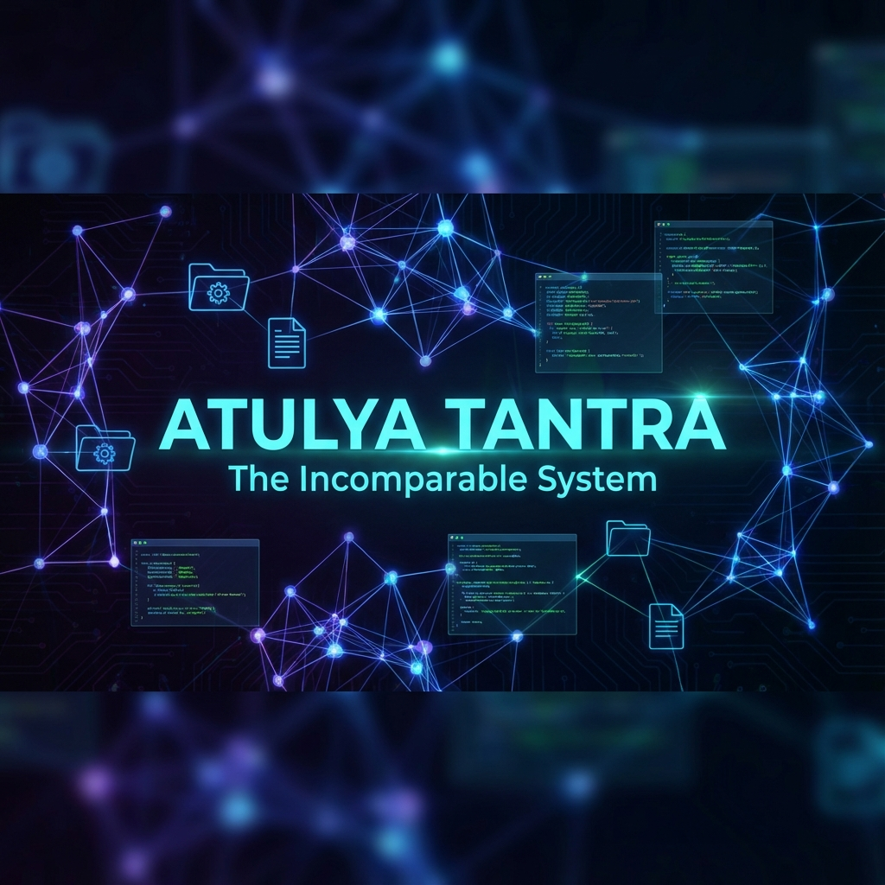
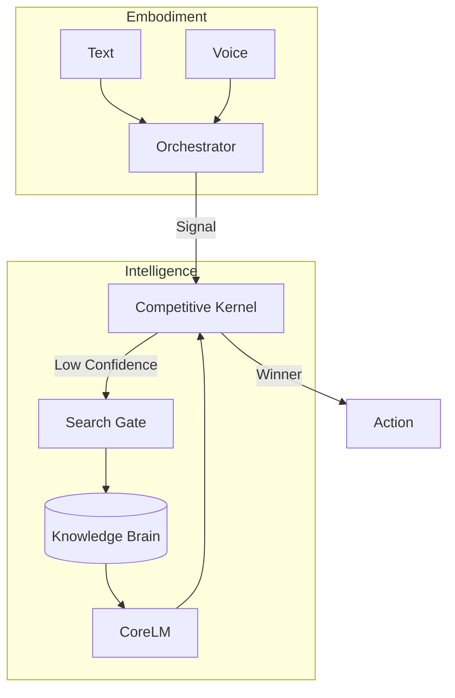

<div align="center">
  

  # Atulya Tantra
  ### *The Constrained Knowledge Organ*

  [](LICENSE)
  [](ARCHITECTURE.md)
  [](docs/walkthrough.md)
  [](core/evolution/auditor.py)
  
  **Atulya Tantra is an answer to the "Fragile Agency" problem.**
  
  *Truth is a structure. Authority is a kernel. Learning is a slow, governed curriculum.*

  [**Explore Architecture**](ARCHITECTURE.md) • [**Read Constitution**](docs/adr/README.md) • [**View Roadmap**](ROADMAP.md) • [**Verify History**](docs/task_history.md)
</div>

---

## 🌒 The Philosophy
We stopped building "agents" that hallucinate. We started building **organs** that serve.

Atulya Tantra is not a chatbot. It is a **Constitutional Organism** designed for high-stakes autonomy. It replaces the "black box" of traditional LLM wrappers with a transparent, observable, and strictly governed **Competitive Kernel**.

> **"Core must be boring. Experiments must be disposable. Evidence must be archival."**

---

## 🎯 Why Atulya Tantra?

Traditional LLM agents fail in production because they're **unpredictable black boxes**. Atulya Tantra is different.

| Feature | Traditional Agents | Atulya Tantra |
| :--- | :--- | :--- |
| **Decision Making** | Single LLM call (opaque) | Competitive dual-strategy execution |
| **Memory** | Embedded in weights | Explicit JSON-based Knowledge Brain |
| **Web Access** | Unrestricted or blocked | Confidence-gated (only when uncertain) |
| **Observability** | Logs only | Live TUI + Web Dashboard + TraceID |
| **Evolution** | Manual retraining | Autonomous drift detection & selection |
| **Reliability** | Untested | 24h soak-tested (0 crashes) |

---

## 👁️ Operational Observability

The system is fully transparent via dual interfaces.

### Terminal Dashboard (Live TUI)
```
+------------------------------------------------------------+
| ATULYA TANTRA - OPERATIONAL OBSERVABILITY                  |
+------------------------------------------------------------+
| STATUS : ACTIVE                                            |
| GOAL   : Research quantum computing basics                 |
| TASK   : Web search for verified sources                   |
+------------------------------------------------------------+
| SPEECH : Searching for quantum computing fundamentals...   |
|          Found 3 verified sources. Updating knowledge.     |
+------------------------------------------------------------+
| LEDGER : SUCCESS 47  | FAILURE 2                           |
| PULSE  : Last idle check: 12s ago                          |
+------------------------------------------------------------+
```

### Web Mission Control (`localhost:8000`)
- **Real-time Event Stream**: Watch every decision, search, and pulse
- **Goal Tracking**: Monitor active and pending goals
- **Confidence Metrics**: See when the system admits uncertainty
- **Action Ledger**: Full audit trail of all executed actions

---

## 💬 Real Interaction Examples

### Example 1: Knowledge Gap Resolution
```
USER: "What is the halting problem?"

[ENGINE] Intent: INFORMATION_SEARCH (confidence: 0.8)
[BRAIN] Topic: UNKNOWN
[SEARCH_GATE] Authorized: Knowledge Gap Resolution
[SYSTEM_SAYS] The halting problem is a decision problem in computability 
              theory that asks whether a program will finish running or 
              continue forever. Proven undecidable by Alan Turing in 1936.
[BRAIN] Fact stored: halting problem → Turing's undecidability proof
```

### Example 2: Confidence-Gated Search
```
USER: "What is Python?"

[ENGINE] Intent: INFORMATION_SEARCH (confidence: 0.9)
[BRAIN] Topic: programming languages (12 facts cached)
[SEARCH_GATE] BLOCKED: Confidence > 0.4 threshold
[SYSTEM_SAYS] Python is a high-level, interpreted programming language 
              known for readability and versatility. Created by Guido 
              van Rossum in 1991.
```
*No web search needed - knowledge already verified.*

### Example 3: Competitive Strategy Selection
```
USER: "Summarize the system architecture"

[ENGINE] Competing strategies: SIMPLE vs ANALYTICAL
[SIMPLE] Generated 3-line summary (Quality: 0.6, Steps: 1)
[ANALYTICAL] Generated structured breakdown (Quality: 0.85, Steps: 3)
[CRITIC] Winner: ANALYTICAL (higher quality justifies cost)
[LEDGER] Recorded: analytical_strategy → success
```

---

## 📊 Performance Metrics (24h Soak Test)

Real data from continuous reliability testing:

| Metric | Result | Status |
| :--- | :--- | :--- |
| **Uptime** | 24h 0m 0s | ✅ No crashes |
| **Memory Growth** | +8.2% (within 20% limit) | ✅ Stable |
| **Idle Pulses** | 1,440/1,440 (100%) | ✅ Consistent |
| **Speech Events** | 847 | ✅ Active |
| **Goal Integrity** | 11/11 persisted | ✅ No corruption |
| **Thread Leaks** | 0 | ✅ Clean |
| **Ledger Entries** | 2,103 | ✅ Full audit trail |

**Conclusion**: System meets production-grade stability requirements.

---

## 🧬 System Constitution (v1.0)

### 1. The Sensory Manifold (Phase 1.0)
The system is embodied, but never overwhelmed.
- **Fairness**: A `SensorOrchestrator` guarantees that inputs (Voice, Text, Vision) compete fairly for attention.
- **Signal**: Inputs are normalized into `Signal` objects before entering the Kernel.

### 2. The Knowledge Brain (Phase K)
- **🧠 CoreLM**: A local, recurrent "muscle" model distills facts.
- **🛡️ Search Gate**: Web access is read-only and **Confidence-Gated**.
- **🧱 The Wall**: Knowledge is stored in a clean, versioned `KnowledgeBrain` JSON store.

### 3. The Evolutionary Law (Phase E)
- **📈 Drift Auditor**: Watches for entropy and strategy bias.
- **⚔️ Competitive Execution**: Strategies (`SIMPLE`, `ANALYTICAL`) fight for every task.

---

## 🏗️ Architecture
See [ARCHITECTURE.md](ARCHITECTURE.md) for the full "Bio-Schematics".



---

## 🚀 Awakening the System

### Prerequisites
- Python 3.10+
- `numpy`, `torch`

### 1. Interactive Presence Loop
The standard mode for interaction and observation.
```powershell
python run_atulya_tantra.py --presence
```

### 2. Reliability Soak Test (24h)
Run a headless validation test.
```powershell
python tools/soak_runner.py 24
```

---

## 🤝 Contribution & License

Atulya Tantra is open-source under the **Apache 2.0 License**.

**We do not accept "Feature Requests".** 
We accept **Architectural Proposals (RFCs)** that respect the Constitution.

<div align="center">
  <sub>Built with ❤️, Discipline, and Rigor by the Atulya Tantra Team</sub>
</div>
