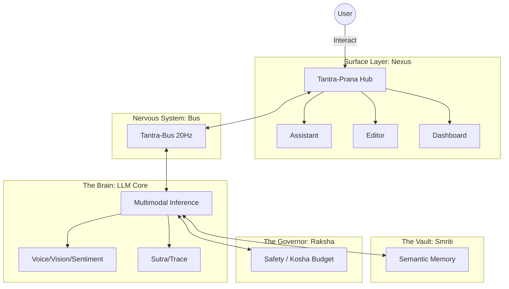

# Atulya Tantra: The AGI OS-Organism (v1.0.0) 🌌

  
  
  
   
   
  <b><a href="#-system-manifesto">Manifesto</a></b>
  •
  <b><a href="#-the-5-power-organs">Hierarchy</a></b>
  •
  <b><a href="#-architecture">Architecture</a></b>
  •
  <b><a href="#-nervous-system">Nerves</a></b>
  •
  <b><a href="#-roadmap">Roadmap</a></b>

---

## 🌌 System Manifesto

**Atulya Tantra** is not a framework; it is an **OS-Organism**. 

Our vision is a **Jarvis-level / Skynet-level AGI automation layer** that lives on your local machine. Built for **CPU-optimized local inference**, it is a modular ecosystem where every repository is a "perfect organ" interlinked by a high-speed nervous system.

---

## 🏗️ The 5 Power Organs

The organism is distilled into 5 functional "Power Organs" for maximum coherence and zero-latency coordination.

| Power Organ | Repository | Responsibility |
| :--- | :--- | :--- |
| **DNA** | [Atulya-Tantra](https://github.com/atulyaai/Atulya-Tantra) | **The Root.** Shared protocols + **Nervous System (Bus)**. |
| **Brain** | [Tantra-LLM](https://github.com/atulyaai/Tantra-LLM) | **The Mind.** Inference + **Sensory** (Voice/Vision) + **Logic** (Sutra/Trace). |
| **Memory** | [Tantra-Smriti](https://github.com/atulyaai/Tantra-Smriti) | **The Vault.** Episodic & Semantic vector storage. |
| **Governor** | [Tantra-Raksha](https://github.com/atulyaai/Tantra-Raksha) | **The Law.** Safety + **Budget (Kosha)** monitoring. |
| **Surface** | [Tantra-Prana](https://github.com/atulyaai/Tantra-Prana) | **The Face.** Assistant + Unified Command Hub. |

---

## 🛠️ Supplemental Utilities

These projects are independent tools that integrate with the organism but are maintained as separate entities:

- **[Tantra-IDE](https://github.com/atulyaai/Tantra-IDE)**: An AI-native development environment for agentic coding.
- **[Atulya-Cpanel](https://github.com/atulyaai/Atulya-Cpanel)**: A multi-server infrastructure management dashboard.

---

## 🏗️ Architecture

---

## 🧬 DNA Consolidation
All modular organs are interlinked via the **`atulya-core`** library. We have archived the separate `Tantra-Core` repository and consolidated all shared intelligence into the root framework to ensure a single source of truth.

---

## ⚡ The Nervous System
Every inference call and sensory event triggers a pulse across the **Tantra-Bus** at **20Hz**, enabling Skynet-levels of coordinated AGI automation.

---

## 🗺️ Roadmap

### Phase 1: The Organism Birth (v1.0.0)
- [x] Consolidate 15-repo architecture into 5 Power Organs.
- [x] Standardize `atulya-core` protocol.
- [x] Launch 20Hz Nervous System (Internalized in Core).
- [x] Cinematic Nexus Surface (`Tantra-Prana`).

### Phase 2: Sensory Mastery (v1.1.0)
- [ ] Integration of 3rd party sensory plugins.
- [ ] Multi-modal reinforcement learning in `Tantra-LLM`.
- [ ] Distributed memory clusters in `Tantra-Smriti`.

### Phase 3: Autonomous Evolution (v2.0.0)
- [ ] Self-healing code repair via `Tantra-IDE`.
- [ ] Global AGI swarm coordination.
- [ ] Biometric sentiment resonance.

---
*In pursuit of the Incomparable System. Engineered for Autonomy.*
