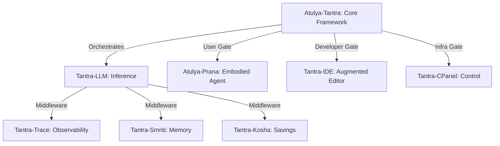

# Atulya Tantra: The Incomparable System 🌌

  
   
   
  
  
  
  
   
   
  <b><a href="#-system-manifesto">Manifesto</a></b>
  •
  <b><a href="#-the-nervous-system">Nervous System</a></b>
  •
  <b><a href="#-governance-as-law">The Law</a></b>
  •
  <b><a href="#-the-agentic-loop">The Loop</a></b>
  •
  <b><a href="#-roadmap-to-wisdom">Roadmap</a></b>
   
   

---

## 🌌 System Manifesto

**Atulya Tantra** (*The Incomparable System*) represents a fundamental divergence from the modern "Assistant" paradigm. 

Most AI systems today are **Stateless Oracles**—they wait passively for a question, generate text, and cease to exist. They have no continuity, no authority, and no hands.

We have engineered an **Embodied OS-Organism**.

This is the root framework that powers the entire Tantra ecosystem. It breathes your filesystem. It creates its own plans, sets its own goals, and executes complex workflows through its modular nervous system. It does not simply "answer questions"; it **solves problems**.

---

## 🏗️ The Nervous System (Interlinked Architecture)

Atulya Tantra is the brain stem. Every other repository is a specialized organ interlinked via the **Tantra-Core** protocol.

| Component | Responsibility | Technical Function |
| :--- | :--- | :--- |
| **ATULYA-TANTRA** | **Governance & Law** | The Root. Defines the immutable safety laws and agentic loops. |
| **TANTRA-LLM** | **Unified Inference** | The Heart. Normalizes all LLMs (Local/Gemini/OpenAI). |
| **TANTRA-IDE** | **Coding Cockpit** | The Hands. Direct file manipulation and augmented engineering. |
| **TANTRA-CPANEL** | **Operational Infra** | The Skeleton. Manages local resources, token budgets, and health. |

---

## 📜 Governance as Law

Governance in Atulya Tantra is not a system prompt. It is **Pythonic Law**. Our [Tantra-Raksha](https://github.com/atulyaai/Tantra-Raksha) module ensures that safety gates are physically disconnected from the LLM's influence.

### The Immutable Constitution
1.  **The Law of Preservation**: The Agent is physically incapable of deleting files in `core/` or `memory/` without hardware authority.
2.  **The Law of Uncertainty**: If the [Tantra-Trace](https://github.com/atulyaai/Tantra-Trace) confidence score falls below **60%**, the Agent **MUST** halt and request user confirmation.
3.  **The Law of Traceability**: No action occurs without a generated `Trace ID` recorded in the [Tantra-Smriti](https://github.com/atulyaai/Tantra-Smriti) ledger.

---

## 🔄 The Agentic Loop (20Hz)

The system runs on a continuous **Observe-Plan-Govern-Act** cycle, operating at a high-frequency internal heartbeat.

1.  **Observe**: [Tantra-Sensors] aggregate signals from your machine.
2.  **Plan**: [Tantra-Sutra] compiles intent into a structured logic graph.
3.  **Govern**: [Tantra-Raksha] vets the plan against the Constitution.
4.  **Act**: [Tantra-LLM] executes tools while [Tantra-Kosha] optimizes the cost.
5.  **Reflect**: [Tantra-Trace] validates the output reality.

---

## 🗺️ Roadmap to Wisdom

### ✅ Phase 1: Consolidation (Completed)
*   Established the 10-repo modular architecture.
*   Defined the interlinked "Atulya-Standard" protocols.

### 🚧 Phase 2: Tantra-LLM Integration (In Progress)
*   **Unified Inference**: Implementing the Universal Adapter to allow any repository to talk to any LLM seamlessly.
*   **Plug-and-Play Middleware**: Moving `Kosha` and `Trace` into the core pipeline.

### 🔮 Phase 3: Total Autonomy (Future)
*   **Self-Healing Code**: Ability to detect errors in any Tantra module and autonomously submit a PR for repair.

---

*Engineered with discipline by Antigravity in pursuit of the Atulya Tantra.*
