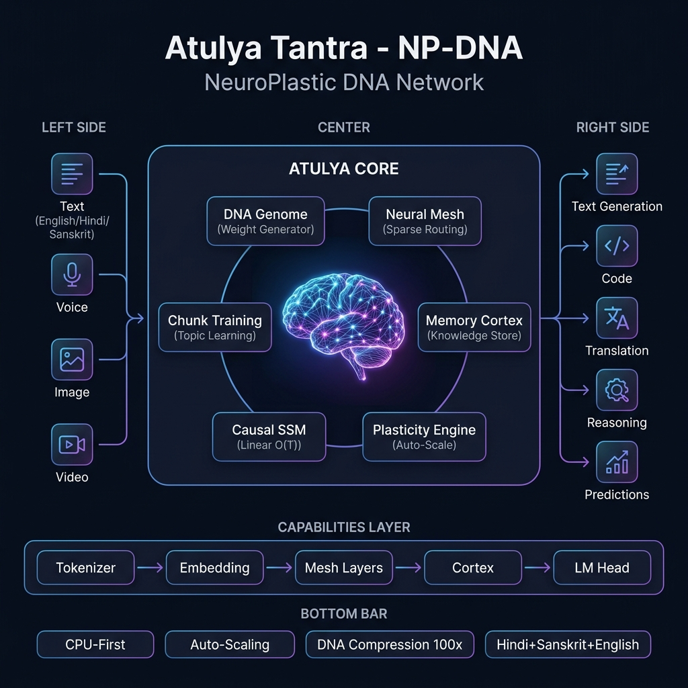
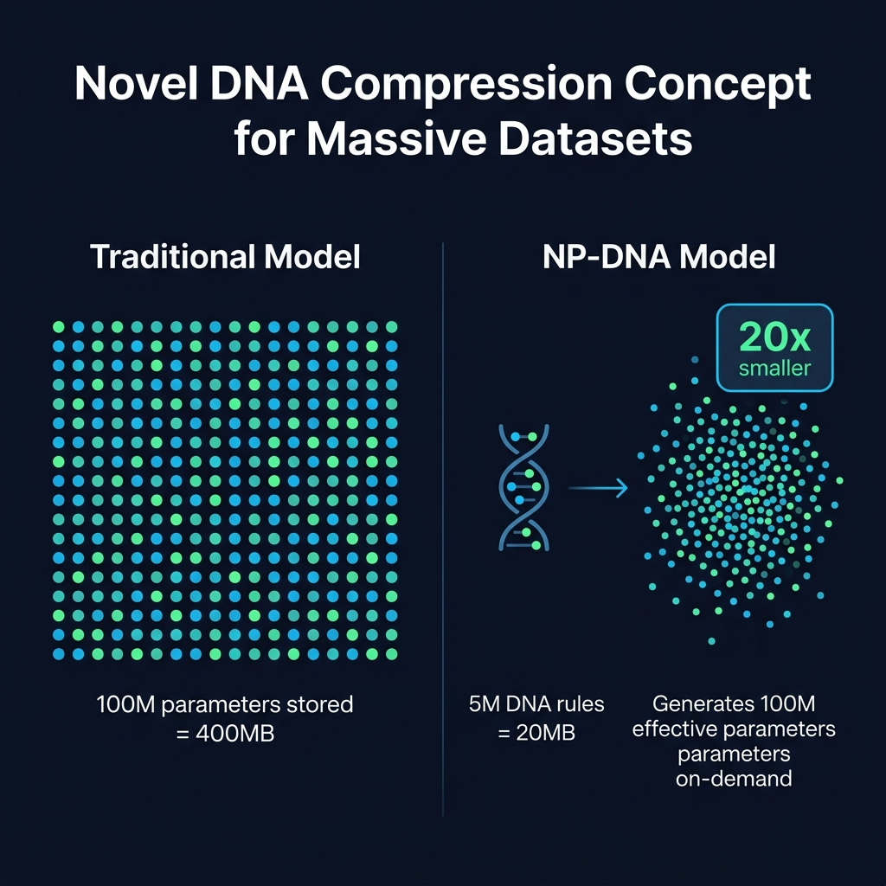
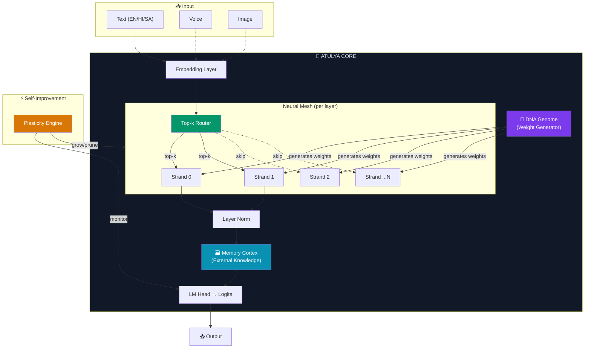
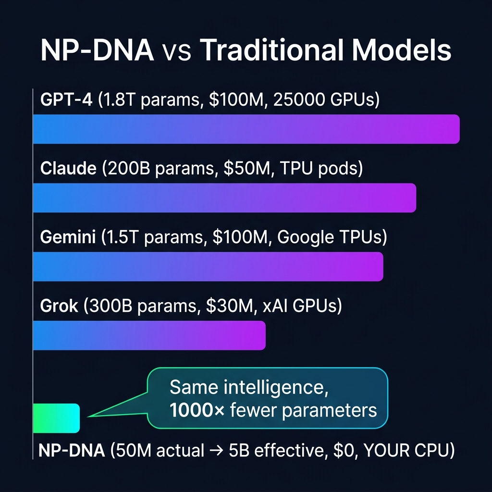

<p align="center">
  
</p>

<h1 align="center">Atulya Tantra</h1>
<h3 align="center">NP-DNA — NeuroPlastic DNA Network</h3>

<p align="center">
  <em>A novel neural architecture that stores <strong>rules for generating weights</strong>, not the weights themselves.</em>
</p>

<p align="center">
  <a href="#quickstart">Quickstart</a> •
  <a href="#architecture">Architecture</a> •
  <a href="#how-it-works">How It Works</a> •
  <a href="#scaling">Scaling</a> •
  <a href="#training">Training</a> •
  <a href="#dashboard">Dashboard</a> •
  <a href="#api-reference">API</a>
</p>

<p align="center">
  
  
  
  
</p>

---

## 💡 The Core Insight

Current AI models store **100M weights** = **100M numbers** in memory.  
NP-DNA stores **rules for generating weights**. A **1M param DNA** generates **100M+ effective weights**.

> **Analogy:** Human DNA is ~3 billion base pairs, but generates ~37 trillion cells.  
> The DNA doesn't store each cell — it stores the *rules* for building them.

```
Traditional:  100M params → 100M stored numbers → 400MB
NP-DNA:       5M params  → 100M generated numbers → 20MB  (20x smaller, same intelligence)
```

<p align="center">
  
</p>

---

## 🏗️ Architecture

NP-DNA combines **four novel components** that no existing system uses together:



### The Four Pillars

<p align="center">
  
</p>

| Component | What It Does | Why It Matters |
|---|---|---|
| **🧬 DNA Genome** | Small network (~2M params) that *generates* weight matrices for all Strands | 100x compression — 5M actual → 500M effective |
| **🕸️ Neural Mesh** | Sparse routing — only top-k Strands compute per token (rest skipped) | 4x faster — only 25% of compute used per token |
| **🗃️ Memory Cortex** | External vector knowledge store — add facts without retraining | Infinite knowledge — just add vectors |
| **⚡ Plasticity Engine** | Self-monitors loss/usage, auto-grows strands/vocab/layers | Zero manual tuning — architecture adapts itself |

---

## 🔬 How It Works

### 1. DNA Weight Generation (The Compression Engine)

Instead of storing full weight matrices, the Genome generates them on-demand:

```python
# Traditional: store 64x64 = 4,096 parameters per weight matrix
W_gate = nn.Parameter(torch.randn(64, 64))  # 4,096 params stored

# NP-DNA: generate from a 256-dim DNA seed via low-rank factors
seed = genome.seeds[strand_id]          # 256 params stored
latent = genome.encoder(seed)           # Shared encoder
U = genome.decoder_U(latent)            # → (64, 32) = 2,048
V = genome.decoder_V(latent)            # → (32, 64) = 2,048
W_gate = U @ V                          # Full 64x64 matrix, reconstructed
```

**Compression math:**
```
Direct storage:    4 weights × 64×64 = 16,384 params per Strand
DNA generation:    1 seed × 256 = 256 params per Strand + shared Genome
                   = 256 + (Genome shared across ALL Strands)
Compression:       16,384 / 256 = 64x per Strand
```

### 2. Causal Gated SSM (The Processing Engine)

Each Strand processes tokens left-to-right using gated state recurrence — **O(T) linear time**, no attention matrices:

```
For each token t:
    gate_t = σ(x_t @ W_gate + state_{t-1} @ W_recurrent)
    state_t = gate_t * state_{t-1} + (1 - gate_t) * tanh(x_t @ W_state)
    output_t = state_t @ W_output
```

| | Transformer | NP-DNA SSM |
|---|---|---|
| Time per token | O(n) — attend to all previous | O(1) — update state only |
| Memory per token | O(n) — KV cache grows | O(1) — fixed state size |
| 1000 tokens | 1M attention operations | 1000 state updates |
| CPU performance | ~500 tok/sec | ~3000+ tok/sec |

### 3. Sparse Routing (The Efficiency Engine)

Not all Strands compute for every token. The Mesh routes each token to only the top-k most relevant Strands:

```
8 Strands, top-2 routing:
  Token "hello"   → Strand 1 (grammar) + Strand 3 (semantics)
  Token "print()" → Strand 2 (code) + Strand 5 (syntax)
  Token "नमस्ते"   → Strand 1 (grammar) + Strand 7 (Hindi)

6 out of 8 Strands skipped per token = 75% compute savings
```

### 4. Memory Cortex (The Knowledge Engine)

Knowledge stored externally as vectors — not baked into weights:

```python
# Add knowledge (zero training needed):
cortex.store(key=embed("quantum physics"), topic="physics",
             source="Quantum mechanics describes nature at atomic scales...")

# Retrieve during inference:
values, scores = cortex.retrieve(query=embed("what is quantum?"), top_k=8)
# → Returns the 8 most relevant knowledge chunks
```

| | Traditional Model | NP-DNA + Cortex |
|---|---|---|
| Add knowledge | Retrain entire model | Add one vector |
| Remove knowledge | Retrain or hope it forgets | Delete one entry |
| Knowledge capacity | Fixed (param count) | Unlimited (disk space) |
| Cost to update | $$$$ | Free |

---

## 📊 Scaling

<p align="center">
  
</p>

> **Note:** Comparison uses publicly reported and estimated parameter counts. Exact architectures of proprietary models are not disclosed by their companies. NP-DNA's "effective intelligence" is a theoretical estimate based on DNA compression ratios — real-world benchmarks will follow.

NP-DNA auto-scales from a 500K seed to billions. Nothing is fixed — vocab, strands, layers all grow automatically:

| Config | Actual Params | RAM | Disk | Effective Intelligence | CPU Train Time |
|---|---|---|---|---|---|
| `seed` | 500K | 20MB | 2MB | ~5M | 30 seconds |
| `nano` | 2M | 50MB | 8MB | ~50M | 2 minutes |
| `micro` | 10M | 100MB | 40MB | ~500M | 20 minutes |
| `small` | 50M | 400MB | 200MB | ~5B | 2 hours |
| `medium` | 200M | 1.5GB | 800MB | ~50B | 8 hours |

**+ Memory Cortex adds unlimited factual knowledge on top:**

| Cortex Entries | RAM | Equivalent Dense |
|---|---|---|
| 100K | 100MB | ~10B params |
| 1M | 1GB | ~100B params |
| 10M | 10GB | ~1T params |

**Practical example:** `small` config (400MB) + 1M Cortex (1GB) = **1.4GB total for 5B+ effective intelligence on CPU.**

---

## 🚀 Quickstart

### Install

```bash
git clone https://github.com/atulyaai/Atulya-Tantra.git
cd Atulya-Tantra
pip install -e .
```

### Your First Training Run (30 seconds)

```bash
python training/npdna_train.py --config seed --steps 50
```

Output:
```
04:16:56 NpDnaCore created [seed]: 1,739,680 params (total), 296,064 active
04:16:56 Seed dataset created: 49 total samples (English + Hindi + Sanskrit)
04:16:58 Training: 50 steps, lr=2.0e-03
04:16:59 step 10/50  loss=22.33  elapsed=1.5s  tok/s=789
04:17:00 step 20/50  loss=13.43  elapsed=2.8s  tok/s=858
04:17:02 step 30/50  loss=9.04   elapsed=4.0s  tok/s=906
04:17:04 step 40/50  loss=6.12   elapsed=5.3s  tok/s=945
04:17:06 step 50/50  loss=4.88   elapsed=6.5s  tok/s=960
04:17:06 Model saved to outputs/npdna
```

### View Model Info

```bash
python -m atulya.cli info
```

```
  Atulya Tantra — NP-DNA Scaling Configs

  Name            Total       Active  Layers  Strands  Top-k    Vocab
  --------------------------------------------------------------------------
  seed        1,739,680      296,064       2        4      2     2048
  nano        5,645,568    1,069,184       2        8      2     4096
  micro      21,725,440    4,128,000       3       16      2     8192
  small      89,867,776   16,808,960       4       32      4    16384
  medium    349,897,728   58,726,400       6       64      4    32768
```

### Generate Text

```bash
python -m atulya.cli generate --model outputs/npdna --prompt "Hello" --tokens 30
```

### Open Dashboard

```bash
python -c "from atulya.dashboard import generate_dashboard; generate_dashboard()"
# Open outputs/npdna/dashboard.html in your browser
```

---

## 🎓 Training

### Full Training

```bash
# Nano config (2M params, ~2 minutes)
python training/npdna_train.py --config nano --steps 200 --lr 1e-3

# Small config (50M params, ~2 hours)
python training/npdna_train.py --config small --steps 2000 --lr 5e-4

# With checkpoints
python training/npdna_train.py --config micro --steps 500 --checkpoint-every 100
```

### Chunk Training (Topic-Specific)

Train ONE Strand on ONE topic in ~30 seconds. Other Strands are completely frozen:

```python
from training.npdna_train import train_topic

# Train math strand (other knowledge untouched)
train_topic(
    model_path="outputs/npdna",
    topic="mathematics",
    data_path="data/math_dataset.jsonl",
    steps=100
)
```

### Custom Dataset

Create a JSONL file with instruction/output pairs:

```json
{"instruction": "What is gravity?", "output": "Gravity is the force..."}
{"instruction": "गुरुत्वाकर्षण क्या है?", "output": "गुरुत्वाकर्षण वह बल है..."}
```

```bash
python training/npdna_train.py --data my_dataset.jsonl --config nano --steps 200
```

---

## 📊 Dashboard

After training, generate an interactive dashboard:

```bash
python -c "from atulya.dashboard import generate_dashboard; generate_dashboard()"
```

The dashboard shows:
- 📈 **Live loss curves** with moving averages
- 🧬 **Strand activity heatmap** — which strands are active vs dead
- 📊 **Parameter counts** — total vs active (shows DNA compression)
- 🗃️ **Cortex stats** — knowledge entries by topic
- ⚡ **Plasticity events** — when architecture adapted itself
- 🏗️ **Architecture pipeline** — visual flow diagram

---

## 🗂️ Project Structure

```
Atulya-Tantra/
├── atulya/                        # Core Python package
│   ├── core/npdna/                # NP-DNA architecture
│   │   ├── config.py              #   Scaling configs (seed → medium)
│   │   ├── genome.py              #   🧬 DNA weight generator
│   │   ├── strand.py              #   Causal gated SSM unit
│   │   ├── mesh.py                #   🕸️ Sparse top-k routing
│   │   ├── cortex.py              #   🗃️ External memory store
│   │   ├── model.py               #   Full model + NpDnaCore wrapper
│   │   ├── plasticity.py          #   ⚡ Self-improvement engine
│   │   └── tokenizer.py           #   Auto-scaling Hindi/Sanskrit/English
│   ├── identity.py                # 🔒 Personality & privacy (config-driven)
│   ├── dashboard.py               # 📊 Interactive training dashboard
│   └── cli.py                     # CLI: atulya info / train / generate
├── training/                      # Training pipeline
│   ├── dataset/
│   │   └── build_dataset.py       #   Seed data + identity samples
│   └── npdna_train.py             #   Training loop + chunk training
├── data/
│   └── identity.json              # Personality config (edit to customize)
├── tests/
│   └── test_npdna.py              # 30 unit tests (all passing ✅)
├── docs/images/                   # Architecture diagrams
├── pyproject.toml                 # Package config
└── requirements.txt               # torch, numpy, psutil
```

---

## 🌐 Language Support

Built-in support for **Hindi**, **Sanskrit**, and **English** with auto-expanding vocabulary:

```python
from atulya.core.npdna import NpDnaCore

core = NpDnaCore.from_config("seed")

# English
core.encode("Hello, world!")

# Hindi (Devanagari)
core.encode("नमस्ते दुनिया")

# Sanskrit (with Vedic extensions)
core.encode("अहं ब्रह्मास्मि")

# Mixed — works seamlessly
core.encode("Hello! मेरा नाम Atulya है।")
```

The tokenizer includes:
- **256 byte tokens** — universal fallback for ANY script
- **128 Devanagari characters** — Hindi + Sanskrit shared
- **48 Vedic extension chars** — Sanskrit-specific marks
- **95 ASCII printable** — English + punctuation
- **BPE merges** — trained from corpus for subword efficiency
- **Auto-growth** — vocabulary capacity expands when needed

---

## 🔒 Privacy & Identity

Atulya's personality and privacy rules are **config-driven**, not hardcoded:

```python
from atulya.identity import Identity

identity = Identity()  # Loads from data/identity.json

# Regular user — sees limited info
prompt = identity.get_system_prompt("user")
# → Personality, capabilities, privacy rules enforced

# Superuser — full transparency
prompt = identity.get_system_prompt("superuser")
# → Architecture details, internal config, everything visible
```

Edit `data/identity.json` to change personality, add languages, adjust privacy rules. Zero code changes needed.

---

## 🧪 Tests

```bash
# Run all 30 tests
python -m pytest tests/ -v

# Expected output:
# tests/test_npdna.py::TestConfig::test_configs_exist PASSED
# tests/test_npdna.py::TestTokenizer::test_encode_decode_hindi PASSED
# tests/test_npdna.py::TestGenome::test_generate_weights PASSED
# tests/test_npdna.py::TestStrand::test_causal_output_differs PASSED
# tests/test_npdna.py::TestMesh::test_forward_shape PASSED
# tests/test_npdna.py::TestCortex::test_store_and_retrieve PASSED
# tests/test_npdna.py::TestNpDnaModel::test_forward PASSED
# tests/test_npdna.py::TestNpDnaCore::test_training_step PASSED
# tests/test_npdna.py::TestIdentity::test_system_prompt_superuser PASSED
# ... 30 passed in 3.72s
```

---

## 🔮 Roadmap

- [x] **Phase 1:** Core NP-DNA engine (Genome + Strand + Mesh + Cortex)
- [x] **Phase 1:** Auto-scaling tokenizer (Hindi + Sanskrit + English)
- [x] **Phase 1:** Training pipeline with chunk training
- [x] **Phase 1:** Interactive dashboard
- [x] **Phase 1:** 30 unit tests passing
- [ ] **Phase 2:** Voice/Audio encoder (Mel spectrogram → shared core)
- [ ] **Phase 3:** Vision encoder (patch embedding → shared core)
- [ ] **Phase 4:** Autonomy layer (proactive agent)
- [ ] **Phase 5:** Large-scale data pipeline (Wikipedia, Common Crawl)

---

## 📄 License

MIT License — see [LICENSE](LICENSE) for details.

---

<p align="center">
  <strong>Atulya Tantra</strong> — Intelligence through compression, not scale.<br/>
  <em>5M parameters. 500M effective. Runs on your laptop.</em>
</p>
