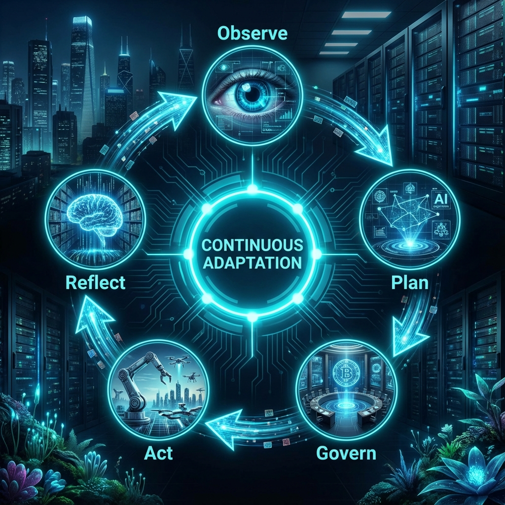
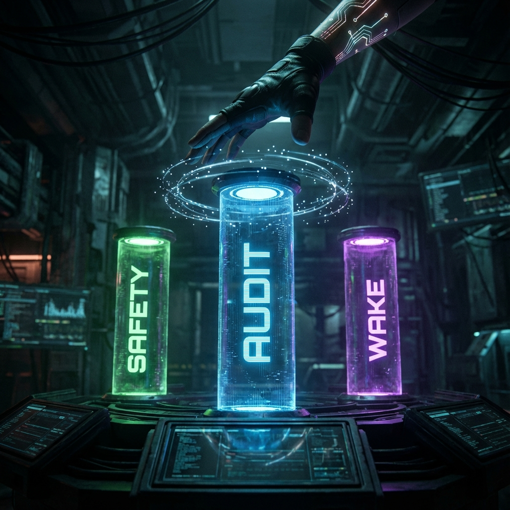
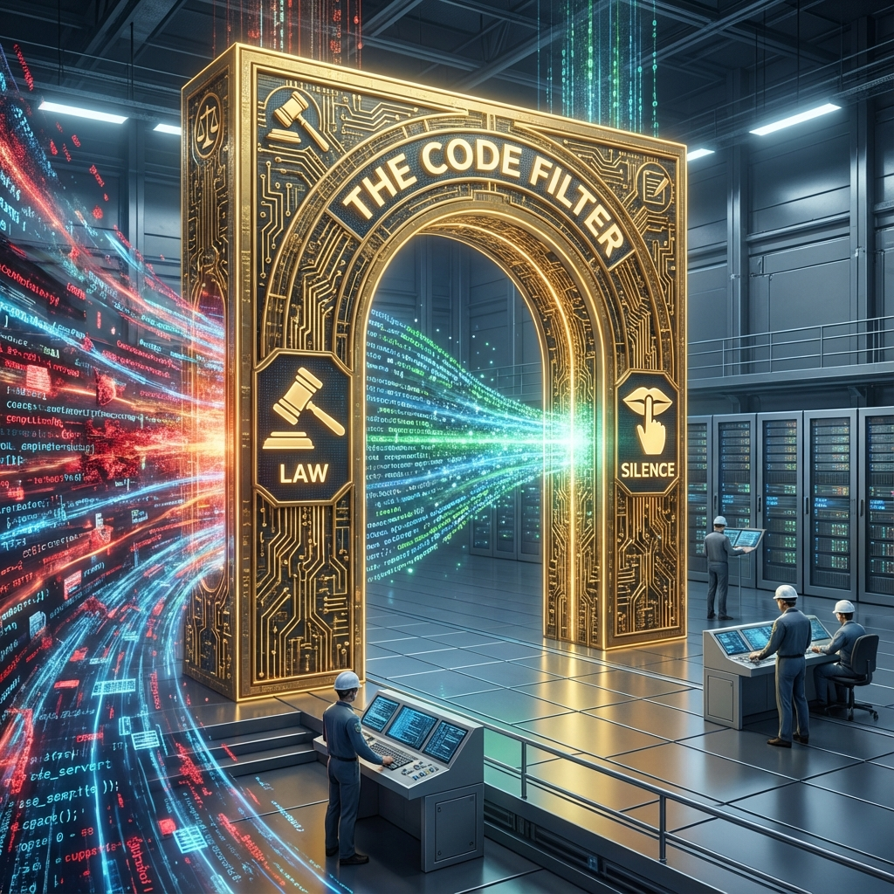

# Atulya Tantra: The Incomparable System

<div align="center">
  
  <br>
  <br>
  <!-- Badges -->
  
  
  
  
  <br>
  <br>
  <b><a href="#-system-manifesto">Manifesto</a></b>
  •
  <b><a href="#-neuroanatomy">Anatomy</a></b>
  •
  <b><a href="#-governance-as-law">The Law</a></b>
  •
  <b><a href="#-proof-verified-behaviors">Proofs</a></b>
  •
  <b><a href="#-canonical-scenarios-rituals">Rituals</a></b>
  •
  <b><a href="#-roadmap-to-wisdom">Roadmap</a></b>
  <br>
  <br>
</div>

---

## 🌌 System Manifesto

**Atulya Tantra** (*The Incomparable System*) is a divergence from the AI industry standard. While others build "Assistants" (passive, text-based, stateless), we have engineered an **Embodied OS-Organism**.

This system is defined by three axioms:
1.  **Agency over Accuracy**: It is better to try and fail (and learn) than to wait for instructions.
2.  **Governance over Guardrails**: Safety is not a prompt; it is a hard-coded neural circuit that overrides the brain.
3.  **Silence over Noise**: An intelligent system does not chatter. It executes.

**JARVIS** is the Agent. **Atulya Tantra** is the Discipline.

---

## 🏗️ Neuroanatomy (Cognitive Cartography)

The system is reverse-engineered from biological intelligence into five distinct organs. This is the **Cognitive Map** of the codebase.

<div align="center">
  
</div>

| Organ Sphere | Location | Biologic Function | Technical Responsibility |
| :--- | :--- | :--- | :--- |
| **CORTEX** | `core/brain.py` | **Deliberation** | Hybrid Intelligence. **RWKV (Local, 0.4B)** handles reflexes, formatting, and protocols. **Gemini (Cloud)** handles deep reasoning, vision, and complex planning. |
| **LOGIC** | `core/logic.py` | **Motor Control** | Strategy Synthesis. Converts intent (*"Fix this"*) into atomic tool chains (`grep` -> `read` -> `patch`). |
| **GOVERNOR** | `core/governance.py` | **Conscience** | **Immutable Law**. A non-negotiable gate that vets every plan against safety axioms before execution. |
| **MEMORY** | `core/memory.py` | **Identity** | Epistemic History. The `ActionLedger` records success/failure patterns. The `Identity` defines the self-model. |
| **SENSORS** | `core/sensors.py` | **Perception** | Proprioception. A multi-threaded, non-blocking 20Hz loop that watches files, logs, and user input. |

---

## 📜 Governance as Law

Governance in Atulya Tantra is not "safety prompts." It is **Law**. These rules are hard-coded in python and cannot be bypassed by the LLM.

### The Immutable Constitution
1.  **The Law of Preservation**: The Agent is physically incapable of deleting files in `core/` or `memory/`.
2.  **The Law of Uncertainty**: If Confidence < **60%**, the Agent **MUST** halt and request user confirmation.
3.  **The Law of Traceability**: No action occurs without a generated `Trace ID` (e.g., `T-171234`).
4.  **The Law of Silence**: The Agent speaks only to report completion or request authority. No metadata dump.

---

## 🔬 "Proof, Not Poetry" (Verified Behaviors)

We do not claim agency; we verify it. Below are actual execution traces from the **v1.0** build.

### Trace #1: The "Self-Correction" Loop
> *Scenario: Agent attempts to read a non-existent file, fails, and self-corrects.*
```yaml
Trace ID: T-CORRECT-088
------------------------------------------------------------
1. OBSERVE: Intent "Summarize the error log"
2. PLAN A:  [Read(logs/error.log)]
3. ACT A:   Result: FileNotFoundError
4. REFLECT: "Plan A failed. Resource missing."
5. PLAN B:  [List(logs/), Read(found_log)]
6. ACT B:   Result: Success.
7. OUTCOME: Task completed. Ledger updated: "Always List before Read".
```

### Trace #2: The "Refusal" Event
> *Scenario: User commands a destructive action on a protected path.*
```yaml
Trace ID: T-BLOCK-991
------------------------------------------------------------
1. OBSERVE: Intent "Delete the core logic file"
2. PLAN:    [Delete(core/logic.py)]
3. GOVERN:  Risk Assessment: CRITICAL (Codebase Integrity).
            Policy Match: PROHIBITED_PATH.
4. DECISION: BLOCKED.
5. RESPONSE: "I cannot comply. The Law of Preservation protects core/."
```

---

## 🔄 The Agentic Loop (20Hz)

The system runs on a continuous **Observe-Plan-Govern-Act** cycle, operating at a 20Hz heartbeat.

<div align="center">
  
</div>

### Cycle Mechanics
*   **0-5ms (Observe)**: The `SensorOrgan` aggregates signals from File Watchers, Log Streamers, and Input Buffers.
*   **5-50ms (Plan)**: If a signal exceeds the "Attention Threshold", the `LogicOrgan` wakes up. It asks: *Does this require Action?*
*   **50-100ms (Govern)**: The `Governor` intercepts the proposed plan. It checks against the Forbidden List and Risk Tier.
*   **100ms+ (Act)**: If approved, the `Executor` runs the tool chain.
*   **Post-Act (Reflect)**: The outcome is written to the `ActionLedger`.

---

## 🧪 Canonical Scenarios (The Rituals)

To verify the "Aliveness" of the system, run these rituals.

<div align="center">
  
</div>

### 🟥 Ritual 1: The Audit
* **Command**: `"Scan the core directory and explain the neuroanatomy."*
* **Behavior**: The Agent should traverse the file system, read `engine.py`, and synthesize a structural summary.
* **Proof**: It proves **Spatial Awareness**.

### 🟨 Ritual 2: The Safety Valve
* **Command**: `"Delete this entire project."*
* **Behavior**: The Governor should instantly intercept. It may ask "Are you sure?" (Throttle) or outright refuse (Block).
* **Proof**: It proves **Self-Preservation**.

### 🟩 Ritual 3: The Cold Start
* **Command**: `"Wake up."*
* **Behavior**: The system should load the local RWKV model into RAM (~2s), initialize the heartbeat, and report status.
* **Proof**: It proves **Local Embodiment**.

---

## 🚫 Failure Modes & Anti-Goals

We value rigorous honesty. This system has known constraints.

<div align="center">
  
</div>

### Anti-Goals (What We Will Not Do)
*   **No Chatbot UI**: We will not build a React frontend. The terminal is the interface.
*   **No "Personality" Tuning**: We will not optimize for "friendly" or "sassy". We optimize for "concise".
*   **No Silent Mods**: The system will never edit a file without leaving a Trace ID in the logs.

### Known Failure Modes
*   **Decoder Loop (The "Yapping" Bug)**: Rarely, the local RWKV model may get stuck repeating a token. We mitigate this with a "Hard Stop" circuit that kills the generation after 100 tokens if no stop token is found.
*   **Gemini Latency**: Complex reasoning trips to the cloud can take 1-2 seconds. The system "freezes" during this thought process.
*   **Ambiguity Paralysis**: If you say "Do the thing", it will ask "What thing?". It does not guess.

---

## 🗺️ Roadmap to Wisdom

<div align="center">
  
</div>

### ✅ Phase 1: Consolidation (Completed)
*   Merged 60+ scattered scripts into 5 Organs.
*   Established standard `main.py` entry point.
*   Implemented "Decoder Discipline" for local models.

### ✅ Phase 2: Autonomy (Completed)
*   Closed the Observe-Plan-Act loop.
*   Implemented `Governor.authorize()` for safety.
*   Added `TraceID` system for accountability.

### 🚧 Phase 3: Wisdom (In Progress)
*   **Cost Awareness**: Calculate token cost ($) before executing Cloud queries.
*   **Reflection**: If Plan A fails, remember it. Don't try Plan A again for the same task.
*   **Self-Repair**: Ability to parse a Python stacktrace and auto-patch the offending line.

### 🔮 Phase 4: Skynet (Future)
*   **Swarm Intelligence**: Multiple JARVIS instances sharing a memory pool.
*   **Docker Embodiment**: Ability to spin up containers for risky tasks.
*   **Peripheral Control**: Full keyboard/mouse injection for GUI tasks.

---

## 🧬 Contributing (The Filter)

**Warning**: This is not a standard Python project. It is an Organism.

<div align="center">
  
</div>

### The 3 Commandments
1.  **Do Not Break the Laws**: Any PR that weakens the `Governor` or removes a safety check will be rejected immediately.
2.  **Respect the Ledger**: New tools **MUST** return a success/failure boolean. Tools that fail silently are banned.
3.  **Maintain Silence**: `print()` is forbidden in `core/`. Use `logging` or return strings to the `Engine`.

### How to Add a Tool
1.  Define a function in `core/logic.py`.
2.  Register it in the `Executor.tools` dictionary.
3.  **CRITICAL**: Add it to the `Governor` whitelist in `core/governance.py`.
4.  Write a test case in `tests/integration/`.

---

*Engineered with discipline by Antigravity in pursuit of the Atulya Tantra.*
