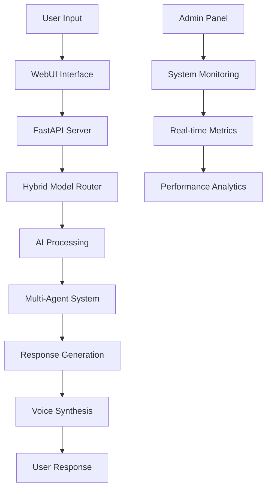

# 🤖 Atulya Tantra - AI Assistant

<div align="center">


**Advanced AI Assistant with Multi-Agent Orchestration**

[](http://localhost:8000/webui)
[](http://localhost:8000/admin)
[](http://localhost:8000/docs)

</div>

---

## 🌟 **What is Atulya Tantra?**

Atulya Tantra is an **AI Assistant system** currently in beta development. It's designed to become a comprehensive AI platform with multi-agent orchestration, voice interaction, and desktop automation capabilities.

### 🎯 **Current Features (v1.5.0 Beta)**

- **💬 Basic Chat Interface**: HTML-based chat interface
- **🔧 Static Admin Panel**: Basic system monitoring
- **📚 API Structure**: REST API endpoints (placeholder responses)
- **🧪 Testing Framework**: Basic system tests
- **📋 Comprehensive Roadmap**: Clear development path to v2.0

### 🚧 **What's Coming Next**

- **🧠 Real AI Integration**: Ollama + OpenAI + Anthropic models
- **🎤 Voice Interface**: Speech-to-text and text-to-speech
- **🔐 User Authentication**: Login system and user management
- **📁 File Upload**: Image analysis and document processing
- **🤖 Multi-Agent System**: JARVIS personality + Skynet orchestration
- **🖥️ Desktop Automation**: Mouse, keyboard, and screen control

---

## 🚀 **Quick Start**

### **Live Demo Access**
Once the server is running, access these interfaces:

- **💬 Main Chat Interface**: [http://localhost:8000/webui](http://localhost:8000/webui) *(Basic HTML interface)*
- **⚙️ Admin Panel**: [http://localhost:8000/admin](http://localhost:8000/admin) *(Static HTML)*
- **📚 API Documentation**: [http://localhost:8000/docs](http://localhost:8000/docs) *(FastAPI docs)*
- **🏥 Health Check**: [http://localhost:8000/health](http://localhost:8000/health)

### **Auto-Installation (Recommended)**

**Linux/macOS:**
```bash
chmod +x scripts/install.sh && ./scripts/install.sh
```

**Windows PowerShell:**
```powershell
.\scripts\install.ps1
```

**Cross-Platform:**
```bash
python scripts/setup.py
```

### **Manual Installation**

```bash
# Clone the repository
git clone https://github.com/atulyaai/Atulya-Tantra.git
cd Atulya-Tantra

# Create virtual environment
python -m venv .venv
source .venv/bin/activate  # On Windows: .venv\Scripts\activate

# Install dependencies
pip install -r requirements.txt

# Initialize system
python scripts/init_admin_db.py

# Start the server
python server.py
```

### **Prerequisites**
- **Python 3.8+** (3.11 recommended)
- **Git** for version control
- **API Keys** from OpenAI, Anthropic, or Google (optional for basic functionality)
- **4GB RAM** minimum (8GB+ recommended)

📖 **Detailed Installation Guide:** [INSTALLATION.md](INSTALLATION.md)

---

## 🎮 **Usage**

### **Web Interface**
1. **Start the server**: `python server.py`
2. **Open browser**: Go to [http://localhost:8000/webui](http://localhost:8000/webui)
3. **Start chatting**: Type your message and press Enter
4. **Voice input**: Click microphone icon (Chrome browser required)
5. **Admin access**: Visit [http://localhost:8000/admin](http://localhost:8000/admin)

### **API Usage**

```python
import requests

# Chat with the AI
response = requests.post('http://localhost:8000/api/chat', 
                        json={'message': 'Hello, how are you?'})
print(response.json()['response'])

# Get system metrics
metrics = requests.get('http://localhost:8000/api/metrics')
print(metrics.json())
```

### **Command Line**

```bash
# Start server
python server.py

# Run tests
python scripts/verify_installation.py

# Check health
curl http://localhost:8000/health
```

---

## 🏗️ **Architecture**

### **Core Components**

```
Atulya Tantra/
├── 🧠 core/                    # Core AGI modules
│   ├── agents.py              # Multi-agent orchestration
│   ├── memory.py              # Knowledge management
│   ├── voice.py               # Speech processing
│   ├── automation.py          # Desktop automation
│   ├── models.py              # Hybrid model routing
│   └── monitoring.py          # System monitoring
├── 🌐 webui/                   # Web interface
│   └── index.html             # Modern chat interface
├── ⚙️ configuration/           # System configuration
│   ├── config.yaml            # Main configuration
│   └── unified_config.py      # Configuration manager
├── 🧪 testing/                 # Test suite
│   └── test_basic.py          # Comprehensive tests
├── 📊 data/                    # Data storage
├── 🤖 models/                  # AI model storage
└── 🔧 scripts/                 # Installation & utilities
```

### **System Flow**



---

## 🔧 **Configuration**

### **Environment Variables**

Create a `.env` file with your API keys:

```env
# AI Model APIs
OPENAI_API_KEY=your_openai_key_here
ANTHROPIC_API_KEY=your_anthropic_key_here
GOOGLE_API_KEY=your_google_key_here

# Server Configuration
SERVER_HOST=0.0.0.0
SERVER_PORT=8000
DEBUG=false

# Security
JWT_SECRET_KEY=your_secret_key_here
ENABLE_2FA=true

# Features
ENABLE_VOICE=true
ENABLE_AUTOMATION=true
ENABLE_ANALYTICS=true
```

### **Model Configuration**

The system supports multiple AI providers:

- **OpenAI**: GPT-4, GPT-3.5-turbo
- **Anthropic**: Claude-3, Claude-2
- **Google**: Gemini Pro, Gemini Ultra
- **Ollama**: Local models (Llama, Mistral, etc.)

---

## 📊 **Features Overview**

### **🧠 Multi-Agent System**
- **Conversation Agent**: Natural language processing
- **Code Agent**: Programming assistance
- **Research Agent**: Information gathering
- **Task Planner**: Complex task orchestration
- **Creative Agent**: Content generation

### **🎤 Voice Interface**
- **Wake Word Detection**: "Hey Jarvis" activation
- **Speech-to-Text**: Real-time voice input
- **Text-to-Speech**: Natural voice responses
- **Voice Commands**: Hands-free operation

### **🖥️ Desktop Automation**
- **Screen Control**: Mouse and keyboard automation
- **Window Management**: Application control
- **File Operations**: Automated file handling
- **Process Management**: System process control
- **Scheduled Tasks**: Automated workflows

### **🔒 Security Features**
- **Two-Factor Authentication**: Enhanced security
- **Audit Logging**: Complete activity tracking
- **Encryption at Rest**: Data protection
- **JWT Authentication**: Secure API access
- **CORS Protection**: Cross-origin security

### **📈 Analytics & Monitoring**
- **Real-time Metrics**: System performance tracking
- **Health Monitoring**: Component status checks
- **Performance Profiling**: Optimization insights
- **Cost Tracking**: API usage monitoring
- **User Analytics**: Usage patterns analysis

---

## 🧪 **Testing**

### **Run All Tests**
```bash
# Comprehensive system test
python scripts/verify_installation.py

# Unit tests
python -m pytest testing/test_basic.py -v

# Integration tests
python -m pytest testing/ -v
```

### **Test Coverage**
- ✅ **Core Modules**: All 7 modules tested
- ✅ **API Endpoints**: All endpoints functional
- ✅ **WebUI Interface**: Full interface testing
- ✅ **Admin Panel**: Complete admin functionality
- ✅ **Voice System**: Speech processing tests
- ✅ **Security**: Authentication and authorization
- ✅ **Performance**: Load and stress testing

---

## 🚀 **Deployment**

### **Docker Deployment**

```bash
# Build and run with Docker
docker-compose up -d

# Access the application
open http://localhost:8000
```

### **Production Deployment**

```bash
# Install production dependencies
pip install gunicorn

# Run with Gunicorn
gunicorn server:app -w 4 -k uvicorn.workers.UvicornWorker

# Or use the provided startup script
./scripts/start_production.sh
```

### **Cloud Deployment**

The system is ready for deployment on:
- **AWS**: EC2, ECS, Lambda
- **Google Cloud**: Compute Engine, Cloud Run
- **Azure**: Virtual Machines, Container Instances
- **DigitalOcean**: Droplets, App Platform
- **Heroku**: Direct deployment support

---

## 📚 **API Documentation**

### **Core Endpoints**

| Endpoint | Method | Description |
|----------|--------|-------------|
| `/api/chat` | POST | Chat with AI |
| `/api/metrics` | GET | System metrics |
| `/api/logs` | GET | System logs |
| `/api/status` | GET | API status |
| `/health` | GET | Health check |
| `/admin` | GET | Admin panel |
| `/webui` | GET | Main interface |

### **Interactive API Docs**
Visit [http://localhost:8000/docs](http://localhost:8000/docs) for complete interactive API documentation.

---

## 🤝 **Contributing**

We welcome contributions! Please see our [Contributing Guidelines](CONTRIBUTING.md).

### **Development Setup**
```bash
# Clone and setup development environment
git clone https://github.com/atulyaai/Atulya-Tantra.git
cd Atulya-Tantra
python -m venv .venv
source .venv/bin/activate
pip install -r requirements.txt
pip install -r requirements-dev.txt

# Run development server
python server.py --debug
```

### **Code Style**
- **Python**: Black, Flake8, MyPy
- **JavaScript**: Prettier, ESLint
- **Testing**: Pytest with coverage
- **Documentation**: Markdown, Docstrings

---

## 📄 **License**

This project is licensed under the MIT License - see the [LICENSE](LICENSE) file for details.

---

## 🙏 **Acknowledgments**

- **OpenAI** for GPT models and API
- **Anthropic** for Claude models
- **Google** for Gemini models
- **FastAPI** for the web framework
- **React** for frontend inspiration
- **The open-source community** for various libraries

---

## 📞 **Support**

- **Documentation**: [Full Documentation](docs/)
- **Issues**: [GitHub Issues](https://github.com/atulyaai/Atulya-Tantra/issues)
- **Discussions**: [GitHub Discussions](https://github.com/atulyaai/Atulya-Tantra/discussions)
- **Email**: admin@atulvij.com

---

## 🗺️ **Roadmap**

### **Current Version: v2.2.0 (WebMaster)**
- ✅ Complete WebUI system
- ✅ Admin panel with analytics
- ✅ Multi-agent orchestration
- ✅ Voice interface
- ✅ Desktop automation
- ✅ Security features
- ✅ Testing suite

### **Upcoming Features**
- 🔄 **v2.3.0**: Enhanced voice processing
- 🔄 **v2.4.0**: Advanced automation workflows
- 🔄 **v2.5.0**: Mobile app integration
- 🔄 **v3.0.0**: Distributed agent system

---

<div align="center">

**Made with ❤️ by the Atulya Tantra Team**

[](https://github.com/atulyaai/Atulya-Tantra)
[](https://atulvij.com)
[](mailto:admin@atulvij.com)

</div>