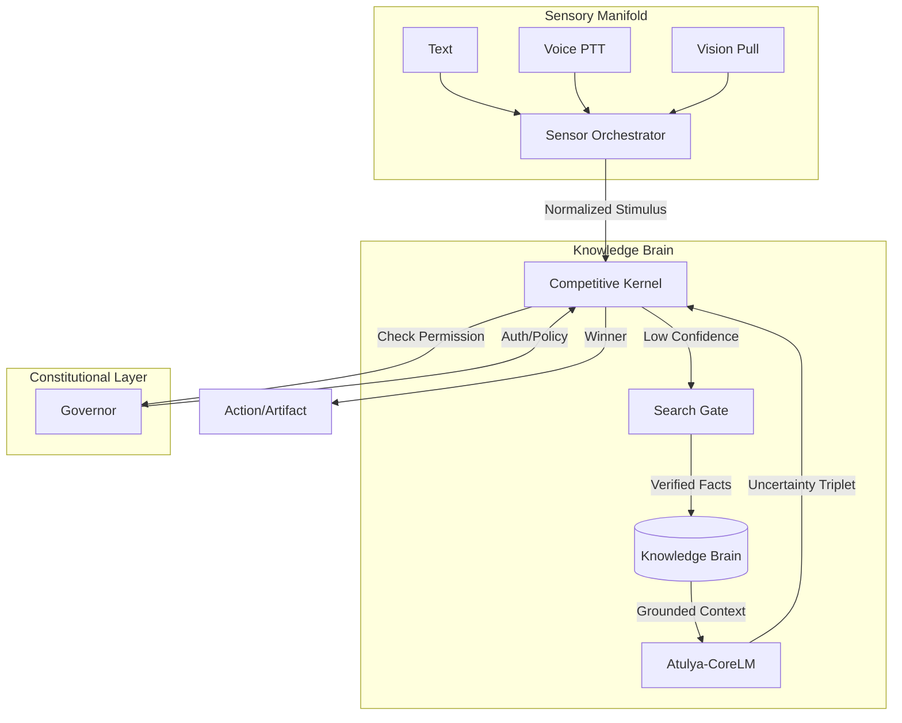

<div align="center">
  

  # Atulya Tantra
  ### *The Constrained Knowledge Organ*

  [](LICENSE)
  [](docs/architecture/ARCHITECTURE.md)
  [](docs/archival/walkthrough.md)
  [](docs/README.md)
  [](core/evolution/cycle_driver.py)
  
  **Atulya Tantra is an answer to the "Fragile Agency" problem.**
  
  *Truth is a structure. Authority is a kernel. Learning is a slow, governed curriculum.*

  [**Explore Architecture**](docs/architecture/ARCHITECTURE.md) • [**Read Constitution**](docs/adr/README.md) • [**Join Evolution**](core/evolution/cycle_driver.py)
</div>

---

## 🌒 The Philosophy
We stopped building "agents" that hallucinate. We started building **organs** that serve.

Atulya Tantra is not a chatbot. It is a **Constitutional Organism** designed for high-stakes autonomy. It replaces the "black box" of traditional LLM wrappers with a transparent, observable, and strictly governed **Competitive Kernel**.

> **"Core must be boring. Experiments must be disposable. Evidence must be archival."**

---

## 🧬 System Constitution (v1.0)

The system is defined by three immutable pillars. These are not features; they are laws.

### 1. The Sensory Manifold (Phase 1.0)
The system is embodied, but never overwhelmed.
- **👁️ Vision (Pull)**: Discrete, on-demand snapshots. No video streaming. Privacy by default.
- **🗣️ Voice (PTT)**: Intentional "Push-to-Talk" interface. No "always-listening" wiretap.
- **⚖️ Fairness**: A `SensorOrchestrator` guarantees that inputs (Voice, Text, Vision) compete fairly for attention.

### 2. The Knowledge Brain (Phase K)
The system separates what it *is* (Weights) from what it *knows* (Facts).
- **🧠 CoreLM (300M Tier)**: A local, recurrent "muscle" model. It effectively distills facts but never invents them.
- **🛡️ Search Gate**: Web access is read-only and **Confidence-Gated**. If the system is >40% confident, it is forbidden from searching.
- **🧱 The Wall**: Knowledge is stored in a clean, versioned `KnowledgeBrain` JSON store, separated from the messy weights.

### 3. The Evolutionary Law (Phase E)
The architecture is locked. Improvement happens through **Drift & Selection**.
- **📈 Drift Auditor**: A persistent telemetry layer that watches for "Entropy" (Strategy bias, Calibration loss).
- **🦋 Knowledge Cycles**: The system wakes up to resolve `UNKNOWN` topics, digests them, and goes back to sleep.
- **⚔️ Competitive Execution**: Two strategies (`SIMPLE` vs `ANALYTICAL`) fight for every task. The winner survives.

---

## 🏗️ Architecture



---

## 📂 The Archives
Navigate the living history of the system.

| Registry | Description | Status |
| :--- | :--- | :--- |
| [**Architecture Guide**](docs/architecture/ARCHITECTURE.md) | The technical blueprint and "Bio-Schematics". | **v1.0** |
| [**ADR Registry**](docs/adr/README.md) | Sequential loog of all 13 Design commitments. | **Locked** |
| [**Walkthrough**](docs/archival/walkthrough.md) | Evidence-driven certification of all phases. | **Certified** |
| [**Task History**](docs/archival/task.md) | The construction checklist. | **Complete** |

---

## 🚀 Awakening the System

Atulya Tantra operates in a continuous **Presence Loop**.

### Prerequisites
- Python 3.10+
- `numpy`, `torch` (for CoreLM scaffolding)

### Start the Loop
```powershell
# Enter the Always-On Presence Loop
python run_atulya_tantra.py --mode presence
```

### Interactions
- **Text**: Type naturally.
- **Vision**: Type `img` to trigger a discrete snapshot.
- **Voice**: Hold `v` (if configured) or use the simulation buffer.
- **Search**: Happens automatically when the system says "I don't know."

---

## 🤝 Contribution & License

Atulya Tantra is open-source under the **Apache 2.0 License**.

**We do not accept "Feature Requests".** 
We accept **Architectural Proposals (RFCs)** that respect the Constitution.

<div align="center">
  <sub>Built with ❤️, Discipline, and Rigor by the Advanced Agentic Coding Team</sub>
</div>
