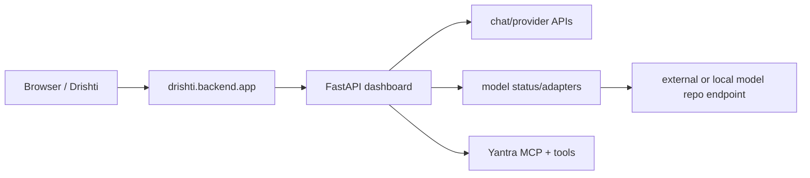

# Atulya Tantra

Atulya Tantra is a local-first AI workspace for the Atulya assistant: Drishti WebUI, provider routing, memory, actions, security/context helpers, and dashboard APIs in one repo.

The custom LLM/model work now lives in a separate model repository. This repo can call external/local models through routers and compatibility links, but it is no longer the source of truth for model training, checkpoints, tokenizer development, or custom architecture work.


## What This Is

| Area | Folder | Purpose |
|---|---|---|
| Atulya | `atulya/` | Personality, memory, identity, assistant brain, docs, Atulya-owned tests |
| Tantra | `tantra/` | Support layer for security, context, classification, compatibility links, and legacy NP-DNA references |
| Yantra | `yantra/` | Actions, tools, automation, browser/device/camera/voice systems, action tests |
| Drishti | `drishti/` | Mobile/desktop experience: Live Mode, chat, dashboard, backend APIs, frontend build |

The goal is a local AI system that can remember, inspect itself, route work to the right model/provider, automate tasks, and expose controls through a dashboard.


## Legacy NP-DNA Reference

The NP-DNA notes below are retained for compatibility and historical context only. Active custom model design, training, tokenizer changes, checkpoints, and release notes belong in the separate LLM/model repository.


NP-DNA uses a compact **genome** to generate strand weights. A sparse **mesh** routes each token to the most relevant specialist strands. The **cortex** stores external memory, and the **plasticity engine** watches load, dead strands, vocabulary pressure, and training behavior so the model can rebalance or grow.


Core ideas:

- **Genome-generated weights**: compact seeds plus a generator instead of every dense layer weight.
- **Specialist strands**: named groups like `main`, `sentiment`, `bias`, `security`, and `cortex`.
- **Sparse top-k routing**: a **mesh** layer scores every strand per token, activates only the top-k, and weight-sums their outputs. Compute stays linear in active strands, not total strands.
- **Memory cortex**: external vector memory for facts, state, and retrieval.
- **Plasticity**: vocabulary and strand growth hooks for adaptation during training.
- **Frozen codecs**: audio/image/video can become tokenizer-like streams without storing codec weights inside NP-DNA.

**Mesh routing breakdown**:

| Step | What happens |
|------|-------------|
| 1. Score | Router linear layer computes a score per strand: `scores = W_router @ x` |
| 2. Select | Top-k scores picked: `indices = scores.topk(k)` |
| 3. Normalize | Softmax over selected scores → weighted blend |
| 4. Execute | Only the k selected strands run their SSM on the token |
| 5. Combine | Weighted sum of strand outputs added to the residual stream |
| 6. Regularize | Router probabilities pushed toward uniform to prevent collapse |

## Current Layout

```text
Atulya Tantra/
|-- assets/                     # runtime-local app state: audio, temp files, scheduler state
|-- atulya/
|   |-- docs/                   # architecture, security, contribution guide, project map, images
|   |-- memory/                 # memory providers, tree, reflection, Obsidian export
|   |-- observability/          # usage, metrics, tracing, error tracking
|   |-- tests/                  # Atulya and integration tests
|   |-- persona.py
|   |-- identity.py             # compatibility wrapper
|   `-- cli.py
|-- config/                     # cross-package static configuration
|-- outputs/                    # generated reports, invoices, benchmark artifacts
|-- tantra/
|   |-- core/                   # security, context, encryption, task classification
|   |-- config/                 # support-layer configuration
|   |-- scripts/                # support and compatibility utilities
|   |-- npdna/                  # legacy/reference model compatibility code
|   |-- training/               # legacy/reference dataset and training utilities
|   |-- outputs/                # local generated artifacts, not model-repo source
|   `-- README.md               # boundary for what Tantra owns in this repo
|-- drishti/
|   |-- frontend/src/           # editable React frontend
|   |-- backend/dashboard/      # FastAPI app, helpers, state, routes
|   |-- api/                    # Drishti route wrappers
|   |-- dist/                   # built frontend assets
|   |-- build/                  # alternate generated frontend build artifacts
|   |-- tests/                  # Drishti tests
|   |-- package.json
|   `-- vite.config.js
|-- yantra/
|   |-- capabilities/           # gated tools, workflow, browser, voice, web search (canonical)
|   |-- harness.py              # canonical agents, skills, slash commands, safety, duplicate reports
|   |-- tools/                  # compatibility re-exports from capabilities/
|   |-- mcp/                    # MCP server/client/transport/manifest
|   |-- assistant/              # channels, sources, cron, task brain
|   |-- selfimprovement/        # unified self-improvement (bridge merged in)
|   |-- selfrepair.py           # automated error repair
|   |-- channels.py             # unified multi-channel communication (14 channels)
|   |-- dispatch.py             # smart dispatch layer (classifier + failover + tools)
|   |-- events.py               # event bus
|   |-- device_controller.py    # CPU-first device management
|   |-- notify/                 # notification system
|   |-- plugins/                # plugin SDK with trust levels
|   `-- tests/                  # Yantra action/tool tests
|-- start.bat
|-- pyproject.toml
`-- requirements.txt
```

More ownership detail lives in [atulya/docs/PROJECT_MAP.md](atulya/docs/PROJECT_MAP.md).
Root folder drift is checked by `python -m yantra.assistant.structure_audit`.

## Quick Start

Use Python 3.10+ with PyTorch installed. If Python is not on `PATH`, use your local interpreter path, for example `\Python311\python.exe`.

```powershell
python -m pip install -r requirements.txt
python -m pip install -e .
```

Build the dashboard frontend:

```powershell
cd drishti
npm install
npm run build
cd ..
```

Start the dashboard:

```powershell
start.bat
```

Or run the backend directly:

```powershell
python -u -m drishti.backend.app
```

Open:

```text
http://localhost:8501
```

First startup can take 30-60 seconds because FastAPI/Pydantic and Torch-related native modules load slowly.

## Environment & Pluggable Brains

Create a `.env` file in the root directory (based on `.env.example`). The dashboard reads these configurations on startup to configure path execution, binding configurations, and local/cloud intelligence fallback providers.

```text
# Host and port binding (Set host to 0.0.0.0 for mobile/local network access)
ATULYA_HOST=127.0.0.1
ATULYA_PORT=8501

# Python path configuration
ATULYA_BACKEND_PYTHON=\Python311\python.exe
ATULYA_TRAIN_PYTHON=\Python311\python.exe  # legacy compatibility only; active model training is external

# Pluggable cloud/local providers fallback chain
OPENAI_API_KEY=sk-proj-...
GEMINI_API_KEY=AIzaSy...
OPENROUTER_API_KEY=sk-or-v1-...
NVIDIA_API_KEY=nvapi-...
ATULYA_OLLAMA_HOST=http://localhost:11434
ATULYA_OLLAMA_MODEL=llama3

# Dashboard API authentication
ATULYA_DASHBOARD_TOKEN=my_secure_session_token
```

### Fallback Failover Order
When you submit a request, the `ProviderRouter` scans the list of configured keys and automatically failovers in this order:
1. **OpenAI**: Cloud-based GPT engines.
2. **Gemini**: Standard Gemini models.
3. **OpenRouter**: Cloud-based aggregator models.
4. **NVIDIA NIM**: Pluggable microservice containers.
5. **Ollama**: Local containerized LLMs or the separate model repo when exposed through an Ollama-compatible endpoint.
6. **OpenCode Zen**: Offline rule-based voice fallback if all endpoints are offline or keys are missing.

Local custom models should be integrated through a provider endpoint or adapter. Keep their training and checkpoint lifecycle in the separate model repo.

---

## Mobile Access (Like Siri or Gemini)

Atulya Tantra is built mobile-first. You can access the voice cockpit, real-time cameras, memory galaxies, and planning modules on your smartphone or tablet with the feeling of a native OS assistant (like Siri or Gemini).

### Step 1: Bind Server to Local Network
Configure your `.env` file to expose the server to the local network:
```text
ATULYA_HOST=0.0.0.0
ATULYA_PORT=8501
```
Start the dashboard using `start.bat`.

### Step 2: Open on Mobile
1. Find your computer's local IP address (e.g., `192.168.1.15`).
2. Open Safari (iOS) or Chrome (Android) on your mobile device.
3. Navigate to: `http://192.168.1.15:8501`.
4. Enter your session token (`ATULYA_DASHBOARD_TOKEN`) to authenticate.

### Step 3: Add to Home Screen (PWA Mode)
- **iOS (Safari)**: Tap the **Share** button at the bottom, scroll down, and select **Add to Home Screen**.
- **Android (Chrome)**: Tap the **three-dot menu** at the top right and select **Add to Home screen** or **Install App**.

This places a native launcher icon on your smartphone home screen. Opening it hides browser navigation controls and launches Atulya in full-screen immersion mode.

### Step 4: Engage Hands-Free Voice Cycle
1. Click **ENGAGE ORACLE** to grant microphone permission.
2. Check the **HANDS-FREE** checkbox.
3. The interface will open the microphone, listen for voice input, process thoughts across the digital nervous system, vocalize responses via edge-tts, and automatically re-open the mic for continuous conversation.

### Step 5: Remote Mobile Access (Anywhere in the World)
To talk to Atulya outside your home WiFi network:
- **Tailscale (Recommended)**: Install Tailscale on your host computer and your phone. You can access Atulya from anywhere using the private Tailscale IP (e.g., `http://100.x.y.z:8501`) securely, without opening public ports.
- **ngrok**: Expose local port 8501 securely to a public ngrok domain: `ngrok http 8501`.

---

## Model Repo Boundary

Do not add new custom LLM training flows to this repository. Model architecture work, tokenizer changes, training jobs, checkpoints, evaluations, and model release artifacts belong in the separate LLM/model repo.

Use this repo to connect models to the product:

- Add provider keys and endpoint URLs in `.env`.
- Route chat through `atulya/llm.py` and provider/router adapters.
- Surface status, links, and diagnostics in Drishti.
- Keep old NP-DNA utilities only for compatibility with historical dashboards, tests, and artifacts.

## Drishti Development

Run the Vite dev server:

```powershell
cd drishti
npm run dev
```

The dev server proxies `/api` and `/ws` to `http://127.0.0.1:8501`.

Build production assets:

```powershell
cd drishti
npm run build
```

Backend entrypoint:

```powershell
python -u -m drishti.backend.app
```

## Legacy Checkpoint Reference

Historical NP-DNA checkpoints may still exist under local `tantra/outputs/` paths for old dashboards and tests. Treat them as legacy/reference artifacts, not the active model source of truth.

One historical local checkpoint path was:

```text
tantra/outputs/npdna/versions/2026-05-24_v3_expanded_training
```

Its historical metadata said:

| Field | Value |
|---|---:|
| Config | `atulya_v1_small` |
| Layers | 6 |
| Total strands | 40 |
| Parameters | 1,097,376 |
| Active parameters | 423,040 |
| Compression ratio | 2.59x |
| Vocabulary | 564 / 4,096 |
| Cortex entries | 0 |
| Best loss | 27.12455177307129 |

Real layer list from `model_index.json`:

| File | Layer | Strands | top-k |
|---|---|---:|---:|
| `layer_main_001.pt` | main | 10 | 3 |
| `layer_sentiment.pt` | sentiment | 4 | 1 |
| `layer_bias.pt` | bias | 4 | 1 |
| `layer_security.pt` | security | 4 | 1 |
| `layer_cortex.pt` | cortex | 8 | 2 |
| `layer_main_002.pt` | main | 10 | 3 |

The second `main` layer was not pre-created. It appeared in v3 because the historical training run recorded this structural event:

```json
{
  "step": 2,
  "type": "add_layer",
  "details": "added main layer 1 -> 2; reason: plateau"
}
```

## Dashboard And Automation



Important Yantra locations:

- `yantra/capabilities/`: file read/write/edit, gated shell execution, web search/fetch, todo, memory, browser, voice, and workflow capabilities (canonical)
- `yantra/harness.py`: ECC-inspired command surface for agents, skills, commands, safety checks, and duplicate reports. Add new Jarvis-style behavior here first, then route into existing capabilities instead of creating parallel folders.
- `yantra/tools/`: compatibility re-exports from capabilities/ for older callers
- `yantra/channels.py`: unified 14-channel system (Discord, Telegram, Slack, Email, Webhook, WhatsApp, Signal, Matrix, Teams, IRC, WebChat, Console, Log, Twitter)
- `yantra/mcp/`: MCP server, transport, manifest signing, external client, dashboard bridge
- `yantra/assistant/`: channels, sources, cron scheduler, task brain
- `yantra/selfimprovement/`: unified self-improvement (bridge functionality merged into unified.py, original bridge.py deleted)

Yantra harness pattern:

- Agents define who should handle work: planner, coder, researcher, memory manager, safety checker, self-improvement, and automation operator.
- Skills define reusable abilities and point to one canonical tool name.
- Slash commands such as `/remember`, `/recall`, `/research`, `/scan-project`, `/scrub-data`, `/payroll`, `/gst`, `/invoice`, and `/sap` resolve through the harness before dispatch.
- Duplicate cleanup is handled by canonical registration: aliases map to one command or skill, and `YantraHarness.report_duplicates()` shows duplicate tool registration attempts.

## Memory And Identity

Atulya application memory lives in `atulya/memory/`. Memory is part of the assistant brain, not a fifth top-level product folder.

| Module | Purpose |
|---|---|
| `orchestrator.py` | provider registry and context assembly |
| `session_search.py` | session text search |
| `prompt_cache.py` | prompt/result cache |
| `subconscious.py` | decision/event log |
| `reflection.py` | insights and reflective notes |
| `tree.py` | hierarchical memory summaries |
| `obsidian.py` | markdown vault export |

Identity and prompt behavior are controlled by `atulya/identity.py` and the Atulya memory/persona modules. The old `tantra/training/datasets/identity.json` file is kept only for legacy compatibility.

## API Example

Token-protected dashboard routes expect `X-Atulya-Token`.

```powershell
$token = $env:ATULYA_DASHBOARD_TOKEN
Invoke-RestMethod http://127.0.0.1:8501/api/system -Headers @{"X-Atulya-Token"=$token}
```

Routes implemented by the current backend:

| Route | Method | Real source |
|---|---|---|
| `/api/dashboard/bootstrap` | GET | combines system stats, configs, datasets, checkpoints, history |
| `/api/system` | GET | `psutil` CPU/RAM/disk plus Python version |
| `/api/configs` | GET | legacy NP-DNA config compatibility for older dashboard controls |
| `/api/datasets` | GET | legacy dataset listing for older dashboard controls |
| `/api/run-history` | GET | legacy checkpoint metadata when present locally |
| `/api/training-status` | GET | legacy local training status compatibility |
| `/api/training-metrics` | GET | legacy local metrics compatibility |
| `/api/train/start` | POST | legacy compatibility only; active training belongs in the model repo |
| `/api/train/stop` | POST | legacy compatibility only |
| `/api/chat` | POST | blocking chat routed through provider/model adapters |
| `/api/chat/stream` | POST | Server-Sent Events token stream |
| `/api/plasticity/check` | POST | legacy checkpoint metadata compatibility |
| `/api/model/status` | GET | model/provider warm status where available |
| `/api/checkpoints` | GET | legacy local checkpoint list |
| `/api/cortex/stats` | GET | legacy cortex metadata compatibility |
| `/api/cortex/entries` | GET | legacy cortex metadata entries when present |
| `/api/auth/login` | POST | validates the dashboard token |
| `/v1/models` | GET | OpenAI-compatible model list |

## Verification

```powershell
python -m pytest atulya/tests tantra/tests yantra/tests drishti/tests -q
python -m pytest -q  # current suite: 413 passing tests
python -m atulya.cli info
```

## Notes

- Do not commit `.env`; it can contain secrets.
- Do not commit `tantra/outputs/`, generated checkpoints, `__pycache__`, or large local datasets unless intentionally publishing data elsewhere.
- `drishti/node_modules` can exist locally for development, but should not be treated as source.
- `assets/` replaces the old root `data/` directory for app config cache (prompt_cache).
- Active LLM training data, checkpoints, and tokenizer artifacts belong in the separate model repo.
- `tantra/data/`, `tantra/training/`, and `tantra/npdna/` are retained here only for legacy compatibility and historical reference.
