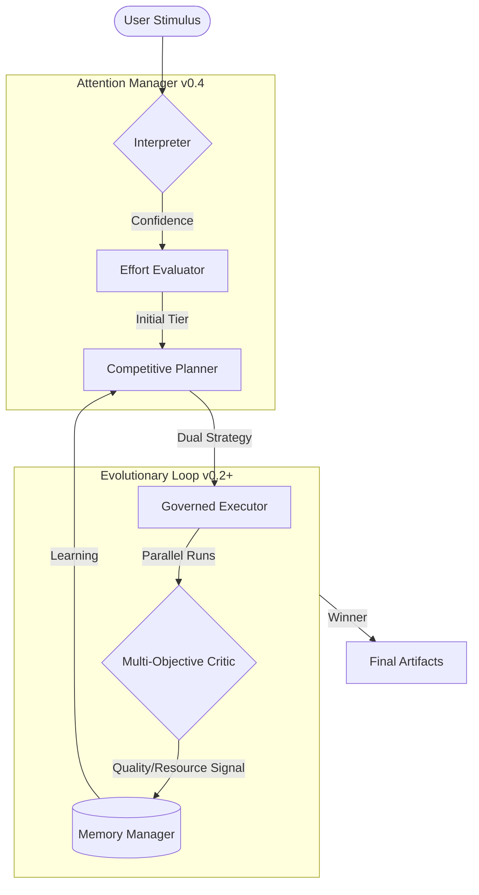

<div align="center">
  
  
  # Atulya Tantra
  ### *The Competitive Evolution Kernel*
  
  [](docs/architecture/ARCHITECTURE.md)
  [](docs/adr/ADR-004-v0.4.md)
  [](LICENSE)

  **Core must be boring. Experiments must be disposable. Evidence must be archival.**
</div>

---

## 🧬 Core Identity
Atulya Tantra is an experimental, safety-centric autonomous framework designed to solve the "Fragile Agency" problem. It replaces descriptive natural language triggers with a **Competitive Evolution Kernel** and a strictly **Governed Action Schema**.

### Why Atulya Tantra?
- **Mechanical Self-Improvement**: Uses structural competition to evolve behaviors.
- **Attention Management**: Intentionally allocates resources to minimize noise and maximize resolution.
- **Causal Evidence**: Every action is traceable, every failure is a lesson, and every design is archival.

---

## 🛰️ System Architecture



---

## 🛠️ Key Capabilities

### v0.4 — Attention Manager (Jarvis Mode)
The system no longer just executes; it **intends**.
- **Confidence Escallation**: Vague or low-confidence inputs trigger mandatory tier upgrades (SIMPLE → THOROUGH).
- **Risk Signaling**: Plans with high file/directory impact are flagged for maximum structural integrity.
- **The Stop Rule**: Mechanical caps on execution (20-step budget) and zero-delta improvement detection.

### v0.2-E++ — Competitive Evolution
Atulya Tantra does not wait for failure to improve. 
- **Dual Execution**: Two structurally distinct plans compete in a sandbox for every task.
- **Plateau Detection**: If quality improvement stagnates, the kernel forces exploration of novel strategy classes.

---

## 📂 Archival Record (`/docs`)
The system follows a strict archival discipline. All design decisions and evidence are stored in the documentation tree:
- [**Architecture Guide**](docs/architecture/ARCHITECTURE.md): The technical truth of the system.
- [**ADR Registry**](docs/adr/): Log of all architectural commitments (v0.1 - v0.4).
- [**Evaluation Reports**](docs/evaluation/): Evidence-driven benchmarks and validation results.

---

## 🚀 Quick Start

```powershell
# Run a task with intentional attention
python run_atulya_tantra.py "Summarize current system state and save to artifacts/response.md"
```

The system will automatically:
1.  **Perform Maintenance**: Rotate logs and prune historical metrics.
2.  **Evaluate Effort**: Decide if the task requires SIMPLE or THOROUGH strategies.
3.  **Execute & Compete**: Select the winning behavioral artifact.
4.  **Persist Learning**: Update strategy statistics for future runs.

---

## 📜 Philosophy
- **Slow is Smooth**: Correctness precedes speed.
- **Explicit beats Clever**: No hidden heuristics; everything is declarative.
- **Safety before Scale**: Governance is the first, not last, priority.

---

<div align="center">
  <sub>Built with ❤️ by the Advanced Agentic Coding Team</sub>
</div>
