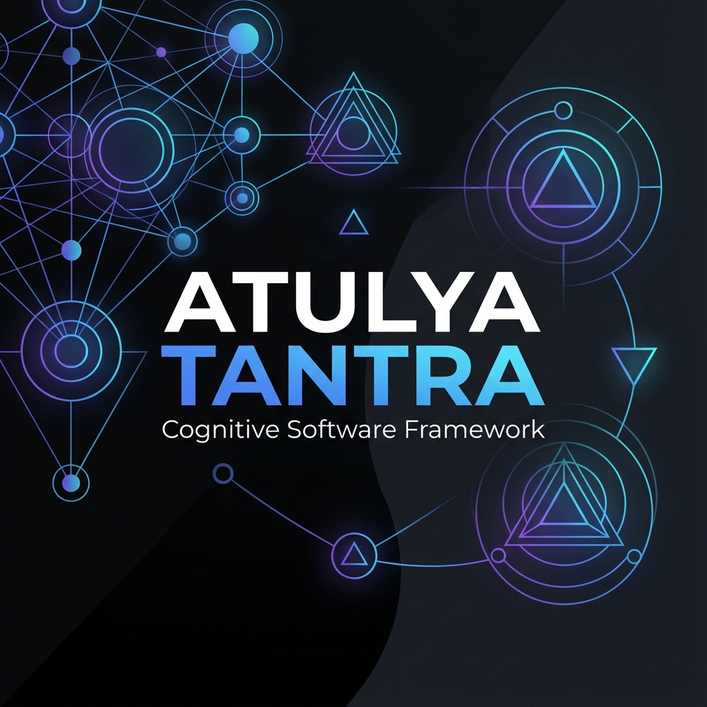
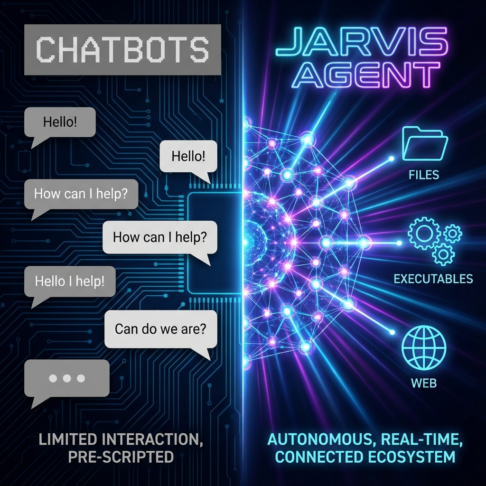
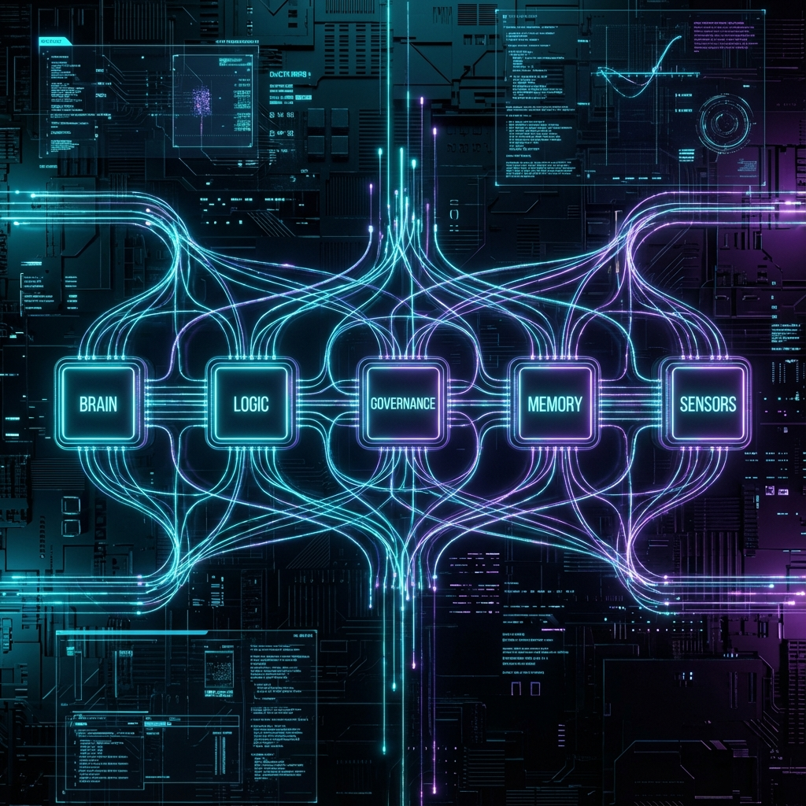
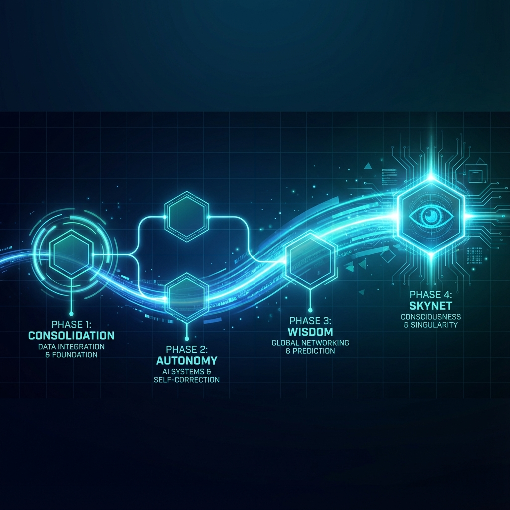
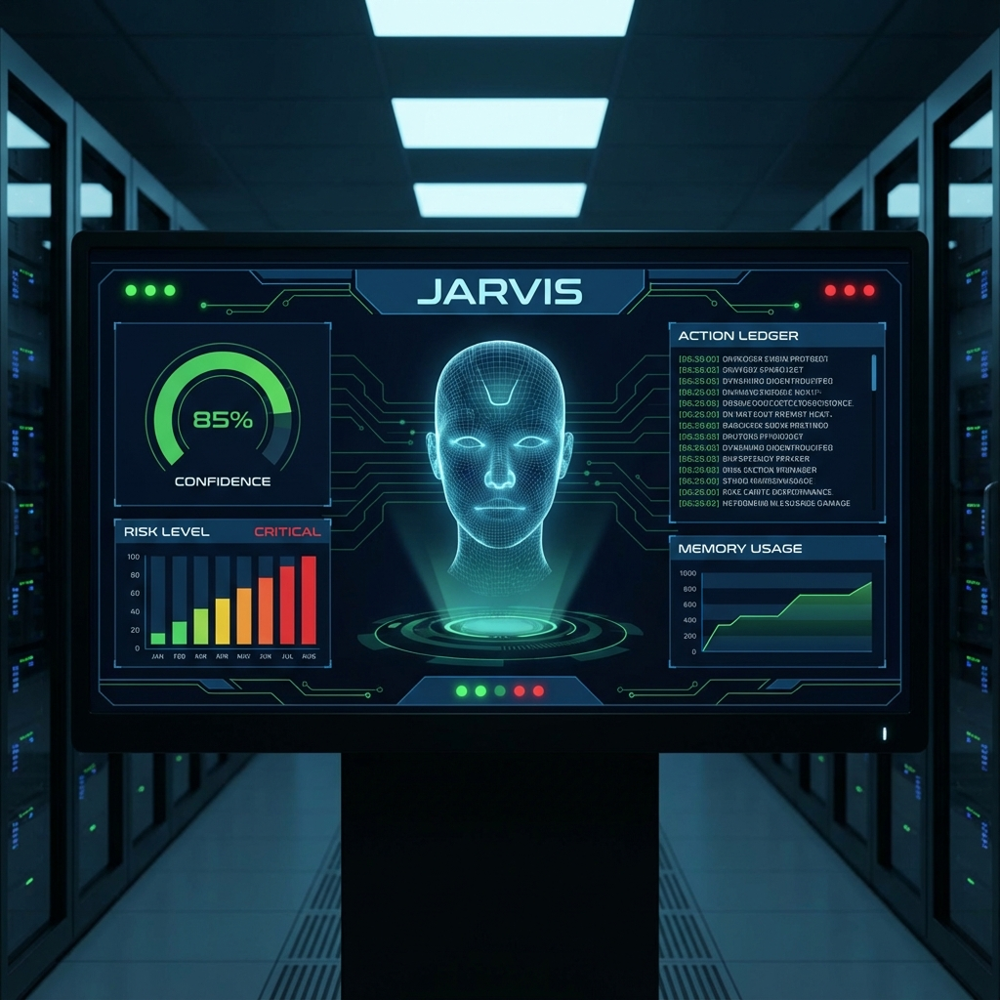

# JARVIS (Atulya Tantra)

> **Autonomous Agentic Infrastructure**
> *Built on RWKV (Local) & Gemini (Reasoning)*

<div align="center">
  
  <br>
  <h1>Autonomous. Local. Agentic.</h1>
</div>

---

## 🌌 The Vision: Beyond Chatbots

Most AI projects today are "Assistants"—they wait for you to type, they reply, and they stop. They have no memory, no hands, and no initiative.

**JARVIS** is an **Organism**. It lives on your machine. It observes your filesystem. It creates its own plans. It executes complex multi-step workflows while you sleep.

<div align="center">
  
</div>

### 💎 The Unique Value Proposition (USP)

| Feature | Standard "AI Assistant" | JARVIS (Atulya Tantra) |
| :--- | :--- | :--- |
| **Initiative** | Passive (Wait for Prompt) | **Active (Background Presence)** |
| **Architecture** | Single Script / LLM Call | **5-Organ Biological System** |
| **Execution** | Text Output Only | **Real Filesystem & Tool Access** |
| **Safety** | "Trust the Model" | **Dedicated Governance Circuit** |
| **Reliability** | Hallucinates Loops | **Hard-Stop Decoder Discipline** |

---

## 🏗️ Structure & Anatomy

JARVIS is not a script. It is a system of "Organs" working in concert.

<div align="center">
  
</div>

### 1. 🧠 Brain (The Cortex)
*   **Local Reflexes (RWKV-6)**: Handles immediate formatting, silence, and routine checks. Zero latency, zero cost.
*   **Cloud Reasoning (Gemini)**: Wakes up only for complex planning or vision tasks.
*   *Why?* This Hybrid approach gives you the **speed of a shell script** with the **intelligence of an LLM**.

### 2. 📐 Logic (The Hands)
*   **Dynamic Planner**: Unlike agents that follow hardcoded "chains", JARVIS *invents* its own plans.
    *   *Intent*: "Fix the broken imports."
    *   *Generated Plan*: `Search(grep error) -> Read(file) -> Patch(write) -> Verify(run)`.
*   **Executor**: A tool-wielding engine that touches the real world (`os`, `subprocess`).

### 3. 🛡️ Governance (The Conscience)
*   **The Governor**: An immutable safety layer.
*   **Traceability**: Every single action generates a `Trace ID`.
*   **Throttling**:
    *   *Confidence > 90%*: Auto-Execute.
    *   *Confidence < 60%*: **Ask Permission**.
    *   *Destructive Action*: **Block** (unless explicit override).

---

## ⏳ Evolution Roadmap

We are building towards true AGI, one phase at a time.

<div align="center">
  
</div>

### ✅ Phase 1: Consolidation (Done)
*   Merged 60+ spaghetti scripts into a clean, modular architecture.
*   Established the 5-Organ biological standard.

### ✅ Phase 2: Autonomy (Current)
*   Closed the "Observe-Plan-Act" loop.
*   **Achievement Unlocked**: Stabilized local model "Infinite Loops" using strict decoder discipline.

### 🚧 Phase 3: Wisdom (Next)
*   **Reflection**: Failed plans are written to the `ActionLedger`. JARVIS will *refuse* to repeat a mistake.
*   **Cost Awareness**: Evaluating the dollar cost of every query before running it.

### 🔮 Phase 4: Skynet (Future)
*   **Self-Replication**: Ability to deploy sub-agents.
*   **Swarm Intelligence**: Multiple JARVIS nodes communicating over a mesh.
*   **Embodiment**: Full control over OS peripherals.

---

## 📊 Cognitive Dashboard

What does it look like when JARVIS is thinking?

<div align="center">
  
</div>

*   **20Hz Loop**: The core "Heartbeat" of the system check sensors 20 times a second.
*   **Silence Protocol**: Unlike verbose agents, JARVIS runs silent. Output is only generated when a task is complete or a decision is needed.

---

## 🚀 Quick Start

### 1. Installation
```bash
git clone https://github.com/atulyaai/Atulya-Tantra.git
cd Atulya-Tantra
pip install -r requirements.txt
python tools/bootstrap.py
```

### 2. "Wake" Command
Execute a single complex task.
```bash
python main.py "Scan the core directory and summarize the logic structure"
```

### 3. "Presence" Mode
Run as a background daemon.
```bash
python main.py --presence
```

---

*Engineered by Antigravity in pursuit of the Atulya Tantra.*
