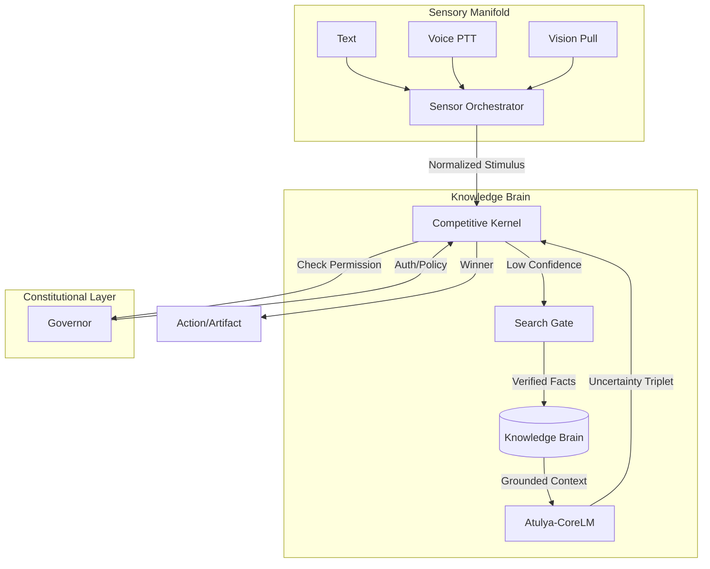

<div align="center">
  
  
  # Atulya Tantra
  ### *The Constrained Knowledge Organ*
  
  [](docs/architecture/ARCHITECTURE.md)
  [](docs/archival/walkthrough.md)
  [](LICENSE)

  **Truth is a structure. Authority is a kernel. Learning is a curriculum.**
</div>

---

## 🧬 System Constitution
Atulya Tantra is a "Constitutional AI" framework designed for high-stakes agency. Unlike traditional LLM wrappers, it treats the model as a restricted **organ** within a governed **system**. It is designed to be CPU-friendly, stateful, and strictly truth-bound.

### Core Pillars
- **Strict Embodiment**: All sensory input (Text, Voice, Vision) is normalized and arbitrated by a thread-safe Orchestrator.
- **Knowledge Brain**: A persistent, versioned fact store that separates *Truth* from *Weights*.
- **Governed Search**: Web access is confidence-gated and read-only, preventing news-poisoning or auto-belief loops.
- **Evolutionary Stability**: The system evolves through intentional, law-governed cycles (Phase E) and internal drift auditing.

---

## 🏗️ Technical Architecture (v1.0)



---

## 📂 Archival Registry
- [**Architecture Guide**](docs/architecture/ARCHITECTURE.md): The technical truth of the system (Updated for v1.0).
- [**ADR Registry**](docs/adr/README.md): Log of all architectural commitments (ADR-001 to ADR-013).
- [**Walkthrough**](docs/archival/walkthrough.md): Evidence-driven certification of all system phases.
- [**Task History**](docs/archival/task.md): Detailed checklist of project progression.

---

## 🛠️ Operational Modes

### 1. Embodied Presence
The system is "always-on," polling for discrete stimuli.
- **PTT (Push-To-Talk)**: Intentional voice capture with 'v' and 's'.
- **Vision (Pull)**: Manual snapshots via 'img'.
- **Fairness**: Quota-based attention prevents sensor starvation.

### 2. Knowledge Acquisition (Governed)
- **Atulya-CoreLM**: Local, recurrent, 300M tier model focused on distillation.
- **Search Gate**: Authorizes web retrieval only when internal knowledge is `UNKNOWN`.
- **Drift Audit**: Measures confidence calibration and strategy bias to ensure long-term stability.

---

## 🚀 Execution

```powershell
# Enter the Always-On Presence Loop
python run_atulya_tantra.py --mode presence
```

---

## 📜 Principles
1. **Mechanical Integrity**: Structures do not change without an ADR.
2. **Privacy First**: Local transcription, ephemeral audio/image buffers.
3. **Defense in Depth**: Grounding, governance, and auditing must all agree.

<div align="center">
  <sub>Built with ❤️ by the Advanced Agentic Coding Team</sub>
</div>
