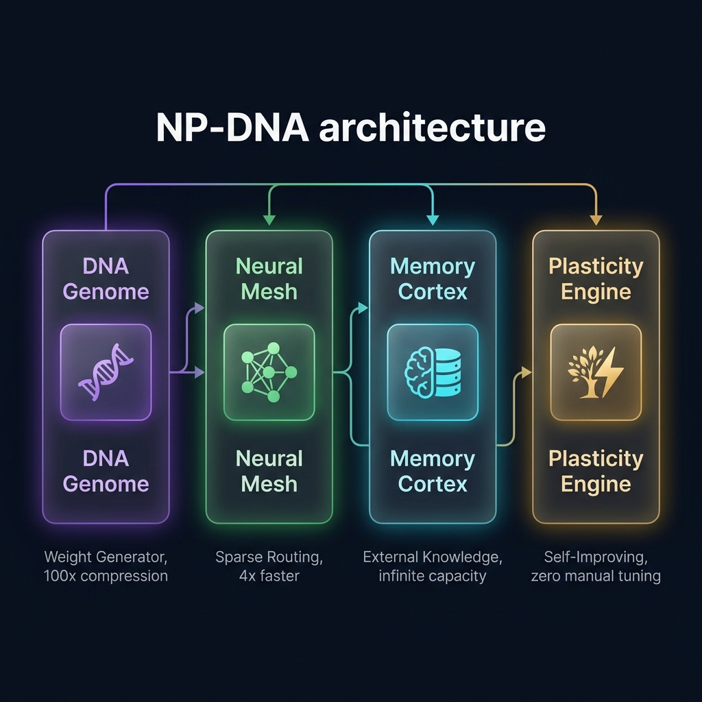
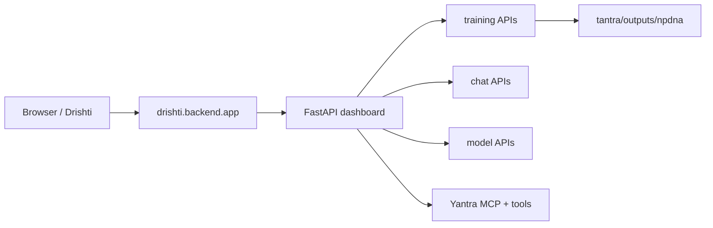

# Atulya Tantra

Atulya Tantra is a local-first AI workspace built around **NP-DNA**: a NeuroPlastic DNA Network that keeps a compact genome, generates neural weights on demand, routes tokens through specialist strands, and connects model training, memory, Drishti, and automation in one repo.


## What This Is

| Area | Folder | Purpose |
|---|---|---|
| Atulya | `atulya/` | Personality, memory, identity, assistant brain, docs, Atulya-owned tests |
| Tantra | `tantra/` | NP-DNA model package, tokenizer, checkpoints, training, datasets, model tests |
| Yantra | `yantra/` | Actions, tools, automation, browser/device/camera/voice systems, action tests |
| Drishti | `drishti/` | Mobile/desktop experience: Live Mode, chat, dashboard, backend APIs, frontend build |

The goal is a local AI system that can train, grow, remember, inspect itself, automate tasks, and expose controls through a dashboard.



## NP-DNA In One Picture



NP-DNA uses a compact **genome** to generate strand weights. A sparse **mesh** routes each token to the most relevant specialist strands. The **cortex** stores external memory, and the **plasticity engine** watches load, dead strands, vocabulary pressure, and training behavior so the model can rebalance or grow.


Core ideas:

- **Genome-generated weights**: compact seeds plus a generator instead of every dense layer weight.
- **Specialist strands**: named groups like `main`, `sentiment`, `bias`, `security`, and `cortex`.
- **Sparse top-k routing**: a **mesh** layer scores every strand per token, activates only the top-k, and weight-sums their outputs. Compute stays linear in active strands, not total strands.
- **Memory cortex**: external vector memory for facts, state, and retrieval.
- **Plasticity**: vocabulary and strand growth hooks for adaptation during training.
- **Frozen codecs**: audio/image/video can become tokenizer-like streams without storing codec weights inside NP-DNA.

**Mesh routing breakdown**:

| Step | What happens |
|------|-------------|
| 1. Score | Router linear layer computes a score per strand: `scores = W_router @ x` |
| 2. Select | Top-k scores picked: `indices = scores.topk(k)` |
| 3. Normalize | Softmax over selected scores → weighted blend |
| 4. Execute | Only the k selected strands run their SSM on the token |
| 5. Combine | Weighted sum of strand outputs added to the residual stream |
| 6. Regularize | Router probabilities pushed toward uniform to prevent collapse |

## Current Layout

```text
Atulya Tantra/
|-- assets/                     # runtime-local app state: audio, temp files, scheduler state
|-- atulya/
|   |-- docs/                   # architecture, security, contribution guide, project map, images
|   |-- memory/                 # memory providers, tree, reflection, Obsidian export
|   |-- observability/          # usage, metrics, tracing, error tracking
|   |-- tests/                  # Atulya and integration tests
|   |-- persona.py
|   |-- identity.py             # compatibility wrapper
|   `-- cli.py
|-- config/                     # cross-package static configuration
|-- outputs/                    # generated reports, invoices, benchmark artifacts
|-- tantra/
|   |-- npdna/                  # model, genome, mesh, tokenizer, cortex, checkpointing
|   |-- core/                   # security, context, encryption, task classification
|   |-- training/               # trainer, benchmark, dataset builders, RAG
|   |   `-- datasets/           # identity.json and tokenizer.json live here
|   |-- assets/                 # model-adjacent generated support assets
|   |-- data/                   # training data examples, health scans
|   |-- outputs/                # generated model outputs and checkpoints
|   `-- tests/                  # Tantra model/training tests
|-- drishti/
|   |-- frontend/src/           # editable React frontend
|   |-- backend/dashboard/      # FastAPI app, helpers, state, routes
|   |-- api/                    # Drishti route wrappers
|   |-- dist/                   # built frontend assets
|   |-- build/                  # alternate generated frontend build artifacts
|   |-- tests/                  # Drishti tests
|   |-- package.json
|   `-- vite.config.js
|-- yantra/
|   |-- capabilities/           # gated tools, workflow, browser, voice, web search (canonical)
|   |-- harness.py              # canonical agents, skills, slash commands, safety, duplicate reports
|   |-- tools/                  # compatibility re-exports from capabilities/
|   |-- mcp/                    # MCP server/client/transport/manifest
|   |-- assistant/              # channels, sources, cron, task brain
|   |-- selfimprovement/        # unified self-improvement (bridge merged in)
|   |-- selfrepair.py           # automated error repair
|   |-- channels.py             # unified multi-channel communication (14 channels)
|   |-- dispatch.py             # smart dispatch layer (classifier + failover + tools)
|   |-- events.py               # event bus
|   |-- device_controller.py    # CPU-first device management
|   |-- notify/                 # notification system
|   |-- plugins/                # plugin SDK with trust levels
|   `-- tests/                  # Yantra action/tool tests
|-- start.bat
|-- pyproject.toml
`-- requirements.txt
```

More ownership detail lives in [atulya/docs/PROJECT_MAP.md](atulya/docs/PROJECT_MAP.md).
Root folder drift is checked by `python -m yantra.assistant.structure_audit`.

## Quick Start

Use Python 3.10+ with PyTorch installed. If Python is not on `PATH`, use your local interpreter path, for example `\Python311\python.exe`.

```powershell
python -m pip install -r requirements.txt
python -m pip install -e .
```

Build the dashboard frontend:

```powershell
cd drishti
npm install
npm run build
cd ..
```

Start the dashboard:

```powershell
start.bat
```

Or run the backend directly:

```powershell
python -u -m drishti.backend.app
```

Open:

```text
http://localhost:8501
```

First startup can take 30-60 seconds because FastAPI/Pydantic and Torch-related native modules load slowly.

## Environment & Pluggable Brains

Create a `.env` file in the root directory (based on `.env.example`). The dashboard reads these configurations on startup to configure path execution, binding configurations, and local/cloud intelligence fallback providers.

```text
# Host and port binding (Set host to 0.0.0.0 for mobile/local network access)
ATULYA_HOST=127.0.0.1
ATULYA_PORT=8501

# Python path configuration
ATULYA_BACKEND_PYTHON=\Python311\python.exe
ATULYA_TRAIN_PYTHON=\Python311\python.exe

# Pluggable cloud/local providers fallback chain
OPENAI_API_KEY=sk-proj-...
GEMINI_API_KEY=AIzaSy...
OPENROUTER_API_KEY=sk-or-v1-...
NVIDIA_API_KEY=nvapi-...
ATULYA_OLLAMA_HOST=http://localhost:11434
ATULYA_OLLAMA_MODEL=llama3

# Dashboard API authentication
ATULYA_DASHBOARD_TOKEN=my_secure_session_token
```

### Fallback Failover Order
When you submit a request, the `ProviderRouter` scans the list of configured keys and automatically failovers in this order:
1. **Tantra (Local NP-DNA)**: Running entirely offline on CPU/GPU.
2. **OpenAI**: Cloud-based GPT engines.
3. **Gemini**: Standard Gemini models.
4. **OpenRouter**: Cloud-based aggregator models.
5. **NVIDIA NIM**: Pluggable microservice containers.
6. **Ollama**: Local containerized LLMs.
7. **OpenCode Zen**: Offline rule-based voice fallback if all endpoints are offline or keys are missing.

---

## Mobile Access (Like Siri or Gemini)

Atulya Tantra is built mobile-first. You can access the voice cockpit, real-time cameras, memory galaxies, and planning modules on your smartphone or tablet with the feeling of a native OS assistant (like Siri or Gemini).

### Step 1: Bind Server to Local Network
Configure your `.env` file to expose the server to the local network:
```text
ATULYA_HOST=0.0.0.0
ATULYA_PORT=8501
```
Start the dashboard using `start.bat`.

### Step 2: Open on Mobile
1. Find your computer's local IP address (e.g., `192.168.1.15`).
2. Open Safari (iOS) or Chrome (Android) on your mobile device.
3. Navigate to: `http://192.168.1.15:8501`.
4. Enter your session token (`ATULYA_DASHBOARD_TOKEN`) to authenticate.

### Step 3: Add to Home Screen (PWA Mode)
- **iOS (Safari)**: Tap the **Share** button at the bottom, scroll down, and select **Add to Home Screen**.
- **Android (Chrome)**: Tap the **three-dot menu** at the top right and select **Add to Home screen** or **Install App**.

This places a native launcher icon on your smartphone home screen. Opening it hides browser navigation controls and launches Atulya in full-screen immersion mode.

### Step 4: Engage Hands-Free Voice Cycle
1. Click **ENGAGE ORACLE** to grant microphone permission.
2. Check the **HANDS-FREE** checkbox.
3. The interface will open the microphone, listen for voice input, process thoughts across the digital nervous system, vocalize responses via edge-tts, and automatically re-open the mic for continuous conversation.

### Step 5: Remote Mobile Access (Anywhere in the World)
To talk to Atulya outside your home WiFi network:
- **Tailscale (Recommended)**: Install Tailscale on your host computer and your phone. You can access Atulya from anywhere using the private Tailscale IP (e.g., `http://100.x.y.z:8501`) securely, without opening public ports.
- **ngrok**: Expose local port 8501 securely to a public ngrok domain: `ngrok http 8501`.

---

## Training

Main trainer:

```powershell
python -m tantra.training.npdna_train --config atulya_seed --steps 1000 --data tantra\training\datasets\identity.json --device cpu --pack
```

Train from all JSONL datasets:

```powershell
python -m tantra.training.npdna_train --config atulya_seed --steps 50000 --data tantra\training\datasets\identity.json --device cpu --pack
```

Benchmark a checkpoint/config:

```powershell
python -m tantra.training.benchmark --config atulya_seed --max-samples 64
```

Evaluate checkpoints:

```powershell
python -m tantra.core.eval_checkpoints
```

When `All Datasets` is selected in the Drishti, `Training Steps` means total optimizer steps across the combined dataset stream, not steps per dataset.

## Config Presets


| Config | Vocab | Hidden | State | Layers | Mesh |
|---|---:|---:|---:|---:|---|
| `atulya_seed` | 4,096 | 64 | 32 | 2 | 4 strands/layer, top-k 3 |
| `atulya_small` | 4,096 | 64 | 32 | 5 named layers | main/sentiment/bias/security/cortex |
| `atulya_medium` | 50,000 | 512 | 256 | 6 | 12 strands/layer, top-k 3 |
| `atulya_large` | 50,000 | 768 | 512 | 5 named layers | main/sentiment/bias/security/cortex |

Inspect presets:

```powershell
python -m atulya.cli info
```

Pick a preset automatically by parameter budget:

```python
from tantra.npdna.config import auto_config

cfg = auto_config(target_params=5_000_000)
print(cfg.hidden_size, cfg.total_strands)
```

Legacy names such as `seed`, `nano`, `micro`, `small`, `medium`, `atulya_v1_small`, and `atulya` remain as compatibility aliases for old checkpoints and scripts. New commands should use the four `atulya_*` names.

## Making Layers Unique

The simplest preset repeats the same mesh for every layer. The named Atulya presets use `mesh_specs`, where each layer has its own name, strand count, and `top_k`.

```python
from tantra.npdna.config import (
    CodecConfig,
    CortexConfig,
    GenomeConfig,
    LayerSpec,
    NpDnaConfig,
)

custom = NpDnaConfig(
    initial_vocab=8192,
    hidden_size=128,
    state_size=64,
    genome=GenomeConfig(
        latent_dim=256,
        rank=24,
        max_strands=128,
        encoder_hidden=512,
    ),
    mesh_specs=[
        LayerSpec(name="main", num_strands=16, top_k=3),
        LayerSpec(name="reasoning", num_strands=12, top_k=3),
        LayerSpec(name="safety", num_strands=6, top_k=1),
        LayerSpec(name="memory", num_strands=8, top_k=2),
        LayerSpec(name="tool_use", num_strands=6, top_k=1),
    ],
    cortex=CortexConfig(dim=128, max_entries=100_000, top_k=8),
    codecs=CodecConfig(
        audio_codec="frozen://encodec/tokenizer",
        image_codec="frozen://vqgan/tokenizer",
    ),
)
```

Layer design examples:

| Layer | Good For | Suggested Shape |
|---|---|---|
| `main` | general language modeling | many strands, `top_k=3` |
| `reasoning` | multi-step tasks, code, math | medium strands, `top_k=2` or `3` |
| `safety` | refusal, secrets, policy checks | fewer strands, `top_k=1` |
| `memory` / `cortex` | retrieval-heavy tokens | medium strands, `top_k=2` |
| `tool_use` | command and function planning | fewer strands, `top_k=1` |
| `sentiment` / `bias` | style and affect control | small strands, `top_k=1` |

## Drishti Development

Run the Vite dev server:

```powershell
cd drishti
npm run dev
```

The dev server proxies `/api` and `/ws` to `http://127.0.0.1:8501`.

Build production assets:

```powershell
cd drishti
npm run build
```

Backend entrypoint:

```powershell
python -u -m drishti.backend.app
```

## Real Checkpoint Example

The current best local checkpoint is:

```text
tantra/outputs/npdna/versions/2026-05-24_v3_expanded_training
```

Its real metadata says:

| Field | Value |
|---|---:|
| Config | `atulya_v1_small` |
| Layers | 6 |
| Total strands | 40 |
| Parameters | 1,097,376 |
| Active parameters | 423,040 |
| Compression ratio | 2.59x |
| Vocabulary | 564 / 4,096 |
| Cortex entries | 0 |
| Best loss | 27.12455177307129 |

Real layer list from `model_index.json`:

| File | Layer | Strands | top-k |
|---|---|---:|---:|
| `layer_main_001.pt` | main | 10 | 3 |
| `layer_sentiment.pt` | sentiment | 4 | 1 |
| `layer_bias.pt` | bias | 4 | 1 |
| `layer_security.pt` | security | 4 | 1 |
| `layer_cortex.pt` | cortex | 8 | 2 |
| `layer_main_002.pt` | main | 10 | 3 |

The second `main` layer was not pre-created. It appears in v3 because training recorded this structural event:

```json
{
  "step": 2,
  "type": "add_layer",
  "details": "added main layer 1 -> 2; reason: plateau"
}
```

## Dashboard And Automation



Important Yantra locations:

- `yantra/capabilities/`: file read/write/edit, gated shell execution, web search/fetch, todo, memory, browser, voice, and workflow capabilities (canonical)
- `yantra/harness.py`: ECC-inspired command surface for agents, skills, commands, safety checks, and duplicate reports. Add new Jarvis-style behavior here first, then route into existing capabilities instead of creating parallel folders.
- `yantra/tools/`: compatibility re-exports from capabilities/ for older callers
- `yantra/channels.py`: unified 14-channel system (Discord, Telegram, Slack, Email, Webhook, WhatsApp, Signal, Matrix, Teams, IRC, WebChat, Console, Log, Twitter)
- `yantra/mcp/`: MCP server, transport, manifest signing, external client, dashboard bridge
- `yantra/assistant/`: channels, sources, cron scheduler, task brain
- `yantra/selfimprovement/`: unified self-improvement (bridge functionality merged into unified.py, original bridge.py deleted)

Yantra harness pattern:

- Agents define who should handle work: planner, coder, researcher, memory manager, safety checker, self-improvement, and automation operator.
- Skills define reusable abilities and point to one canonical tool name.
- Slash commands such as `/remember`, `/recall`, `/research`, `/scan-project`, `/scrub-data`, `/payroll`, `/gst`, `/invoice`, and `/sap` resolve through the harness before dispatch.
- Duplicate cleanup is handled by canonical registration: aliases map to one command or skill, and `YantraHarness.report_duplicates()` shows duplicate tool registration attempts.

## Memory And Identity

Atulya application memory lives in `atulya/memory/`. Memory is part of the assistant brain, not a fifth top-level product folder.

| Module | Purpose |
|---|---|
| `orchestrator.py` | provider registry and context assembly |
| `session_search.py` | session text search |
| `prompt_cache.py` | prompt/result cache |
| `subconscious.py` | decision/event log |
| `reflection.py` | insights and reflective notes |
| `tree.py` | hierarchical memory summaries |
| `obsidian.py` | markdown vault export |

Identity and prompt behavior are controlled by `atulya/identity.py` and `tantra/training/datasets/identity.json`.

## API Example

Token-protected dashboard routes expect `X-Atulya-Token`.

```powershell
$token = $env:ATULYA_DASHBOARD_TOKEN
Invoke-RestMethod http://127.0.0.1:8501/api/training-status -Headers @{"X-Atulya-Token"=$token}
```

Routes implemented by the current backend:

| Route | Method | Real source |
|---|---|---|
| `/api/dashboard/bootstrap` | GET | combines system stats, configs, datasets, checkpoints, history |
| `/api/system` | GET | `psutil` CPU/RAM/disk plus Python version |
| `/api/configs` | GET | `tantra.npdna.config.CONFIGS` preferred `atulya_*` presets |
| `/api/datasets` | GET | files in `tantra/training/datasets` |
| `/api/run-history` | GET | checkpoint `metadata.json` files under `tantra/outputs/npdna/versions` |
| `/api/training-status` | GET | latest `train_status.json`, `train.pid`, and `training.log` tail |
| `/api/training-metrics` | GET | latest `live_metrics.jsonl` |
| `/api/train/start` | POST | launches `python -m tantra.training.npdna_train` |
| `/api/train/stop` | POST | stops the stored training PID |
| `/api/chat` | POST | blocking local NP-DNA generation |
| `/api/chat/stream` | POST | Server-Sent Events token stream |
| `/api/plasticity/check` | POST | checkpoint metadata plus layer/parameter/vocab info |
| `/api/model/status` | GET | whether a checkpoint is already warm in memory |
| `/api/checkpoints` | GET | available checkpoint list |
| `/api/cortex/stats` | GET | checkpoint cortex metadata |
| `/api/cortex/entries` | GET | saved cortex metadata entries when present |
| `/api/auth/login` | POST | validates the dashboard token |
| `/v1/models` | GET | OpenAI-compatible model list |

Start a short training run:

```powershell
$body = @{
  config = "atulya_seed"
  steps = 100
  device = "cpu"
  pack = $true
} | ConvertTo-Json

Invoke-RestMethod http://127.0.0.1:8501/api/train/start `
  -Method Post `
  -ContentType "application/json" `
  -Headers @{"X-Atulya-Token"=$token} `
  -Body $body
```

## Verification

```powershell
python -m pytest atulya/tests tantra/tests yantra/tests drishti/tests -q
python -m pytest -q  # current suite: 413 passing tests
python -m atulya.cli info
```

## Notes

- Do not commit `.env`; it can contain secrets.
- Do not commit `tantra/outputs/`, generated checkpoints, `__pycache__`, or large local datasets unless intentionally publishing data elsewhere.
- `drishti/node_modules` can exist locally for development, but should not be treated as source.
- `assets/` replaces the old root `data/` directory for app config cache (prompt_cache).
- Training data and generated datasets live in `tantra/data/` or are passed via CLI args.
