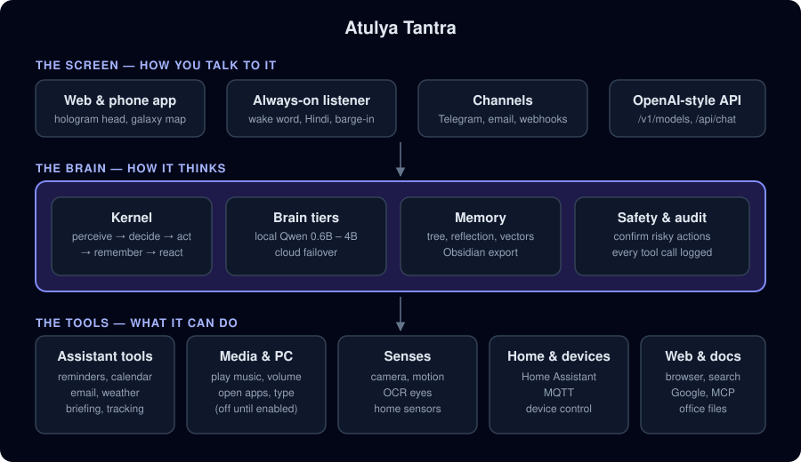

<!-- Hero Banner -->
<div align="center">
  
</div>

<div align="center">
  <h1>
    
  </h1>
</div>

<p align="center">
  <em><strong>अतुल्य</strong> (Atulya) — Peerless, without equal &nbsp;·&nbsp; <strong>तन्त्र</strong> (Tantra) — System, loom of intelligence</em><br/>
  <strong>A personal AI assistant you talk to: a 3D hologram that listens in Hindi and English, remembers you, and acts for you.</strong>
</p>

<p align="center">
  <a href="https://www.python.org/downloads/"></a>
  <a href="LICENSE"></a>
  <a href="#"></a>
  <a href="#"></a>
  <a href="#"></a>
  <a href="#"></a>
</p>

```
 +--------------------------------------------------------------------------+
 |                         HOW ATULYA WORKS                                 |
 |                                                                          |
 |  Your voice or text --> hologram screen (frontend/) --> server (atulya/sevak)|
 |                                  |                                       |
 |                                  v                                       |
 |                 thinking kernel (atulya/buddhi)                       |
 |            /              |                 \                            |
 |     brain: cloud       memory: what you     tools: music, email,         |
 |     or local model     told it, habits      calendar, PC, home           |
 |            \              |                 /                            |
 |                  safety: risky actions ask first                         |
 +--------------------------------------------------------------------------+
```

---

A local-first personal AI assistant. You talk to a glowing hologram: it listens in English or
Hindi, thinks with a cloud or local brain, remembers you, and does things for you — music,
reminders, email, calendar, price tracking, a morning briefing, smart home, and (if you turn it
on) your PC.

<p align="center">
  
  
</p>

**One screen.** There are no pages. Ask for something ("show my routines", "open the dashboard",
"chat history") or tap the menu, and a pop-up slides in over the orb. Esc or a tap outside closes
it. Replies appear in a caption card under the head. Admin-only details (models, health, audit log)
are hidden from normal users.



---

## Where things stand

| I want to… | Read |
|---|---|
| Know what actually works today, and what is only proven in tests | **[docs/STATUS.md](docs/STATUS.md)** |
| Know what is left and what comes next | **[docs/ROADMAP.md](docs/ROADMAP.md)** |
| Deploy it for real | **[docs/DEPLOYMENT.md](docs/DEPLOYMENT.md)** |
| Run it on a VM, put it in Telegram, pair a phone | **[docs/RECIPES.md](docs/RECIPES.md)** |
| Understand how it thinks | **[docs/COGNITIVE_ARCHITECTURE.md](docs/COGNITIVE_ARCHITECTURE.md)** |
| Hit the API | **[docs/API_REFERENCE.md](docs/API_REFERENCE.md)** |
| Control TVs, phones and lights | **[docs/DEVICES.md](docs/DEVICES.md)** |
| Work on the code | **[docs/CONTRIBUTING.md](docs/CONTRIBUTING.md)** |

> **Honest status:** the test suite is strong and the hardware coverage is weak. Almost everything
> below is implemented and unit-tested but has **never been run on a real microphone, camera, TV,
> phone or mailbox**. See [STATUS.md](docs/STATUS.md) for the exact split.

---

## Quick start (Windows)

You need Python 3.10+ and Node.js 18+.

```powershell
python install.py
```

One command: it shows what is already configured, asks only for what is missing, installs the
extras, builds the dashboard and checks that everything works. Secrets are never shown in full —
only `set (last 4)`.

| Command | What it does |
|---|---|
| `python install.py --doctor` | Report only — changes nothing |
| `python install.py --yes` | Unattended, accepts defaults (cPanel, VPS, CI) |
| `python install.py --profile full` | `basic` / `voice` / `full` / `server` — pick up front, no prompts |
| `python install.py --no-start` | Configure and check, but do not offer to start |

Manual equivalent: copy `.env.example` to `.env`, add a brain (see below), double-click
**`start.bat`**, then open http://localhost:8501 in Chrome or Edge and allow the microphone. On the
computer Atulya runs on there is no login.

First start takes a minute. Full detail, including Docker and hardening:
**[docs/DEPLOYMENT.md](docs/DEPLOYMENT.md)**.

---

## Brains

Atulya asks the first brain that is set up and falls back to the next. Put keys in `.env`:

| # | Brain | Setting | Notes |
|---|---|---|---|
| 1 | Claude | `ANTHROPIC_API_KEY` | Fastest and smartest; answers first when set |
| 2 | Local model | `.[brain]` + `ATULYA_AUTO_DOWNLOAD_MODEL=true` | Works offline; downloads about 400 MB. Choose a size with `ATULYA_BRAIN=tiny/balanced/power/auto` |
| 3 | Ollama | `ATULYA_OLLAMA_MODEL` | Local models you already run |
| 4 | Groq | `GROQ_API_KEY` | Free tier, very fast |
| 5 | OpenRouter | `OPENROUTER_API_KEY` | Free `:free` models, tried in turn when one is busy (`ATULYA_OPENROUTER_MODEL`) |
| 6 | Gemini | `GEMINI_API_KEY` | Free tier; also describes pictures |
| 7 | OpenAI, NVIDIA NIM | `OPENAI_API_KEY`, `NVIDIA_API_KEY` | Optional |

22 providers are catalogued in one table — see **Menu → Brains & keys** in the app.
`ATULYA_BRAIN=cloud` puts the cloud brains first. Every cloud brain sends your questions to that
company; only the local model keeps them on your PC.

---

## What it can do

Highlights — the full capability table with per-item test state is
**[docs/STATUS.md](docs/STATUS.md)**.

| Ability | State |
|---|---|
| Hologram head with lip sync, blink and breathing; volume boost to 300% | Working |
| Listening in English and Hindi; "stop" interrupts; no wake word needed in the web app | Working. `atulya listen` uses "Hey Atulya" / "हे अतुल्य" |
| Reminders, calendar, email, weather, open websites, time | Working |
| Play music (YouTube, Spotify), media keys and volume (Windows) | Working |
| Price watchlist, morning briefing (`ATULYA_BRIEFING_AT=08:00`) | Working |
| Memory that learns facts about you and recalls them when you ask about the past | Working |
| Camera motion and person detection, reading text in pictures | Working; scene description needs `ollama pull moondream` or a Gemini key |
| Smart home (Home Assistant, MQTT), messaging channels | Needs your hardware or accounts to verify |
| Control the PC (open apps, type, shortcuts) | Off until `ATULYA_PC_CONTROL=on`; asks before each action; audited |
| Offline natural voice | Optional: Piper (`ATULYA_PIPER_MODEL`) |

Atulya never reads out emoji and answers "what can you do" with a real list.

### Money

"I spent 500 on groceries", "how much did I spend this month", "set a budget for food of 5000",
"what bills are due". Everything stays in `kosh/agent/money.json` — **Atulya never connects to a
bank and never pays anything.** Bank alerts can come from email, from an SMS-forwarding app on your
phone, or a pasted statement CSV; OTPs and offers are ignored and duplicates are counted once.

### Devices

TV, phone, lights, plugs, PCs: say "scan for devices", "add number 1 as living room TV", then
"turn off the TV". Works through HTTP profiles (Roku, Kodi, Tasmota, WLED, Shelly), Android over
ADB, Wake-on-LAN, and Home Assistant. See **[docs/DEVICES.md](docs/DEVICES.md)**.

### On your phone

Set `ATULYA_HOST=0.0.0.0`, open `http://<your-pc>:8501` on the phone, log in, and (for camera and
mic) set `ATULYA_HTTPS=on`. Away from home, use Tailscale rather than exposing the port. Pairing a
phone or a second computer is in **[docs/RECIPES.md](docs/RECIPES.md)**.

---

## Layout

Project folders use standard English engineering names. Generated frontend dependencies and build
output are not source files.

| Folder | Purpose |
|---|---|
| `atulya/` | Python application package — API, reasoning, memory, tools, channels, devices and voice |
| `frontend/` | React/Vite dashboard, PWA assets and Capacitor config; `dist/` is generated, `node_modules/` is disposable |
| `docs/` | Documentation: status, roadmap, deployment, recipes, architecture, API, devices |
| `tests/` | Unit and integration tests, grouped by subsystem |
| `examples/` | Termux companion and optional model experiments |
| `kosh/` | Local user data — private memory, credentials and settings (कोश, store/vault); git-ignored |
| `runtime/` | Downloaded model files; optional and not source code |
| `.github/` | CI and release workflows |

The module-by-module map (which file holds what) is in
**[docs/CONTRIBUTING.md](docs/CONTRIBUTING.md#module-map)**.

---

## Development

```powershell
python -m pytest -q          # tests
ruff check .                 # lint (unused imports are errors)
cd frontend; npm run dev     # web dev server, proxies /api and /ws to :8501
python -m atulya.adesh doctor # readiness report
```

## API

Token-protected routes expect `X-Atulya-Token`. Full list:
**[docs/API_REFERENCE.md](docs/API_REFERENCE.md)**.

| Route | Who | What |
|---|---|---|
| `GET /api/auth/local` | this computer only | sign in without a password |
| `POST /api/auth/login` | everyone | username and password |
| `POST /api/chat`, `/api/chat/stream`, `/api/voice/chat` | signed in | talk to Atulya |
| `GET /api/brain`, `/api/health`, `/api/audit` | admin | models, server health, audit log |
| `/api/users`, `/api/routines`, `/api/senses`, `/api/triggers`, `/api/fabric` | admin | management |

## Notes

- Do not commit `.env` or `kosh/`; they hold your keys, accounts and memory.
- `frontend/dist` is built by `start.bat`; `frontend/node_modules` is only needed while building
  and can be deleted any time. **A clean checkout has no web app until the build runs.**
- Custom model training does not belong here; keep it in a separate repository and connect it as a
  provider.
- Before exposing Atulya beyond your own network, read
  [docs/DEPLOYMENT.md](docs/DEPLOYMENT.md#7-hardening-checklist).

---

## Contributing

Contributions, bug reports, and ideas are welcome!

1. **Fork** the repository
2. **Create** a feature branch: `git checkout -b feat/your-feature`
3. **Commit** your changes: `git commit -m "feat: add your feature"`
4. **Push** and open a **Pull Request**

Please keep PRs focused and include tests where relevant. For major changes, open an issue first.
See **[docs/CONTRIBUTING.md](docs/CONTRIBUTING.md)** for the project rules, where things go, and
the safety rules every new tool must obey.

> All contributions are released under the [MIT License](LICENSE).

## License

MIT License. Copyright (c) 2026 Atulya AI (atulyaai). See [LICENSE](LICENSE).
