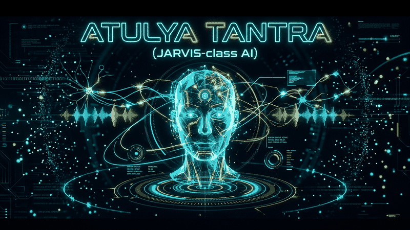
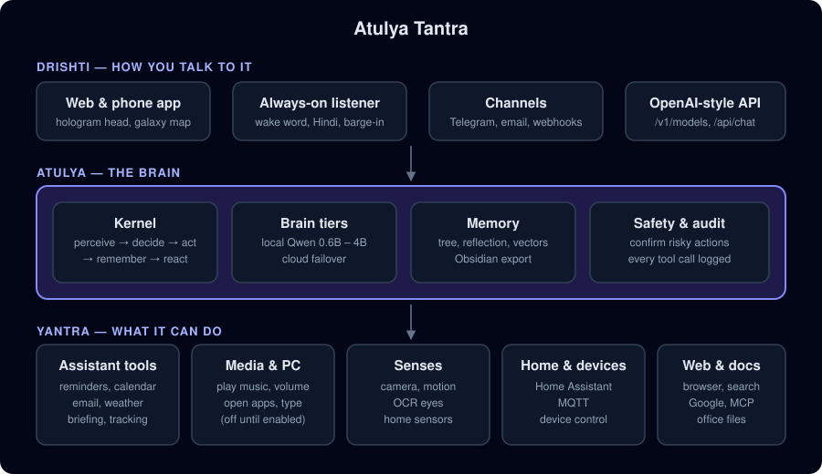
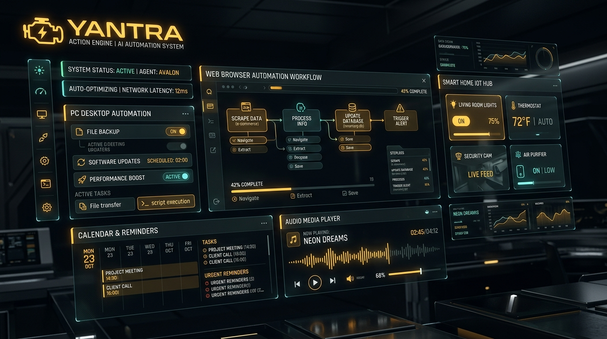
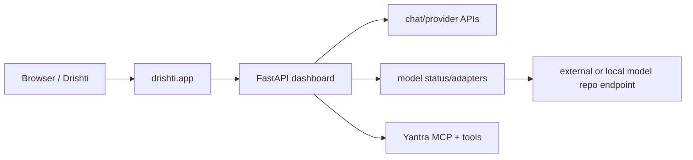
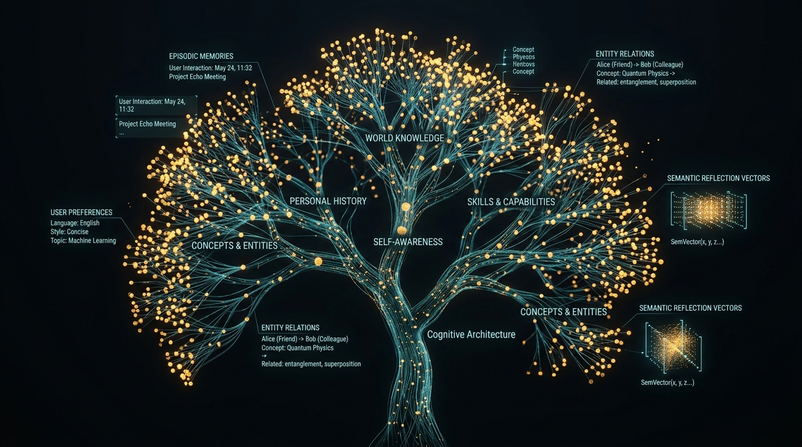

<!-- Hero Banner -->
<div align="center">
  
</div>

<div align="center">
  <h1>
    
  </h1>
</div>

<p align="center">
  <em><strong>अतुल्य</strong> (Atulya) — Peerless, without equal &nbsp;·&nbsp; <strong>तन्त्र</strong> (Tantra) — System, loom of intelligence</em><br/>
  <strong>A local-first, always-listening personal AI: talking 3D hologram avatar, ambient Hindi/English voice mode, neural memory tree, and autonomous computer action.</strong>
</p>

<p align="center">
  <a href="https://www.python.org/downloads/"></a>
  <a href="LICENSE"></a>
  <a href="#"></a>
  <a href="#"></a>
  <a href="#"></a>
  <a href="#"></a>
</p>

```
 ┌─────────────────────────────────────────────────────────────────────────────┐
 │                             ATULYA TANTRA PIPELINE                          │
 ├─────────────────────────────────────────────────────────────────────────────┤
 │   🎙️ Ambient Audio (Mic) ──► Wake Word Detect ("Hey Atulya" / "सुनो अतुल्य")│
 │                                      │                                      │
 │                                      ▼                                      │
 │   🧠 Cognition Router     ──► Local GGUF / Tantra-LLM / Cloud Fallback      │
 │                                      │                                      │
 │            ┌─────────────────────────┴─────────────────────────┐            │
 │            ▼                                                   ▼            │
 │   🌲 Neural Memory Tree                               🛠️ Yantra Action Engine│
 │   (Vector recall · Reflection)                        (Browser, Media, PC)  │
 │            │                                                   │            │
 │            └─────────────────────────┬─────────────────────────┘            │
 │                                      ▼                                      │
 │   🎭 Drishti Hologram Engine ──► Lip-sync · Expressive Eyes · Audio Out     │
 └─────────────────────────────────────────────────────────────────────────────┘
```

---

<div align="center">
  
</div>

> [!NOTE]
> Custom language model training lives in [Tantra-LLM](https://github.com/atulyaai/Tantra-LLM). This repository provides the assistant runtime, Drishti hologram frontend, long-term memory, and Yantra automation engine.

---

## What This Is

| Area | Folder | Purpose |
|---|---|---|
| Atulya | `atulya/` | Personality, memory, identity, assistant brain, provider routing, local model glue, security core (`atulya/core/`) |
| Yantra | `yantra/` | Actions, tools, automation, browser/device/camera/voice systems, action tests |
| Drishti | `drishti/` | Mobile/desktop experience: Live Mode, chat, dashboard, backend APIs, frontend build |

The goal is a local AI system that can remember, inspect itself, route work to the right model/provider, automate tasks, and expose controls through a dashboard.

## Current Layout

```text
Atulya-Tantra/
|-- atulya/                     # the brain
|   |-- cognition/              # kernel, safety, toolbelt, triggers, brain tiers
|   |-- agent/                  # tools: reminders, email, calendar, weather, media, tracking,
|   |                           #   briefing, PC control, audit log; intent router
|   |-- ambient/                # always-on listener: mic, wake word (EN/HI), barge-in, tray
|   |-- memory/                 # providers, tree, reflection, vectors, Obsidian export
|   |-- core/                   # security, task classification, safe expression eval
|   |-- llm.py, intelligence.py # AtulyaLLM and the provider failover router
|   |-- local_provider.py       # local GGUF chat / streaming / tool calls
|   |-- eyes.py, emotion.py     # seeing images, mood detection
|   `-- persona.py, heartbeat.py, cli.py
|-- yantra/                     # hands: capabilities, channels, MCP, senses, device control
|-- drishti/                    # face: React/Vite frontend + FastAPI dashboard and routes
|-- config/  install/          # static config, install helpers
|-- docs/                       # guides, architecture, security, features, images
|-- assets/  outputs/  runtime/ # local state, generated files, downloaded models (git-ignored)
|-- tests/                      # test suite (run by CI on Linux and Windows)
|-- pyproject.toml
`-- start.bat
```

More ownership detail lives in [docs/CONTRIBUTING.md](docs/CONTRIBUTING.md).

## What Atulya Can Do

Full list, with what is missing: [docs/FEATURES.md](docs/FEATURES.md).

| Ability | Status |
|---|---|
| Talk back with a hologram head (lip sync, blink, breathing) | Working |
| Always-on listening, wake words in English and Hindi, "stop" to interrupt | Working; optional wake-word model (`ATULYA_WAKE_MODEL`) |
| Natural offline voice | Optional: Piper (`ATULYA_PIPER_MODEL`) |
| Daily spoken morning briefing | Set `ATULYA_BRIEFING_AT=08:00` (and `ATULYA_BRIEFING_LOCATION`) |
| Local brain (Qwen3 0.6B / 1.7B / 4B) with Groq, OpenRouter, Gemini failover | Working |
| Memory, reflection, knowledge galaxy map | Working |
| Reminders, calendar, email, weather, open websites | Working |
| Play music (YouTube/Spotify), media keys and volume (Windows) | Working |
| Track prices and things, morning briefing | Working |
| See: camera motion/person detection, read text, describe scenes | Scene description needs `ollama pull moondream` (or a Gemini key) |
| Smart home (Home Assistant, MQTT) | Needs your hardware to verify |
| Control the PC (open apps, type, shortcuts) | Opt-in: `ATULYA_PC_CONTROL=on`; asks before each action by default (unless you pre-approve it with `ATULYA_AUTO_APPROVE`); audited |
| Phone app and remote access | PWA + Tailscale; no cross-device sync yet |

## Quick Start

Use Python 3.10+.

```powershell
python -m pip install -e ".[dev,serve,brain]"
```

Build the dashboard frontend:

```powershell
cd drishti
npm install
npm run build
cd ..
```

Start the dashboard:

```powershell
start.bat
```

Or run the backend directly:

```powershell
python -u -m drishti.app
```

Open:

```text
http://localhost:8501
```

First startup can take 30-60 seconds while the local model loads.

### Always-listening voice mode

```powershell
python -m pip install -e ".[ambient]"
atulya listen
```

Say "Hey Atulya" or "हे अतुल्य", then your request. Say "stop" while it is talking to interrupt. Optional extras: `.[control]` (PC control), `.[vision]` (camera and OCR), `.[brain]` (local model runtime), `.[wake]` (wake-word model and Piper voice).

Set `ATULYA_BRAIN=auto` to let Atulya pick the biggest local model that fits your free RAM.

## Environment & Pluggable Brains

Create a `.env` file in the root directory (based on `.env.example`). The dashboard reads these configurations on startup to configure path execution, binding configurations, and local/cloud intelligence fallback providers.

```text
# Host and port binding (Set host to 0.0.0.0 for mobile/local network access)
ATULYA_HOST=127.0.0.1
ATULYA_PORT=8501

# Free-first brain provider chain
ATULYA_OLLAMA_HOST=http://localhost:11434
ATULYA_OLLAMA_MODEL=llama3
ANTHROPIC_API_KEY=sk-ant-...   # Claude: fast and smart, answers first when set
GROQ_API_KEY=gsk_...      # free key from https://console.groq.com/keys
ATULYA_BRAIN=cloud        # Groq leads; local 0.6B model is the offline backup
ATULYA_GROQ_MODEL=llama-3.3-70b-versatile
OPENROUTER_API_KEY=sk-or-v1-...
GEMINI_API_KEY=AIzaSy...
OPENAI_API_KEY=sk-proj-...
NVIDIA_API_KEY=nvapi-...

# Dashboard API authentication
ATULYA_DASHBOARD_TOKEN=my_secure_session_token
```

### Fallback Failover Order
When you submit a request, the `ProviderRouter` scans the list of configured keys and automatically failovers in this order:
1. **Claude**: only when `ANTHROPIC_API_KEY` is set (fastest and smartest).
2. **Local GGUF**: Built-in Qwen3-0.6B model, no key required.
3. **Ollama**: Local LLMs (free/offline).
4. **Groq**: Free developer tier.
5. **OpenRouter**: Cloud-based aggregator free models.
6. **Gemini**: Free tier, rare fallback when configured.
7. **OpenAI**: Optional paid fallback.
8. **NVIDIA NIM**: Pluggable microservice containers.
9. **OpenCode Zen**: Offline rule-based persona fallback if all endpoints are offline or keys are missing.


---

## Mobile Access (Like Siri or Gemini)

Atulya Tantra is built mobile-first. You can access the voice cockpit, real-time cameras, memory, and planning modules on your smartphone or tablet with the feeling of a native OS assistant (like Siri or Gemini).

### Step 1: Bind Server to Local Network
Configure your `.env` file to expose the server to the local network:
```text
ATULYA_HOST=0.0.0.0
ATULYA_PORT=8501
```
Start the dashboard using `start.bat`.

### Step 2: Open on Mobile
1. Find your computer's local IP address (e.g., `192.168.1.15`).
2. Open Safari (iOS) or Chrome (Android) on your mobile device.
3. Navigate to: `http://192.168.1.15:8501`.
4. Enter your session token (`ATULYA_DASHBOARD_TOKEN`) to authenticate.

### Step 3: Add to Home Screen (PWA Mode)
- **iOS (Safari)**: Tap the **Share** button at the bottom, scroll down, and select **Add to Home Screen**.
- **Android (Chrome)**: Tap the **three-dot menu** at the top right and select **Add to Home screen** or **Install App**.

This places a native launcher icon on your smartphone home screen. Opening it hides browser navigation controls and launches Atulya in full-screen immersion mode.

### Step 4: Engage Hands-Free Voice Cycle
1. Click **ENGAGE ORACLE** to grant microphone permission.
2. Check the **HANDS-FREE** checkbox.
3. The interface will open the microphone, listen for voice input, process thoughts across the digital nervous system, vocalize responses via edge-tts, and automatically re-open the mic for continuous conversation.

### Step 5: Remote Mobile Access (Anywhere in the World)
To talk to Atulya outside your home WiFi network:
- **Tailscale (Recommended)**: Install Tailscale on your host computer and your phone. You can access Atulya from anywhere using the private Tailscale IP (e.g., `http://100.x.y.z:8501`) securely, without opening public ports.
- **ngrok**: Expose local port 8501 securely to a public ngrok domain: `ngrok http 8501`.

---

## Model Repo Boundary

Do not add new custom LLM training flows to this repository. Model architecture work, tokenizer changes, training jobs, checkpoints, evaluations, and model release artifacts belong in the separate LLM/model repo.

Use this repo to connect models to the product:

- Add provider keys and endpoint URLs in `.env`.
- Route chat through `atulya/llm.py` and provider/router adapters.
- Surface status, links, and diagnostics in Drishti.

## Drishti Development

<div align="center">
  
  <br/><br/>
  
  <p><em>Live Drishti floating desktop orb and conversational HUD interface</em></p>
</div>


Run the Vite dev server:

```powershell
cd drishti
npm run dev
```

The dev server proxies `/api` and `/ws` to `http://127.0.0.1:8501`.

Build production assets:

```powershell
cd drishti
npm run build
```

Backend entrypoint:

```powershell
python -u -m drishti.app
```

## Dashboard And Automation

<div align="center">
  
</div>



```mermaid
flowchart LR
    Browser["Browser / Drishti"] --> Backend["drishti.app"]
    Backend --> App["FastAPI dashboard"]
    App --> Chat["chat/provider APIs"]
    App --> Models["model status/adapters"]
    App --> Yantra["Yantra MCP + tools"]
    Models --> External["external or local model repo endpoint"]
```

Important Yantra locations:

- `yantra/capabilities/`: file tools, gated shell execution, web search, browser, voice, Google Workspace, Home Assistant, documents
- `yantra/channels.py`: unified multi-channel system (Discord, Telegram, Slack, Email, Webhook, WhatsApp, Signal, Matrix, Teams, IRC, WebChat, Console, Log, Twitter)
- `yantra/mcp/`: MCP server, transport, manifest signing, external client, dashboard bridge
- `yantra/senses/`: camera and home sensors

Assistant tools the brain can call live in `atulya/agent/` and register themselves with `@tool`. Risky ones (sending email, deleting events, PC control) ask first by default (`ATULYA_AUTO_APPROVE` can pre-approve specific ones) — see `atulya/cognition/safety.py` — and every call is appended to `assets/agent/audit.jsonl`.

## Memory And Identity

<div align="center">
  
</div>


Atulya application memory lives in `atulya/memory/`. Memory is part of the assistant brain, not a fifth top-level product folder.

| Module | Purpose |
|---|---|
| `orchestrator.py` | provider registry and context assembly |
| `session_search.py` | session text search |
| `prompt_cache.py` | prompt/result cache |
| `subconscious.py` | decision/event log |
| `reflection.py` | insights and reflective notes |
| `tree.py` | hierarchical memory summaries |
| `obsidian.py` | markdown vault export |
| `vector_store.py` | dependency-free feature-hashed vector memory |

Identity and prompt behavior are controlled by `atulya/persona.py` and the Atulya memory modules. An optional identity override can be placed at `data/identity.json` (or pointed to with `ATULYA_IDENTITY_PATH`).

## API Example

Token-protected dashboard routes expect `X-Atulya-Token`.

```powershell
$token = $env:ATULYA_DASHBOARD_TOKEN
Invoke-RestMethod http://127.0.0.1:8501/api/system -Headers @{"X-Atulya-Token"=$token}
```

Routes implemented by the current backend:

| Route | Method | Real source |
|---|---|---|
| `/api/dashboard/bootstrap` | GET | current user, providers, and (for admins) system stats |
| `/api/system` | GET | `psutil` CPU/RAM/disk plus Python version |
| `/api/health` | GET | health check |
| `/api/chat` | POST | blocking chat routed through provider/model adapters |
| `/api/chat/stream` | POST | Server-Sent Events token stream |
| `/api/chat/history` | GET/DELETE | persisted conversation history |
| `/api/agent/status`, `/api/agent/process`, `/api/agent/tools` | GET/POST | agent tools and process control |
| `/api/auth/login` | POST | validates the dashboard token |
| `/api/users` | GET/POST/DELETE | user management |
| `/api/cron/jobs` | GET/POST/DELETE | automation job scheduler |
| `/api/upload`, `/api/files` | POST/GET/DELETE | file upload and serving |
| `/api/voice/voices`, `/api/voice/tts`, `/api/voice/stt`, `/api/voice/chat` | GET/POST | voice pipeline |
| `/api/notifications/subscribe` | POST | notification subscriptions |
| `/v1/models` | GET | OpenAI-compatible model list |

## Verification

```powershell
python -m pytest -q
ruff check .
python -m atulya.cli doctor
```

## Notes

- Do not commit `.env`; it can contain secrets.
- Do not commit generated outputs, `__pycache__`, or large local datasets unless intentionally publishing data elsewhere.
- `drishti/node_modules` can exist locally for development, but should not be treated as source.
- `drishti/dist` is built by `start.bat` or CI; do not commit generated build output.
- `assets/` holds runtime-local app state; runtime artifacts such as scheduler state, memory databases, and email config are gitignored.
- Active LLM training data, checkpoints, and tokenizer artifacts belong in the separate model repo.
- Before exposing Atulya beyond this machine, read the hardening checklist in [docs/DEPLOYMENT.md](docs/DEPLOYMENT.md).

---

## 📜 License

MIT License. Copyright (c) 2026 Atulya AI (atulyaai). See [LICENSE](LICENSE).
