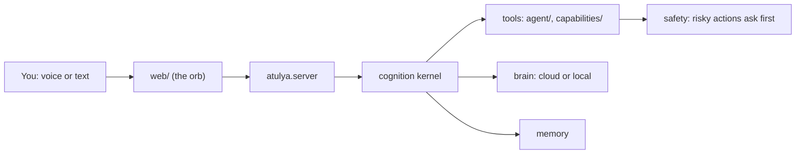

# Atulya Tantra

A local-first personal AI assistant. You talk to a glowing hologram: it listens in English or Hindi, thinks with a cloud or local brain, remembers you, and does things for you: music, reminders, email, calendar, price tracking, a morning briefing, smart home, and (if you turn it on) your PC.

<p align="center">
  
  
</p>

**One screen.** There are no pages. Ask for something ("show users", "open my routines", "chat history") or tap the menu, and a pop-up slides in over the orb. Esc or a tap outside closes it. Replies appear in a caption card under the head. Admin-only details (models, health, users, audit log) are hidden from normal users.


## Quick start (Windows)

You need Python 3.10+ and Node.js 18+.

1. Copy `.env.example` to `.env` and add a brain (see [Brains](#brains)). A free OpenRouter key is enough.
2. Double-click **`start.bat`**. It installs what is missing, builds the web app only when it changed, and starts the server.
3. Open http://localhost:8501 in **Chrome or Edge**, click once, and allow the microphone. On the computer Atulya runs on there is no login.

First start takes a minute. Manual start instead of `start.bat`:

```powershell
python -m pip install -e ".[serve]"
cd web; npm install; npm run build; cd ..
python -m atulya.server
```

Optional extras: `.[ambient]` (always-on listener: `atulya listen`), `.[control]` (PC control), `.[vision]` (camera, OCR), `.[brain]` (a local model), `.[wake]` (wake-word model, Piper voice), `.[docs]` (document tools), `.[browser]` (browser automation).

## Brains

Atulya asks the first brain that is set up and falls back to the next. Put keys in `.env`:

| # | Brain | Setting | Notes |
|---|---|---|---|
| 1 | Claude | `ANTHROPIC_API_KEY` | Fastest and smartest; answers first when set |
| 2 | Local model | `.[brain]` + `ATULYA_AUTO_DOWNLOAD_MODEL=true` | Works offline; downloads about 400 MB. Choose a size with `ATULYA_BRAIN=tiny/balanced/power/auto` |
| 3 | Ollama | `ATULYA_OLLAMA_MODEL` | Local models you already run |
| 4 | Groq | `GROQ_API_KEY` | Free tier, very fast |
| 5 | OpenRouter | `OPENROUTER_API_KEY` | Free `:free` models, tried in turn when one is busy (`ATULYA_OPENROUTER_MODEL`) |
| 6 | Gemini | `GEMINI_API_KEY` | Free tier; also describes pictures |
| 7 | OpenAI, NVIDIA NIM | `OPENAI_API_KEY`, `NVIDIA_API_KEY` | Optional |

`ATULYA_BRAIN=cloud` puts the cloud brains first. With no local model installed (`ATULYA_AUTO_DOWNLOAD_MODEL=false`), if every cloud brain is busy Atulya says so and you try again. Every cloud brain sends your questions to that company; only the local model keeps them on your PC.

## What Atulya can do

Full list, with what is missing: [docs/FEATURES.md](docs/FEATURES.md).

| Ability | Status |
|---|---|
| Hologram head with lip sync, blink and breathing; volume boost up to 300% | Working |
| Listening in English and Hindi; "stop" interrupts; works without a wake word in the web app | Working. The always-on listener (`atulya listen`) uses "Hey Atulya" / "हे अतुल्य" |
| Reminders, calendar, email, weather, open websites, time | Working |
| Play music (YouTube, Spotify), media keys and volume (Windows) | Working |
| Price watchlist, morning briefing (`ATULYA_BRIEFING_AT=08:00`) | Working |
| Memory that learns facts about you; recalled when you ask about the past | Working |
| Camera motion and person detection, reading text in pictures | Working; scene description needs `ollama pull moondream` or a Gemini key |
| Smart home (Home Assistant, MQTT), messaging channels | Needs your hardware or accounts to verify |
| Control the PC (open apps, type, shortcuts) | Off until `ATULYA_PC_CONTROL=on`; asks before each action; audited |
| Offline natural voice | Optional: Piper (`ATULYA_PIPER_MODEL`) |

Atulya never reads out emoji and answers "what can you do" with a real list.

## Phone and other devices

1. In `.env` set `ATULYA_HOST=0.0.0.0`, then restart. (`ATULYA_LOCKDOWN=on` does the opposite: this computer only.)
2. Find your PC's address (for example `192.168.1.15`) and open `http://192.168.1.15:8501` on the phone.
3. Log in with username `admin` and the password you set in `ATULYA_DASHBOARD_TOKEN` (or the one written to `data/admin_token.txt` the first time). Other devices always need a login; only this computer skips it (`ATULYA_REQUIRE_LOGIN=on` turns that off).
4. Add to the home screen: **iOS** Share, Add to Home Screen; **Android** menu, Install app.
5. Away from home: install Tailscale on the PC and phone and use the private address (`http://100.x.y.z:8501`). Avoid exposing the port to the internet.

## Layout

All Python is in `atulya/`, the screen is `web/`, and everything Atulya stores lives in one `data/` folder.

```text
Atulya-Tantra/
|-- atulya/                     # all the Python
|   |-- cognition/              # kernel, safety, planner, triggers, brain tiers
|   |-- agent/                  # assistant tools: reminders, email, calendar, weather, music,
|   |                           #   tracking, briefing, PC control, audit log; intent router
|   |-- ambient/                # always-on listener: mic, wake word (EN/HI), barge-in, tray
|   |-- memory/                 # memory providers, reflection, vectors, Obsidian export
|   |-- capabilities/           # browser, documents, voice, Google, Home Assistant, web search
|   |-- senses/                 # camera, motion, home sensors
|   |-- mcp/                    # MCP server and client (+ servers.json)
|   |-- server/                 # the web server: API routes, accounts, chat history
|   |-- llm.py, intelligence.py # the brain and the provider failover router
|   |-- local_provider.py       # local GGUF model
|   |-- channels.py             # Telegram, Discord, Slack, email ... messaging
|   `-- persona.py, emotion.py, eyes.py, heartbeat.py, events.py, security.py, cli.py ...
|-- web/                        # the animated screen (React + Vite): src/, public/, android/
|-- docs/                       # guides, architecture, security, features, images
|-- tests/                      # test suite
|-- data/                       # everything Atulya stores locally (git-ignored)
|-- pyproject.toml, start.bat, Dockerfile, docker-compose.yml
`-- .env                        # your keys (git-ignored)
```

More detail: [docs/CONTRIBUTING.md](docs/CONTRIBUTING.md). The cognitive pipeline is explained in [docs/COGNITIVE_ARCHITECTURE.md](docs/COGNITIVE_ARCHITECTURE.md).

## How a request flows


```mermaid
flowchart LR
    You["You: voice or text"] --> Web["web/ (the orb)"]
    Web --> Server["atulya.server"]
    Server --> Kernel["cognition kernel"]
    Kernel --> Tools["tools: agent/, capabilities/"]
    Kernel --> Brain["brain: cloud or local"]
    Kernel --> Memory["memory"]
    Tools --> Safety["safety: risky actions ask first"]
```

Assistant tools live in `atulya/agent/` and register themselves with `@tool`. Risky ones (sending email, deleting events, PC control) ask first by default (`ATULYA_AUTO_APPROVE` can pre-approve specific ones), and every call is appended to `data/agent/audit.jsonl`.

## Memory

Atulya's memory is in `atulya/memory/`: a vector store and session search (what the brain uses), plus reflection, a hierarchical summary tree and Obsidian export. A small local model copies recalled answers back, so with it memory is only shown when you ask about the past. Your profile (facts it learned, habits, what you trust it to do without asking) is under the **About you** pop-up. Identity and prompt rules are in `atulya/persona.py`; an optional override goes in `data/identity.json`.

## Development

```powershell
python -m pytest -q       # tests
ruff check .              # lint (unused imports are errors)
cd web; npm run dev       # web dev server, proxies /api and /ws to :8501
python -m atulya.cli doctor
```

Docker: `docker compose up --build` (builds the web app, serves on port 8501, keeps `data/` on your disk). Not yet tried on a real server.

## API

Token-protected routes expect `X-Atulya-Token`. Full list: [docs/API_REFERENCE.md](docs/API_REFERENCE.md).

| Route | Who | What |
|---|---|---|
| `GET /api/auth/local` | this computer only | sign in without a password |
| `POST /api/auth/login` | everyone | username and password |
| `POST /api/chat`, `/api/chat/stream`, `/api/voice/chat` | signed in | talk to Atulya |
| `GET/DELETE /api/chat/history` | signed in | your conversation |
| `POST /api/voice/stt`, `/api/voice/tts` | signed in | speech to text and back |
| `GET /api/profile` and friends | signed in | what Atulya knows about you |
| `GET /api/brain`, `/api/health`, `/api/telemetry`, `/api/system`, `/api/audit` | admin | models, server health, audit log |
| `/api/users`, `/api/routines`, `/api/senses`, `/api/triggers`, `/api/devices`, `/api/agent/tools` | admin | management |
| `GET /v1/models` | admin | OpenAI-style model list |

## Notes

- Do not commit `.env` or `data/`; they hold your keys, accounts and memory.
- `web/dist` is built by `start.bat`; `web/node_modules` is only needed while building and can be deleted any time.
- Custom model training does not belong here; keep it in a separate repository and connect it as a provider.
- Before exposing Atulya beyond your own network, read the hardening checklist in [docs/DEPLOYMENT.md](docs/DEPLOYMENT.md) and [docs/SECURITY_MODEL.md](docs/SECURITY_MODEL.md).
