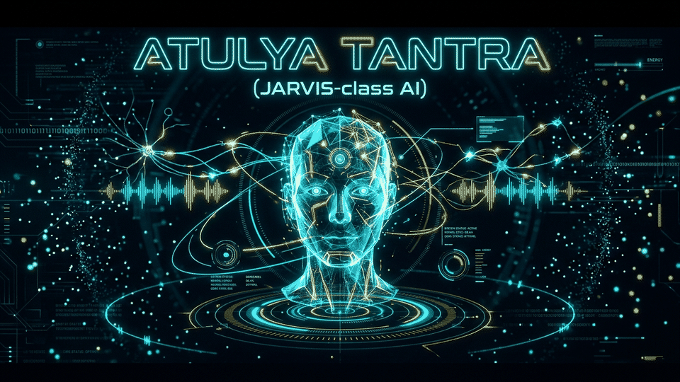
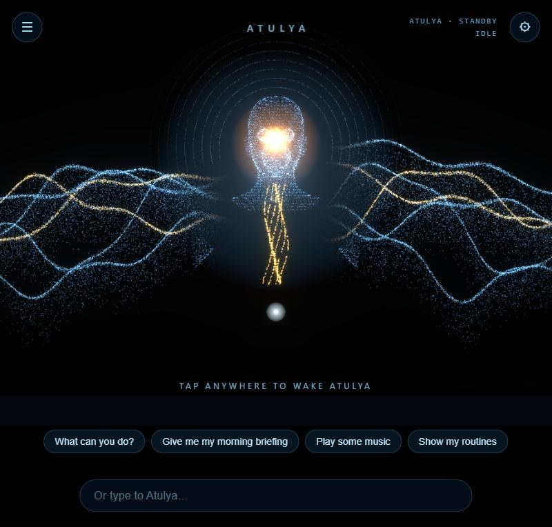
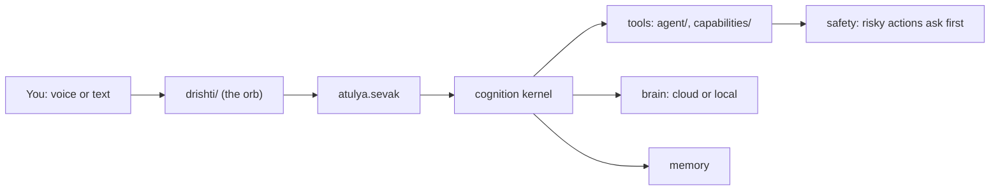

<!-- Hero Banner -->
<div align="center">
  
</div>

<div align="center">
  <h1>
    
  </h1>
</div>

<p align="center">
  <em><strong>अतुल्य</strong> (Atulya) — Peerless, without equal &nbsp;·&nbsp; <strong>तन्त्र</strong> (Tantra) — System, loom of intelligence</em><br/>
  <strong>A personal AI assistant you talk to: a 3D hologram that listens in Hindi and English, remembers you, and acts for you.</strong>
</p>

<p align="center">
  <a href="https://www.python.org/downloads/"></a>
  <a href="LICENSE"></a>
  <a href="#"></a>
  <a href="#"></a>
  <a href="#"></a>
  <a href="#"></a>
</p>

```
 +--------------------------------------------------------------------------+
 |                         HOW ATULYA WORKS                                 |
 |                                                                          |
 |  Your voice or text --> hologram screen (drishti/) --> server (atulya/sevak)|
 |                                  |                                       |
 |                                  v                                       |
 |                 thinking kernel (atulya/buddhi)                       |
 |            /              |                 \                            |
 |     brain: cloud       memory: what you     tools: music, email,         |
 |     or local model     told it, habits      calendar, PC, home           |
 |            \              |                 /                            |
 |                  safety: risky actions ask first                         |
 +--------------------------------------------------------------------------+
```

---

A local-first personal AI assistant. You talk to a glowing hologram: it listens in English or Hindi, thinks with a cloud or local brain, remembers you, and does things for you: music, reminders, email, calendar, price tracking, a morning briefing, smart home, and (if you turn it on) your PC.

<p align="center">
  
  
</p>

<p align="center"></p>

**One screen.** There are no pages. Ask for something ("show my routines", "open the dashboard", "chat history") or tap the menu, and a pop-up slides in over the orb. Esc or a tap outside closes it. Replies appear in a caption card under the head. Admin-only details (models, health, audit log) are hidden from normal users.


## Quick start (Windows)

You need Python 3.10+ and Node.js 18+.

1. Copy `.env.example` to `.env` and add a brain (see [Brains](#brains)). A free OpenRouter key is enough.
2. Double-click **`start.bat`**. It installs what is missing, builds the web app only when it changed, and starts the server.
3. Open http://localhost:8501 in **Chrome or Edge**, click once, and allow the microphone. On the computer Atulya runs on there is no login.

First start takes a minute. Manual start instead of `start.bat`:

```powershell
python -m pip install -e ".[serve]"
cd drishti; npm install; npm run build; cd ..
python -m atulya.sevak
```

Optional extras: `.[ambient]` (always-on listener: `atulya listen`), `.[control]` (PC control), `.[vision]` (camera, OCR), `.[brain]` (a local model), `.[wake]` (wake-word model, Piper voice), `.[docs]` (document tools), `.[browser]` (browser automation).

## Brains

Atulya asks the first brain that is set up and falls back to the next. Put keys in `.env`:

| # | Brain | Setting | Notes |
|---|---|---|---|
| 1 | Claude | `ANTHROPIC_API_KEY` | Fastest and smartest; answers first when set |
| 2 | Local model | `.[brain]` + `ATULYA_AUTO_DOWNLOAD_MODEL=true` | Works offline; downloads about 400 MB. Choose a size with `ATULYA_BRAIN=tiny/balanced/power/auto` |
| 3 | Ollama | `ATULYA_OLLAMA_MODEL` | Local models you already run |
| 4 | Groq | `GROQ_API_KEY` | Free tier, very fast |
| 5 | OpenRouter | `OPENROUTER_API_KEY` | Free `:free` models, tried in turn when one is busy (`ATULYA_OPENROUTER_MODEL`) |
| 6 | Gemini | `GEMINI_API_KEY` | Free tier; also describes pictures |
| 7 | OpenAI, NVIDIA NIM | `OPENAI_API_KEY`, `NVIDIA_API_KEY` | Optional |

Want a bigger model? See `demo/README.md`: try one locally (`demo/try_model.py`) or use a free Colab GPU (`demo/connect_remote.py`).

`ATULYA_BRAIN=cloud` puts the cloud brains first. With no local model installed (`ATULYA_AUTO_DOWNLOAD_MODEL=false`), if every cloud brain is busy Atulya says so and you try again. Every cloud brain sends your questions to that company; only the local model keeps them on your PC.

## What Atulya can do

Full list, with what is missing: [granth/FEATURES.md](granth/FEATURES.md). What is done, tested and planned: [granth/STATUS.md](granth/STATUS.md).

| Ability | Status |
|---|---|
| Hologram head with lip sync, blink and breathing; volume boost up to 300% | Working |
| Listening in English and Hindi; "stop" interrupts; works without a wake word in the web app | Working. The always-on listener (`atulya listen`) uses "Hey Atulya" / "हे अतुल्य" |
| Reminders, calendar, email, weather, open websites, time | Working |
| Play music (YouTube, Spotify), media keys and volume (Windows) | Working |
| Price watchlist, morning briefing (`ATULYA_BRIEFING_AT=08:00`) | Working |
| Memory that learns facts about you; recalled when you ask about the past | Working |
| Camera motion and person detection, reading text in pictures | Working; scene description needs `ollama pull moondream` or a Gemini key |
| Smart home (Home Assistant, MQTT), messaging channels | Needs your hardware or accounts to verify |
| Control the PC (open apps, type, shortcuts) | Off until `ATULYA_PC_CONTROL=on`; asks before each action; audited |
| Offline natural voice | Optional: Piper (`ATULYA_PIPER_MODEL`) |

Atulya never reads out emoji and answers "what can you do" with a real list.

## Phone and other devices

1. In `.env` set `ATULYA_HOST=0.0.0.0`, then restart. (`ATULYA_LOCKDOWN=on` does the opposite: this computer only.)
2. Find your PC's address (for example `192.168.1.15`) and open `http://192.168.1.15:8501` on the phone.
3. Log in with username `admin` and the password you set in `ATULYA_DASHBOARD_TOKEN` (or the one written to `data/admin_token.txt` the first time). Other devices always need a login; only this computer skips it (`ATULYA_REQUIRE_LOGIN=on` turns that off).
4. **Camera and microphone on the phone need https.** Browsers only allow them on `https://` pages or on `http://localhost`. Set `ATULYA_HTTPS=on` in `.env` and restart: Atulya then serves `https://192.168.1.15:8501` with a certificate made for this computer. The browser warns once (the certificate is your own); choose Advanced, then Continue. If your PC's address changes, a new certificate is made automatically.
5. Add to the home screen: **iOS** Share, Add to Home Screen; **Android** menu, Install app.
6. Away from home: install Tailscale on the PC and phone and use the private address (`http://100.x.y.z:8501`). Avoid exposing the port to the internet.

## Devices

TV, phone, lights, plugs, PCs: say "scan for devices", "add number 1 as living room TV", then "turn off the TV" or "volume up 5 on the TV". Works through HTTP profiles (Roku, Kodi, Tasmota, WLED, Shelly and more), Android over ADB, Wake-on-LAN, and Home Assistant (thousands of brands). Atulya can also draft a profile for a device it doesn't know. See [granth/DEVICES.md](granth/DEVICES.md) for what is and isn't covered.

## Money

Say "I spent 500 on groceries", "how much did I spend this month", "set a budget for food of 5000", "add bill electricity 2300 due on 18", "what bills are due". Everything stays in `data/agent/money.json`; Atulya never connects to a bank and never pays anything.

Automatic recording of bank alerts (open **Action engine → Money** to set this up):

- **Email:** say "check my email for bank transactions" (needs Google connected, or `configure_email`).
- **SMS from your phone:** an SMS-forwarding app on the phone posts each bank SMS to your PC. Atulya gives you the address and a key that can only add bank alerts. The phone must reach the PC (see [Phone and other devices](#phone-and-other-devices)).
- **Bank statement:** put the CSV in `data/` and say "import statement.csv".

OTPs, offers and due reminders are ignored, and the same transaction arriving by SMS and email is counted once. Bank messages vary, so check the totals the first week.

## Layout

Every folder has a Sanskrit/Hindi name that says what it does. All Python is in `atulya/`; the screen is `drishti/`; everything Atulya stores lives in one `data/` folder.

| Folder | Name | Meaning | What lives here |
|---|---|---|---|
| `drishti/` | दृष्टि | sight, what you see | The animated screen (React + Vite): the orb, the hologram, the windows, the phone shell |
| `granth/` | ग्रंथ | book, text | Guides, architecture, security, features, status, images |
| `pariksha/` | परीक्षा | examination, test | The test suite (one folder per big part, for example `pariksha/upakaran/`) |
| `data/` | | | Everything Atulya stores on your computer (git-ignored). Keeps its English name so your existing memory and settings stay where they are |
| `atulya/buddhi/` | बुद्धि | intellect | The thinking: kernel, planner, safety rules, triggers, brain tiers, the language model and the provider failover router |
| `atulya/yantra/` | यंत्र | machine, tool | Everything Atulya can *do*: `agent/` (reminders, email, calendar, music, money, web tasks, PC control, intent router), `capabilities/` (browser, documents, Google, Home Assistant, web search), `mcp/` (outside tools) |
| `atulya/upakaran/` | उपकरण | devices | The device layer: TVs, phones, lights, PCs through profiles, ADB, Wake-on-LAN and Home Assistant |
| `atulya/indriya/` | इन्द्रिय | the senses | Camera, motion, home sensors, reading pictures |
| `atulya/shruti/` | श्रुति | hearing | The always-on listener: microphone, wake word (English and Hindi), barge-in, tray |
| `atulya/smriti/` | स्मृति | memory | Memory: vectors, session search, reflection, summary tree, Obsidian export |
| `atulya/vani/` | वाणी | speech | The voice pipeline |
| `atulya/sandesh/` | संदेश | message | Telegram, Discord, Slack, email and other messaging channels |
| `atulya/sevak/` | सेवक | servant, server | The web server: API routes, accounts, chat history |
| `atulya/raksha/` | रक्षा | protection | Encryption at rest (vault), HTTPS certificates, security helpers, lockdown |
| `atulya/bhava/` | भाव | feeling, character | Mood, persona and identity |

```text
Atulya-Tantra/
|-- atulya/        # all the Python: buddhi, yantra, upakaran, indriya, shruti, smriti, vani, sandesh, sevak,
|                  #   raksha, bhava, plus a few shared files (cli.py, config.py, envfile.py, events.py ...)
|-- drishti/       # the animated screen: src/, public/, android/
|-- granth/        # guides and architecture
|-- pariksha/      # tests
|-- data/          # everything Atulya stores locally (git-ignored)
|-- pyproject.toml, start.bat, Dockerfile, docker-compose.yml
`-- .env           # your keys (git-ignored)
```

More detail: [granth/CONTRIBUTING.md](granth/CONTRIBUTING.md). The cognitive pipeline is explained in [granth/COGNITIVE_ARCHITECTURE.md](granth/COGNITIVE_ARCHITECTURE.md).

## How a request flows


```mermaid
flowchart LR
    You["You: voice or text"] --> Web["drishti/ (the orb)"]
    Web --> Server["atulya.sevak"]
    Server --> Kernel["cognition kernel"]
    Kernel --> Tools["tools: agent/, capabilities/"]
    Kernel --> Brain["brain: cloud or local"]
    Kernel --> Memory["memory"]
    Tools --> Safety["safety: risky actions ask first"]
```

Assistant tools live in `atulya/yantra/agent/` and register themselves with `@tool`. Risky ones (sending email, deleting events, PC control) ask first by default (`ATULYA_AUTO_APPROVE` can pre-approve specific ones), and every call is appended to `data/agent/audit.jsonl`.

## Memory

Atulya's memory is in `atulya/smriti/`: a vector store and session search (what the brain uses), plus reflection, a hierarchical summary tree and Obsidian export. A small local model copies recalled answers back, so with it memory is only shown when you ask about the past. Your profile (facts it learned, habits, what you trust it to do without asking) is under the **About you** pop-up. Identity and prompt rules are in `atulya/bhava/persona.py`; an optional override goes in `data/identity.json`.

## Development

```powershell
python -m pytest -q       # tests
ruff check .              # lint (unused imports are errors)
cd drishti; npm run dev       # web dev server, proxies /api and /ws to :8501
python -m atulya.cli doctor
```

Docker: `docker compose up --build` (builds the web app, serves on port 8501, keeps `data/` on your disk). Not yet tried on a real server.

## API

Token-protected routes expect `X-Atulya-Token`. Full list: [granth/API_REFERENCE.md](granth/API_REFERENCE.md).

| Route | Who | What |
|---|---|---|
| `GET /api/auth/local` | this computer only | sign in without a password |
| `POST /api/auth/login` | everyone | username and password |
| `POST /api/chat`, `/api/chat/stream`, `/api/voice/chat` | signed in | talk to Atulya |
| `GET/DELETE /api/chat/history` | signed in | your conversation |
| `POST /api/voice/stt`, `/api/voice/tts` | signed in | speech to text and back |
| `GET /api/profile` and friends | signed in | what Atulya knows about you |
| `GET /api/brain`, `/api/health`, `/api/telemetry`, `/api/system`, `/api/audit` | admin | models, server health, audit log |
| `/api/users`, `/api/routines`, `/api/senses`, `/api/triggers`, `/api/devices`, `/api/agent/tools` | admin | management |
| `GET /v1/models` | admin | OpenAI-style model list |

## Notes

- Do not commit `.env` or `data/`; they hold your keys, accounts and memory.
- `drishti/dist` is built by `start.bat`; `drishti/node_modules` is only needed while building and can be deleted any time.
- Custom model training does not belong here; keep it in a separate repository and connect it as a provider.
- Before exposing Atulya beyond your own network, read the hardening checklist in [granth/DEPLOYMENT.md](granth/DEPLOYMENT.md) and [granth/SECURITY_MODEL.md](granth/SECURITY_MODEL.md).

---

## Contributing

Contributions, bug reports, and ideas are welcome!

1. **Fork** the repository
2. **Create** a feature branch: `git checkout -b feat/your-feature`
3. **Commit** your changes: `git commit -m "feat: add your feature"`
4. **Push** and open a **Pull Request**

Please keep PRs focused and include tests where relevant. For major changes, open an issue first. See [granth/CONTRIBUTING.md](granth/CONTRIBUTING.md) for the project rules and where things go, and [ROADMAP.md](ROADMAP.md) for what is planned.

> All contributions are released under the [MIT License](LICENSE).

## License

MIT License. Copyright (c) 2026 Atulya AI (atulyaai). See [LICENSE](LICENSE).
