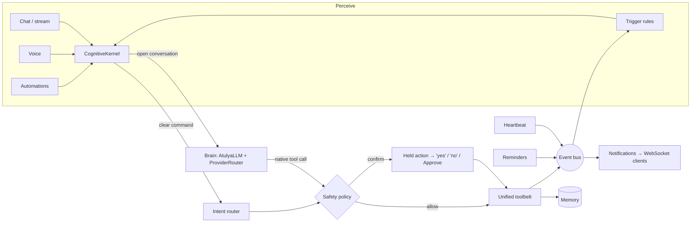

# Atulya Cognitive Architecture

How the assistant thinks, decides and acts. The NP-DNA model internals are in
[ARCHITECTURE.md](ARCHITECTURE.md); this document covers the layer above it:
the loop that turns a sentence, a voice command or an event into a safe action.

## Design principle: one nervous system

Earlier versions had the right organs but no single nervous system. Chat and
voice used one tool registry and brain loop, the CLI and automations used
another, the intent router only served the CLI, risky actions bypassed the
approval gate, and the event bus had no subscribers. The cognition layer
(`atulya/cognition/`) gives every entry point one pipeline:

```
 perceive ──► understand ──► decide ──► act ──► remember ──► react
 (chat, voice,  (intent       (safety    (tools)  (memory)    (event bus →
  automations,   router or     policy)                          triggers)
  events)        the brain)
```



## Organs → modules

| Organ | Role | Module |
|---|---|---|
| Kernel | The one pipeline every request goes through | `atulya/cognition/kernel.py` |
| Understanding | Clear command → concrete tool + arguments, no model needed | `atulya/agent/intent_router.py` |
| Brain | Open conversation, reasoning, native tool calls, provider failover | `atulya/llm.py`, `atulya/intelligence.py`, `atulya/local_provider.py` |
| Brain size | `ATULYA_BRAIN` tiers: tiny / balanced / power / cloud | `atulya/cognition/brain.py` |
| Conscience | Which actions run vs. wait for confirmation | `atulya/cognition/safety.py` |
| Hands | One tool surface: files, web, office, ERP + home, reminders, weather, email, calendar | `atulya/cognition/toolbelt.py` |
| Real-world reach | Home Assistant (Zigbee, Z-Wave, Wi-Fi, Matter…) | `yantra/capabilities/home_assistant.py` |
| Memory | Remembers conversations and the actions it took | `atulya/memory/` |
| Nervous system | Publish/subscribe events | `yantra/events.py` |
| Reflexes | Event → rule → notify and/or act | `atulya/cognition/triggers.py` |
| Interoception | Self-monitoring; publishes health *changes* | `atulya/heartbeat.py` |
| Personality & mood | Persona, emotion detection, mood state | `atulya/persona.py`, `atulya/emotion.py`, `atulya/soul.py` |

## A request's life

1. **Perceive.** Chat (`/api/chat`, `/api/chat/stream`), voice (`/api/voice/chat`),
   automations and trigger rules all call `CognitiveKernel.handle()` or `.stream()`.
2. **Resolve anything pending.** If an action is held for this user, a clear
   "yes" runs it and a clear "no" cancels it. Any other message drops the hold,
   so a stray "yes" later can never release it. Laughter ("ha ha") is not a yes.
   Holds are per user and expire after two minutes.
3. **Understand.** The intent router maps clear commands ("turn off the
   kitchen light", "remind me to call mom in 10 minutes", "weather in Delhi")
   to a tool and arguments deterministically, which is reliable even on a 0.6B
   model. Anything else goes to the brain, which can still call the same tools
   natively.
4. **Decide.** `safety.assess()` returns *allow* or *confirm*. Confirmation is
   needed for physical security (unlocking a door), speaking for the user
   (sending email), irreversible deletion (calendar events, reminders), and
   running code or modifying files. Confirmation-level actions also require an
   **admin** account: a regular or guest user can turn on lights or set
   reminders, but can't unlock the door or send email, and can't approve such
   actions either. `ATULYA_AUTO_APPROVE` pre-approves specific actions (which
   makes them everyday actions for every user). Commands the user authored in
   advance (automations, trigger rules) are pre-authorized, and trigger rules
   additionally need `allow_risky`.
5. **Act.** Tools run through the unified registry, so chat, voice and
   automations all have the same hands.
6. **Remember.** Every action is written to memory.
7. **React.** Every action is published (`action.executed`, `action.pending`,
   `action.cancelled`). Trigger rules can react, and notifications are relayed
   to connected clients.

## Proactivity

Atulya acts on three kinds of stimulus:

- **What it's told.** Chat and voice go through the kernel.
- **The clock.** Scheduled automations (`/api/cron/jobs`) run through the kernel.
- **What happens.** Trigger rules (`/api/triggers`) react to events:

| Event | Emitted by |
|---|---|
| `reminder.due` | a reminder's time arrives (previously these reached no one) |
| `health.warning` / `health.error` / `health.ok` / `health.info` | heartbeat, only when a check *changes* state |
| `automation.completed` / `automation.failed` | automation runner |
| `action.executed` / `action.pending` / `action.cancelled` | kernel |
| `trigger.fired`, `notification` | trigger engine |

Built-in rules (seeded on first run, editable): reminder alerts, system-health
alerts and automation-failure alerts. A rule looks like this:

```json
{
  "name": "Porch light at dusk",
  "event": "reminder.due",
  "match": {"message": "dusk"},
  "notify": "Reminder: {message}",
  "command": "turn on the living room light",
  "allow_risky": false,
  "cooldown_seconds": 60
}
```

Rule safety: event payloads fill only `notify` text, never `command`, so an
event (for example an email subject) can't smuggle in an instruction. Risky
commands need `allow_risky`. Events caused by trigger actions don't fire further
triggers, so rules can't loop.

## In the web UI

- **Notifications.** The page keeps a live WebSocket connection. Reminders,
  health alerts and trigger results appear as notifications and, in Live mode,
  are spoken aloud (routine successes are shown but not spoken). Reconnecting
  doesn't re-alert old events; replayed history is flagged `replay: true`.
- **Confirmation.** Typed chat shows an Approve dialog. In Live mode Atulya asks
  aloud, and the next "yes" or "no" answers it — in hands-free mode too,
  without the wake word.
- **Real reasoning display.** Chat and voice responses carry the kernel's
  `trace` (understand → decide → act → remember, or think). Live mode's
  consciousness stream and node animation follow those real stages.
- **Admin → Reflexes & Brain.** Add, test, pause and delete trigger rules; see
  the active brain tier; watch the live event feed.

## Brain tiers

| `ATULYA_BRAIN` | Local model | Download | RAM | Use it when |
|---|---|---|---|---|
| `tiny` (default) | Qwen3-0.6B | ~0.4 GB | ~1 GB | any machine, fastest |
| `balanced` | Qwen3-1.7B | ~1.1 GB | ~3 GB | better reasoning and tool use |
| `power` | Qwen3-4B | ~2.5 GB | ~6 GB | best local quality |
| `cloud` | cloud providers first | — | — | you have Groq/OpenRouter/Gemini keys |

With `ATULYA_AUTO_DOWNLOAD_MODEL=true` the tier's model downloads on first run.
Until it's present, Atulya falls back to a smaller local model (never silently
to a heavier one). `ATULYA_GGUF_PATH` pins any GGUF you like. `GET /api/brain`
shows the active tier.

## Real devices

Set `HOME_ASSISTANT_URL` and `HOME_ASSISTANT_TOKEN` (a long-lived token from
your Home Assistant profile) and `home_control` drives real devices over Home
Assistant's REST API. Device ids map to entities by convention
(`living_room_light` → `light.living_room`) or through `HOME_ASSISTANT_ENTITIES`.
Failures are reported, never faked. Without Home Assistant, a simulation is used.

## Honest capability boundaries

Built and tested: the unified loop, spoken and UI confirmation, deterministic
action-taking, event-driven proactivity, self-monitoring, brain tiers, and a
real smart-home bridge.

Still ahead on the road from assistant to more general intelligence:

1. **Multi-step planning.** The router handles one action per command; goals
   like "get the house ready for guests" need a planner that decomposes,
   executes and checks steps (`yantra/orchestrator` is the starting point).
2. **Learning from feedback.** Confirmations, cancellations and corrections are
   now events; the next step is to learn preferences from them, for example to
   stop asking about actions the user always approves.
3. **Richer perception.** Camera and vision are wired, but not yet as
   continuous perception that emits events ("someone is at the door").
4. **Always-on ambient presence.** Wake-word listening lives in the web UI; a
   background device runtime (desktop tray, phone app) would make it truly
   always on.
5. **Memory consolidation.** Episodic memory is stored; distilling it into a
   durable user model (habits, people, preferences) is the next layer.
6. **More integrations.** Email and calendar tools exist; OAuth-backed
   connectors (Gmail, Google Calendar) are configured separately.
