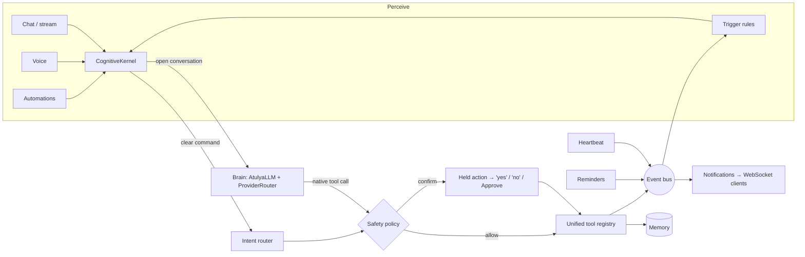

# Atulya Cognitive Architecture

How the assistant thinks, decides and acts: the loop that turns a sentence, a voice command or an event into a safe action.

## Design principle: one nervous system

Earlier versions had the right organs but no single nervous system. Chat and
voice used one tool registry and brain loop, the CLI and automations used
another, the intent router only served the CLI, risky actions bypassed the
approval gate, and the event bus had no subscribers. The cognition layer
(`atulya/pipeline.py` and the files named in the README) gives every entry point one pipeline:

```
 perceive ──► understand ──► decide ──► act ──► remember ──► react
 (chat, voice,  (intent       (safety    (tools)  (memory)    (event bus →
  automations,   router or     policy)                          triggers)
  events)        the brain)
```



## Organs → modules

| Organ | Role | Module |
|---|---|---|
| Kernel | The one pipeline every request goes through | `atulya/pipeline.py` |
| Understanding | Clear command → concrete tool + arguments, no model needed | `atulya/actions/` |
| Planning | Goals → checked multi-step plans (routines, groups, compound commands, the brain) | `atulya/pipeline.py` |
| Knowing you | Facts, habits, which confirmations to stop asking (opt-in) | `atulya/pipeline.py` |
| Brain | Open conversation, reasoning, native tool calls, provider failover | `atulya/brain/` |
| Brain size | `ATULYA_BRAIN` tiers: tiny / balanced / power / cloud | `atulya/brain/` |
| Conscience | Which actions run vs. wait for confirmation | `atulya/brain/` |
| Hands | One tool surface: files, web, office, ERP + home, reminders, weather, email, calendar | `atulya/brain/` |
| Real-world reach | Home Assistant (Zigbee, Z-Wave, Wi-Fi, Matter…) | `atulya/devices.py` |
| Memory | Remembers conversations and the actions it took | `atulya/memory.py` |
| Nervous system | Publish/subscribe events | `atulya/settings.py` |
| Reflexes | Event → rule → notify and/or act | `atulya/pipeline.py` |
| Interoception | Self-monitoring; publishes health *changes* | `atulya/settings.py` |
| Senses | Cameras (motion, people) and Home Assistant sensors → events | `atulya/vision.py` |
| Ears everywhere | Always-listening app: wake word, tray icon, speaks notifications | `atulya/ambient.py` |
| Personal accounts | Google sign-in: Gmail and Calendar per user | `atulya/web.py` |

## A request's life

1. **Perceive.** Chat (`/api/chat`, `/api/chat/stream`), voice (`/api/voice/chat`),
   automations and trigger rules all call `CognitiveKernel.handle()` or `.stream()`.
2. **Resolve anything pending.** If an action is held for this user, a clear
   "yes" runs it and a clear "no" cancels it. Any other message drops the hold,
   so a stray "yes" later can never release it. Laughter ("ha ha") is not a yes.
   Holds are per user and expire after two minutes.
3. **Learn and plan.** Statements about the user ("my wife's name is Priya") are
   remembered; "what do you know about me?" and "forget …" are answered. A
   routine phrase, a device group ("all the lights"), several commands joined by
   "and"/"then", or a goal ("set the mood for movie night") becomes a **plan**.
4. **Understand.** The intent router maps clear commands ("turn off the
   kitchen light", "remind me to call mom in 10 minutes", "weather in Delhi")
   to a tool and arguments deterministically, which is reliable even on a 0.6B
   model. Anything else goes to the brain, which can still call the same tools
   natively.
5. **Decide.** `safety.assess()` returns *allow* or *confirm*. Confirmation is
   needed for physical security (unlocking a door), speaking for the user
   (sending email), irreversible deletion (calendar events, reminders), and
   running code or modifying files. Confirmation-level actions also require an
   **admin** account: a regular or guest user can turn on lights or set
   reminders, but can't unlock the door or send email, and can't approve such
   actions either. `ATULYA_AUTO_APPROVE` pre-approves specific actions (which
   makes them everyday actions for every user). Commands the user authored in
   advance (automations, trigger rules) are pre-authorized, and trigger rules
   additionally need `allow_risky`.
   A plan with a risky step asks once for the whole plan. After five yeses in a
   row to the same confirmation, Atulya offers to stop asking — only that user,
   only if they agree, and never for running code or changing files.
6. **Act.** Tools run through the unified registry, so chat, voice and
   automations all have the same hands. Personal tools (Gmail, Calendar) act for
   the user who asked. Each plan step is **checked** afterwards: device state is
   read back (from Home Assistant when configured), so a device that claims
   success but didn't change is reported.
7. **Remember.** Every action is written to memory, and what the user does
   becomes habits.
8. **React.** Every action is published (`action.executed`, `action.pending`,
   `action.cancelled`). Trigger rules can react, and notifications are relayed
   to connected clients.

## Proactivity

Atulya acts on three kinds of stimulus:

- **What it's told.** Chat and voice go through the kernel.
- **The clock.** Scheduled automations (`/api/cron/jobs`) run through the kernel.
- **What it notices.** Cameras, doorbells and sensors, and habits that haven't
  happened yet today, become events too.
- **What happens.** Trigger rules (`/api/triggers`) react to events:

| Event | Emitted by |
|---|---|
| `reminder.due` | a reminder's time arrives (previously these reached no one) |
| `health.warning` / `health.error` / `health.ok` / `health.info` | heartbeat, only when a check *changes* state |
| `automation.completed` / `automation.failed` | automation runner |
| `action.executed` / `action.pending` / `action.cancelled` | kernel |
| `trigger.fired`, `notification` | trigger engine |
| `plan.started` / `plan.step` / `plan.completed` | kernel, for multi-step plans |
| `vision.person` / `vision.motion` | cameras and Home Assistant person/motion sensors |
| `doorbell.pressed` / `home.sensor` | Home Assistant doorbells and watched sensors |
| `habit.due` | a usual action hasn't happened yet today |
| `profile.learned` / `profile.trusted` | Atulya learned a fact / stopped asking about an action |

Built-in rules (seeded on first run, editable): reminder alerts, system-health
alerts, automation-failure alerts, habit nudges and "someone at the door". New
built-ins are added to older rule files once; a built-in you deleted stays deleted. A rule looks like this:

```json
{
  "name": "Porch light at dusk",
  "event": "reminder.due",
  "match": {"message": "dusk"},
  "notify": "Reminder: {message}",
  "command": "turn on the living room light",
  "allow_risky": false,
  "cooldown_seconds": 60
}
```

Rule safety: event payloads fill only `notify` text, never `command`, so an
event (for example an email subject) can't smuggle in an instruction. Risky
commands need `allow_risky`. Events caused by trigger actions don't fire further
triggers, so rules can't loop.

## In the web UI

- **Notifications.** The page keeps a live WebSocket connection. Reminders,
  health alerts and trigger results appear as notifications and, in Live mode,
  are spoken aloud (routine successes are shown but not spoken). Reconnecting
  doesn't re-alert old events; replayed history is flagged `replay: true`.
- **Confirmation.** Typed chat shows an Approve dialog. In Live mode Atulya asks
  aloud, and the next "yes" or "no" answers it — in hands-free mode too,
  without the wake word.
- **Real reasoning display.** Chat and voice responses carry the kernel's
  `trace` (understand → decide → act → remember, or think). Live mode's
  consciousness stream and node animation follow those real stages.
- **Admin → Reflexes & Brain.** Add, test, pause and delete trigger rules; see
  the active brain tier; watch the live event feed.
- **Admin → Routines.** Run, edit and add routines; "try a sentence" previews a plan.
- **Admin → Senses.** Cameras (with the latest snapshot), Home Assistant sensors,
  and the always-listening devices, with install commands for a new one.
- **About you** (every user). What Atulya knows, habits, which actions it asks
  about, and the Google account. Approvals are shown in plain words.

## Brain tiers

| `ATULYA_BRAIN` | Local model | Download | RAM | Use it when |
|---|---|---|---|---|
| `tiny` (default) | Qwen3-0.6B | ~0.4 GB | ~1 GB | any machine, fastest |
| `balanced` | Qwen3-1.7B | ~1.1 GB | ~3 GB | better reasoning and tool use |
| `power` | Qwen3-4B | ~2.5 GB | ~6 GB | best local quality |
| `cloud` | cloud providers first | — | — | you have Groq/OpenRouter/Gemini keys |

With `ATULYA_AUTO_DOWNLOAD_MODEL=true` the tier's model downloads on first run.
Until it's present, Atulya falls back to a smaller local model (never silently
to a heavier one). `ATULYA_GGUF_PATH` pins any GGUF you like. `GET /api/brain`
shows the active tier.

## Real devices

Set `HOME_ASSISTANT_URL` and `HOME_ASSISTANT_TOKEN` (a long-lived token from
your Home Assistant profile) and `home_control` drives real devices over Home
Assistant's REST API. Device ids map to entities by convention
(`living_room_light` → `light.living_room`) or through `HOME_ASSISTANT_ENTITIES`.
Failures are reported, never faked. Without Home Assistant, a simulation is used.

## Always listening

`atulya listen` (install with `pip install -e ".[ambient]"`) runs on a computer or a
Raspberry Pi, independent of the browser. It detects speech with an adaptive noise
floor, matches the wake word letter by letter (so "a tulia" still wakes it), sends
the sentence to the server as the signed-in user, and speaks the reply and any
notifications. After "should I unlock the front door?" the next yes/no needs no
wake word. `--login` stores a 90-day device token; `--install-autostart` starts it
at login (Windows, macOS, Linux) or at boot (`systemd`). Speech-to-text runs
locally with faster-whisper when installed.

## Honest capability boundaries

Built and tested: the unified loop; spoken and UI confirmation; deterministic
action-taking; multi-step plans with per-step checks; event-driven proactivity;
self-monitoring; learning facts, habits and approval preferences; camera and
doorbell perception; an always-listening app; Gmail and Google Calendar; brain
tiers; and a real smart-home bridge.

Still ahead on the road to more general intelligence:

1. **Open-ended planning.** Plans are sequences of known commands. Goals that need
   research, branching or recovery ("plan my trip to Goa") need a planner that
   reasons over results, not just a list.
2. **Understanding what the camera sees.** Cameras detect motion and people;
   recognising *who* (family vs. stranger) or describing a scene needs a
   vision-language model running continuously.
3. **Memory consolidation.** Facts come from explicit statements; distilling
   conversations into a richer model of the user is the next step.
4. **Voice identity.** The always-listening app acts as the signed-in account;
   telling household members apart by voice would make permissions per person.
5. **More connectors.** Gmail and Calendar are built in; others (WhatsApp,
   banking, Drive) are still separate MCP integrations.
